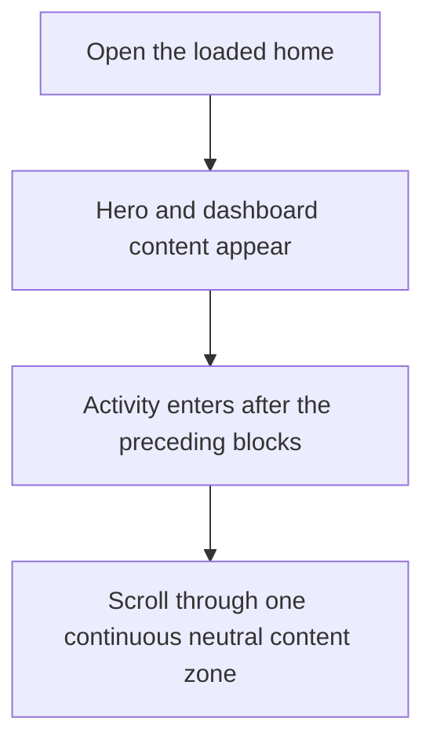
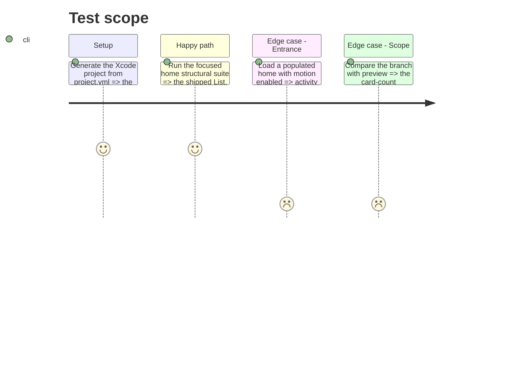

# Instruction: Align the homepage contract with the shipped implementation

## Architecture projection

> Tree of the final files. ✅ create · ✏️ modify · ❌ delete

```txt
ios/
├── Pulpe/
│   ├── Features/CurrentMonth/
│   │   └── ✏️ CurrentMonthView.swift                 restore the activity entrance
│   └── Resources/
│       └── ✏️ Localizable.xcstrings                  remove the unrelated placeholder diff
└── PulpeTests/Features/CurrentMonth/
    └── ✏️ HomeHeroCardTests.swift                    assert the hero/content contract that ships
```

## User Journey



## Test Scope



## Wireframe

```txt
┌──────────────────────────────────────┐
│ (1) Hero                             │
├──────────────────────────────────────┤
│ (2) Primary action                   │
│ (3) Dashboard cards                  │
│ (4) Activity header · period         │
│     Day                              │
│     ┌────────────────────────────┐   │
│     │ Activity row               │   │
│     └────────────────────────────┘   │
└──────────────────────────────────────┘
```

1. Hero: existing forest surface and parallax.
2. Primary action: existing rounded content cap.
3. Dashboard cards: existing conditional list rows.
4. Activity: existing header and intrinsic transaction rows.

## Tasks to do

### `1)` Repair the structural contract test

> Assert the implementation that survived the layering fixes.

1. Replace references to the removed `heroListRow` API with `heroZone(parallax: true)`, `contentZone()`, and `ContentListRowModifier` assertions.
2. Keep the checks for one `List`, hidden system background, and no home-owned gradient in `CurrentMonthView`.

### `2)` Restore the activity entrance

> Return the animation lost during the list conversion.

1. Reapply the existing `staggeredEntrance` modifier at index 3 to `ActivityCard` without adding new animation state.

### `3)` Remove the unrelated localization diff

> Keep this branch limited to swipe and homepage behavior.

1. Restore the three card-count translations to the `preview` values.

## Test acceptance criteria

| Task | Acceptance criteria |
| ---- | ------------------- |
| 1 | `loadedDashboardUsesListCompatibleHeroSurface` references only APIs present in the shipped source and passes. |
| 1 | The test still detects removal of the native list shell, hero parallax, content cap, or neutral list rows. |
| 2 | The activity block uses the shared Reduce Motion-aware entrance at index 3. |
| 3 | `Localizable.xcstrings` has no diff against `preview` for the card-count translations. |
