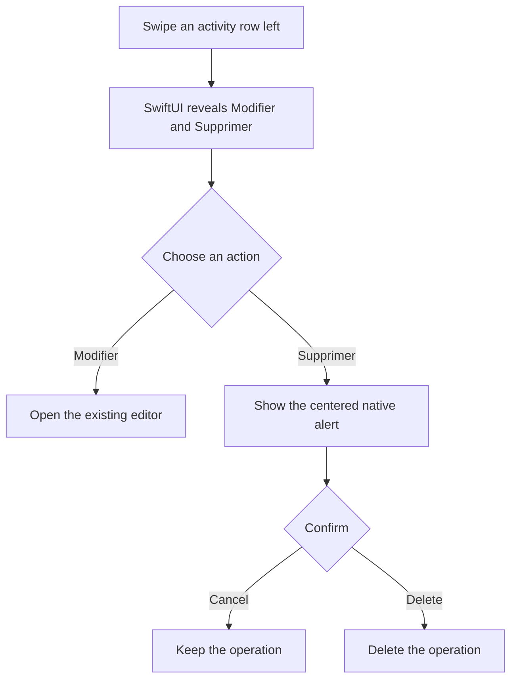
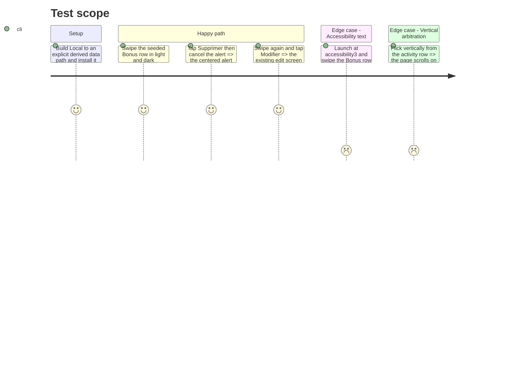

# Instruction: Return swipe presentation to SwiftUI and close the visual matrix

## Architecture projection

> Tree of the final files. ✅ create · ✏️ modify · ❌ delete

```txt
ios/
├── Pulpe/Features/CurrentMonth/Components/
│   └── ✏️ ActivityCard.swift                         native row background and action chrome
└── PulpeUITests/
    └── ✏️ ContextualCreationUITests.swift            light, dark, and accessibility action matrix
```

## User Journey



## Test Scope



## Wireframe

```txt
┌──────────────────────────────────────────┐
│ (1) Activity row      │ (2) Edit │ Delete│
└──────────────────────────────────────────┘

        ┌──────────────────────────┐
        │ (3) Deletion alert       │
        │ Cancel            Delete │
        └──────────────────────────┘
```

1. Activity row: existing content and rounded group surface.
2. Actions: system-owned trailing action region.
3. Alert: system-owned destructive confirmation.

## Tasks to do

### `1)` Remove the mirrored action renderer

> Let SwiftUI own every visible and interactive part of the swipe actions.

1. Move `rowBackground(index:count:)` from the sliding row content to `.listRowBackground`.
2. Keep the two existing `.swipeActions` buttons, tints, identifiers, and `allowsFullSwipe: false`.
3. Delete `dynamicTypeSize`, `swipeActionBackdrop`, `swipeActionVisual`, and the fixed slot geometry.

### `2)` Add the appearance matrix

> Make invisible actions fail in automation and leave screenshots for visual inspection.

1. Extend `HomeActivitySwipeUITests` with light, dark, and accessibility3 launches.
2. Reveal the actions in each configuration, assert both identifiers, and attach a screenshot.
3. Keep the existing edit and mandatory deletion confirmation tests unchanged in purpose.

### `3)` Verify the reviewed behavior

> Close the review only with executable and simulator evidence.

1. Run XcodeGen, the focused Swift test suite, the focused swipe UI suite, and SwiftLint strict.
2. Inspect light, dark, and accessibility3 action states through Noqa; also repeat a vertical flick from the activity row.
3. Stop if system chrome remains invisible; do not restore a fixed visual mirror.

## Test acceptance criteria

| Task | Acceptance criteria |
| ---- | ------------------- |
| 1 | No custom action visual or fixed action-slot geometry remains in `ActivityCard`. |
| 1 | SwiftUI displays and handles Modifier and Supprimer with full swipe disabled. |
| 1 | The grouped row surface and dividers retain their existing rounded-card layout. |
| 2 | UI automation reveals both actions in light, dark, and accessibility3 configurations. |
| 2 | Cancel preserves the operation, edit opens the existing screen, and deletion still requires explicit confirmation. |
| 3 | A vertical flick beginning on the row scrolls immediately; focused tests, build, and SwiftLint pass. |
