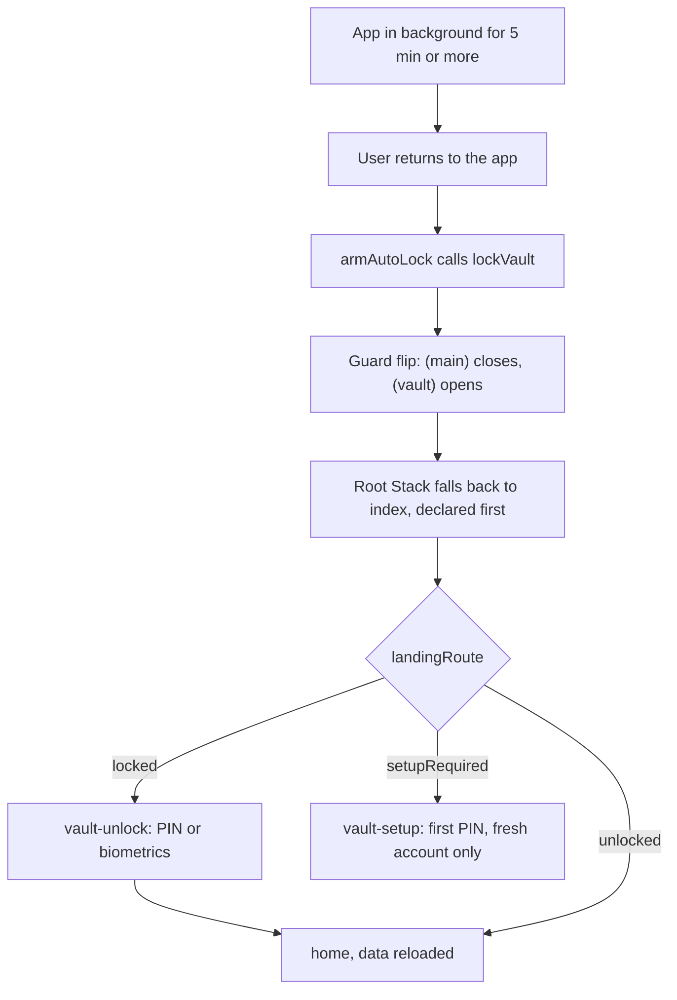
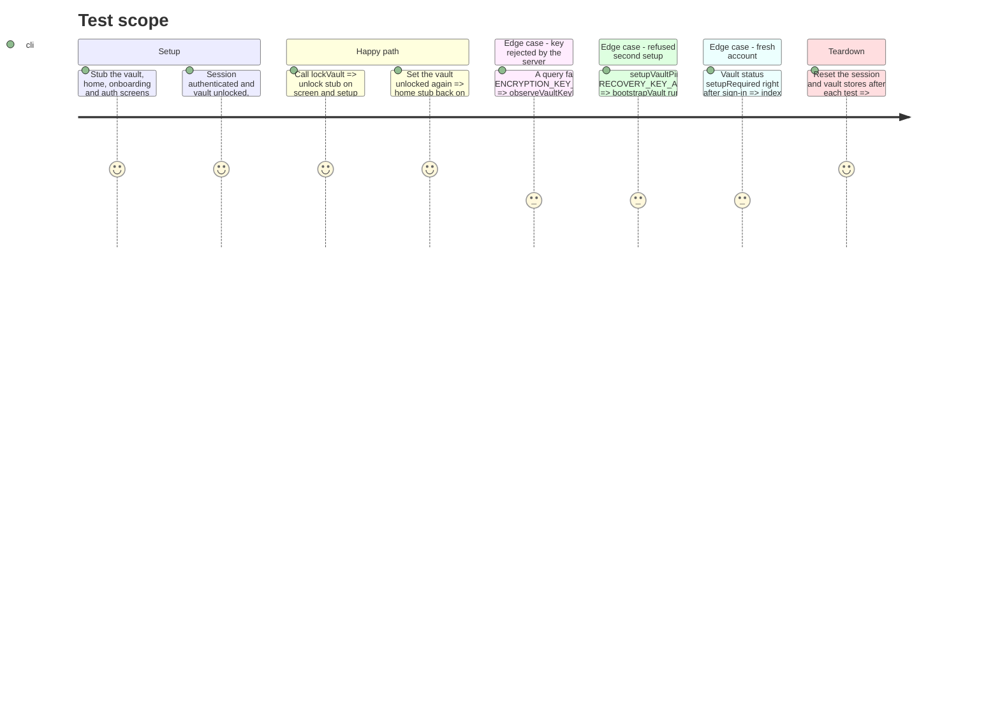

# Instruction: Vault routing decider (PIN regression)

## Architecture projection

> Tree of the final files. ✅ create · ✏️ modify · ❌ delete

```txt
android/src
├── app
│   ├── _layout.tsx                          ✏️ `index` declared first inside the root Stack, above the four Stack.Protected groups
│   └── (vault)
│       └── _layout.tsx                      ✏️ `vault-unlock` declared first so the group's own default is deliberate
└── core
    ├── navigation
    │   └── vault-routing.spec.tsx           ✅ router-level spec: lock, key rejection, fresh account, unlock
    └── vault
        ├── vault-store.ts                   ✏️ setupVaultPin re-runs bootstrapVault on a refused second setup
        ├── vault-store.spec.ts              ✏️ refused-setup case
        └── auto-lock.ts                     ✏️ comment states the real fallback and points to _layout.tsx
```

## User Journey



## Test Scope



## Tasks to do

### `1)` Declare `index` first in the root Stack

> Every guard flip lands on the decider, never on a group.

1. In `android/src/app/_layout.tsx`, add `<Stack.Screen name="index" />` as the first child of the root `<Stack>`, above the four `Stack.Protected` groups; keep the group order.
2. Three-line comment naming the react-navigation fallback (`initialRouteName ?? routeNames[0]`) and why `index` must be that route.

### `2)` Make the `(vault)` group default deliberate

> A guard flip that ever lands on the group shows the unlock screen, not the setup one.

1. In `android/src/app/(vault)/_layout.tsx`, render `<Stack.Screen name="vault-unlock" />` inside the existing `<Stack screenOptions={{ headerShown: false }}>`.
2. One-line comment: expo-router sorts undeclared children by name length, which put `vault-setup` first.

### `3)` Let the server stay the authority on a refused setup

> A refused second setup relocks instead of pinning `setupRequired`.

1. In `setupVaultPin` (`vault-store.ts:112-126`), in the `catch`: when `isApiError(error) && error.code === API_ERROR_CODES.RECOVERY_KEY_ALREADY_EXISTS` or `isVaultKeyRejected(error)` (from `./key-invalidation`), call `clearSessionKey()` then `await bootstrapVault()` and keep the error message on the store; every other failure keeps the current `setupRequired` path.
2. `vault-store.spec.ts`: one case where `setupRecoveryKey` rejects with that code and `fetchSalt` answers a salt; expect `status` to be `locked`.

### `4)` Fix the auto-lock comment

> The comment describes the real contract.

1. Rewrite `auto-lock.ts:34-37`: after `lockVault()` the guards flip and the root Stack falls back to `index`, declared first in `app/_layout.tsx`, which re-runs `landingRoute`.

### `5)` Router-level regression spec

> The lock, rejection and fresh-account transitions are observed through the real router.

1. Create `android/src/core/navigation/vault-routing.spec.tsx` on `renderRouter` from `expo-router/testing-library` with a context object: the real `app/_layout.tsx`, `app/index.tsx`, `app/(vault)/_layout.tsx` and `core/navigation/route-gates.ts`; stub components carrying `testID`s for `(vault)/vault-unlock`, `(vault)/vault-setup`, `(main)/(tabs)/home`, one `(onboarding)` screen and one `(auth)` screen.
2. `jest.mock` every side-effect module `_layout.tsx` imports (session observer, Supabase auto refresh, privacy shield, analytics, onboarding draft, system gate, fonts, client key manager); drive state through `useSessionStore.setState` and `useVaultStore.setState`.
3. Cases from the Test Scope: lock, key rejection through `observeVaultKeyRejection`, fresh account, unlock again.
4. Run the spec on the tree before tasks 1 and 2 to see the setup stub, then after: it must go red then green.

## Test acceptance criteria

| Task | Acceptance criteria                                                                                                                                          |
| ---- | ------------------------------------------------------------------------------------------------------------------------------------------------------------ |
| 1    | After `lockVault()` on the home, the screen shown is `vault-unlock`; `app-entry.spec.tsx` and the whole Jest suite stay green.                               |
| 2    | `(vault)/_layout.tsx` declares `vault-unlock` first; the vault group still renders `vault-setup` and the recovery screen when navigated to explicitly.       |
| 3    | A `RECOVERY_KEY_ALREADY_EXISTS` or key-check rejection during setup ends with `status === "locked"` and the unlock screen, never a stuck "Choisis ton code". |
| 4    | `auto-lock.ts` no longer mentions a fallback to `/`; it names `index` and `app/_layout.tsx`.                                                                 |
| 5    | `vault-routing.spec.tsx` fails on the pre-fix tree and passes on the fixed tree for lock, rejection, fresh account and unlock.                               |
| all  | On a device: unlock, background the app for more than 5 minutes, return: "Déverrouille ton coffre" appears, PIN opens the home with data.                    |
