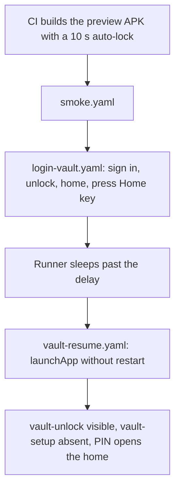
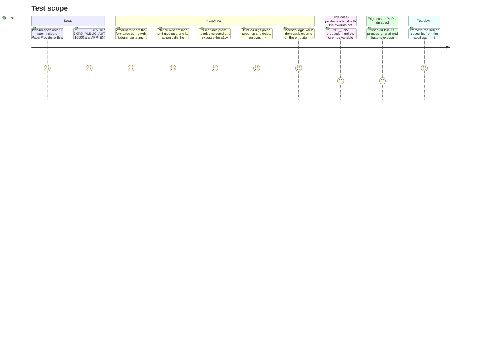

# Instruction: Rendering tests and CI vault flow

## Architecture projection

> Tree of the final files. ✅ create · ✏️ modify · ❌ delete

```txt
.
├── .github/workflows/android-e2e.yml                     ✏️ EXPO_PUBLIC_AUTO_LOCK_DELAY_MS for the CI build; runs login-vault.yaml then vault-resume.yaml after smoke.yaml
└── android
    ├── maestro
    │   ├── login-vault.yaml                              ✏️ ends with the app sent to the background after the home is visible
    │   └── vault-resume.yaml                             ✅ foregrounds without restart, expects vault-unlock and not vault-setup, unlocks
    └── src
        ├── core
        │   ├── config/env.ts                             ✏️ AUTO_LOCK_DELAY_MS override parsed, honoured outside production
        │   ├── vault
        │   │   ├── auto-lock.ts                          ✏️ delay read from ENV
        │   │   └── auto-lock.spec.ts                     ✏️ override case
        │   └── ui
        │       ├── amount.spec.ts                        ❌ → amount.spec.tsx ✅
        │       ├── card.spec.ts                          ❌ → card.spec.tsx ✅
        │       ├── eyebrow.spec.ts                       ❌ → eyebrow.spec.tsx ✅
        │       ├── filter-chip.spec.ts                   ❌ → filter-chip.spec.tsx ✅
        │       ├── notice.spec.ts                        ❌ → notice.spec.tsx ✅
        │       ├── pill.spec.ts                          ❌ → pill.spec.tsx ✅
        │       ├── status-badge.spec.ts                  ❌ → status-badge.spec.tsx ✅
        │       └── field-error.spec.ts                   ❌ → field-error.spec.tsx ✅
        └── ui
            └── pin-pad.spec.tsx                          ✅ digits, delete, haptics, disabled state
```

## User Journey



## Test Scope



## Tasks to do

### `1)` Auto-lock delay override for test builds

> The background-return case can be scripted in seconds.

1. `env.ts`: parse `EXPO_PUBLIC_AUTO_LOCK_DELAY_MS` as a positive integer; expose `ENV.autoLockDelayMs`, defaulting to 5 minutes and ignoring the variable when `ENV.environment === "production"`.
2. `auto-lock.ts`: `AUTO_LOCK_DELAY_MS` comes from `ENV.autoLockDelayMs`; `shouldLockOnResume` unchanged.
3. `auto-lock.spec.ts`: override honoured in preview, ignored in production.

### `2)` Maestro vault flows in CI

> The regression of phase 1 is caught by the pipeline.

1. `android-e2e.yml`: add `EXPO_PUBLIC_AUTO_LOCK_DELAY_MS: "10000"` to the Gradle build step env; after `smoke.yaml`, run `maestro test android/maestro/login-vault.yaml`, `sleep 12`, `maestro test android/maestro/vault-resume.yaml`; failure artifacts unchanged.
2. `login-vault.yaml`: after `home-add-entry` is visible, `pressKey: Home` (confirm the command in the Maestro docs before scripting).
3. Create `vault-resume.yaml`: `launchApp` with `stopApp: false` and `clearState: false`, `assertVisible id: vault-unlock`, `assertNotVisible id: vault-setup`, enter the PIN, `assertVisible id: home-add-entry`.

### `3)` Convert the component specs to renders

> Specs pin what renders, not how a file is written.

1. For `amount`, `card`, `eyebrow`, `filter-chip`, `notice`, `pill`, `status-badge`, `field-error`: delete the `readFileSync` spec, write an RNTL `.spec.tsx` rendering the atom inside `PaperProvider` and asserting text, accessibility state, style tokens (`TABULAR_DIGITS`, `RADIUS.card`) and callbacks.
2. `ripple`, `haptics`, `scheme-colors`, `emphasis`, `fab-clearance`, `keyboard-inset`, `amount-format` test helpers and stay as they are.
3. Create `src/ui/pin-pad.spec.tsx` per the Test Scope; coverage thresholds in `jest.config.js` unchanged and still met.

## Test acceptance criteria

| Task | Acceptance criteria                                                                                                                                         |
| ---- | ----------------------------------------------------------------------------------------------------------------------------------------------------------- |
| 1    | Preview builds honour `EXPO_PUBLIC_AUTO_LOCK_DELAY_MS`; production builds keep 5 minutes whatever the variable; `auto-lock.spec.ts` green.                  |
| 2    | The e2e job runs smoke, login-vault and vault-resume; vault-resume fails on the pre-phase-1 tree (setup screen) and passes on the fixed tree.               |
| 3    | Eight `core/ui` specs render their component and pass; no `readFileSync` left in `core/ui`; `pin-pad.spec.tsx` passes; coverage stays above the thresholds. |
