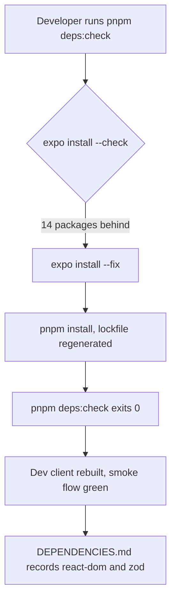
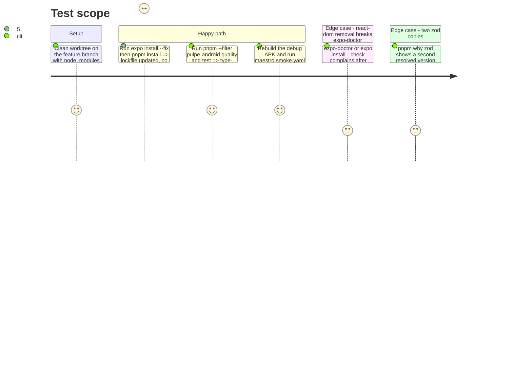

# Instruction: Toolchain and dependency alignment

## Architecture projection

> Tree of the final files. ✅ create · ✏️ modify · ❌ delete

```txt
.
├── pnpm-lock.yaml                          ✏️ regenerated
└── android
    ├── package.json                        ✏️ SDK 57 patch levels, react-dom placement, zod pinned to the shared copy, react-query and posthog minors
    └── docs-android
        └── DEPENDENCIES.md                 ✏️ react-dom and zod decisions, review date 2026-08-27
```

## User Journey



## Test Scope



## Tasks to do

### `1)` Align the Expo-governed packages

> `expo install --check` is green again.

1. `cd android && pnpm exec expo install --fix`, then `pnpm install` from the root.
2. `pnpm deps:check` must exit 0; `pnpm audit` must show no advisory with a `pulpe-android` path.

### `2)` Settle `react-dom`

> Runtime dependencies carry only what the APK needs.

1. `pnpm why react-dom --filter pulpe-android`; if only `expo`/`expo-router` web peers pull it, move it to `devDependencies`.
2. If `expo-doctor` or `expo install --check` objects, keep it and write why in `DEPENDENCIES.md`.

### `3)` One zod copy

> Android bundles the same zod as `pulpe-shared`.

1. `pnpm why zod --filter pulpe-android` and `--filter pulpe-shared`; pin `android/package.json` to the version resolved for shared.
2. Ranges in `shared`, `frontend` and `backend-nest` are not touched.

### `4)` Minor bumps outside Expo's list

> `@tanstack/react-query` and `posthog-react-native` sit on their latest minor.

1. Bump both, run `pnpm --filter pulpe-android test`.

### `5)` Prove the binary

> The dev client still boots and the smoke flow still passes.

1. `pnpm --filter pulpe-android native:generate`, then `cd android/android && ./gradlew assembleDebug -PreactNativeArchitectures=arm64-v8a`.
2. Install on the emulator, `maestro test android/maestro/smoke.yaml`.
3. Update the review date and the two decisions in `docs-android/DEPENDENCIES.md`; list the majors held back by peers (`eslint` 10, `@types/jest` 30, `@babel/runtime` 8) with the blocking peer for each.

## Test acceptance criteria

| Task | Acceptance criteria                                                                                                           |
| ---- | ----------------------------------------------------------------------------------------------------------------------------- |
| 1    | `pnpm deps:check` exits 0; `pnpm audit` reports no advisory reaching `pulpe-android`.                                         |
| 2    | `react-dom` is either a devDependency with `expo-doctor` green, or a runtime dependency with its reason in `DEPENDENCIES.md`. |
| 3    | `pnpm why zod` shows one resolved zod version for `pulpe-android` and `pulpe-shared`.                                         |
| 4    | `pnpm --filter pulpe-android test` is green on the bumped versions.                                                           |
| 5    | The debug APK installs, `smoke.yaml` passes, `DEPENDENCIES.md` carries the 2026-08-27 review.                                 |
