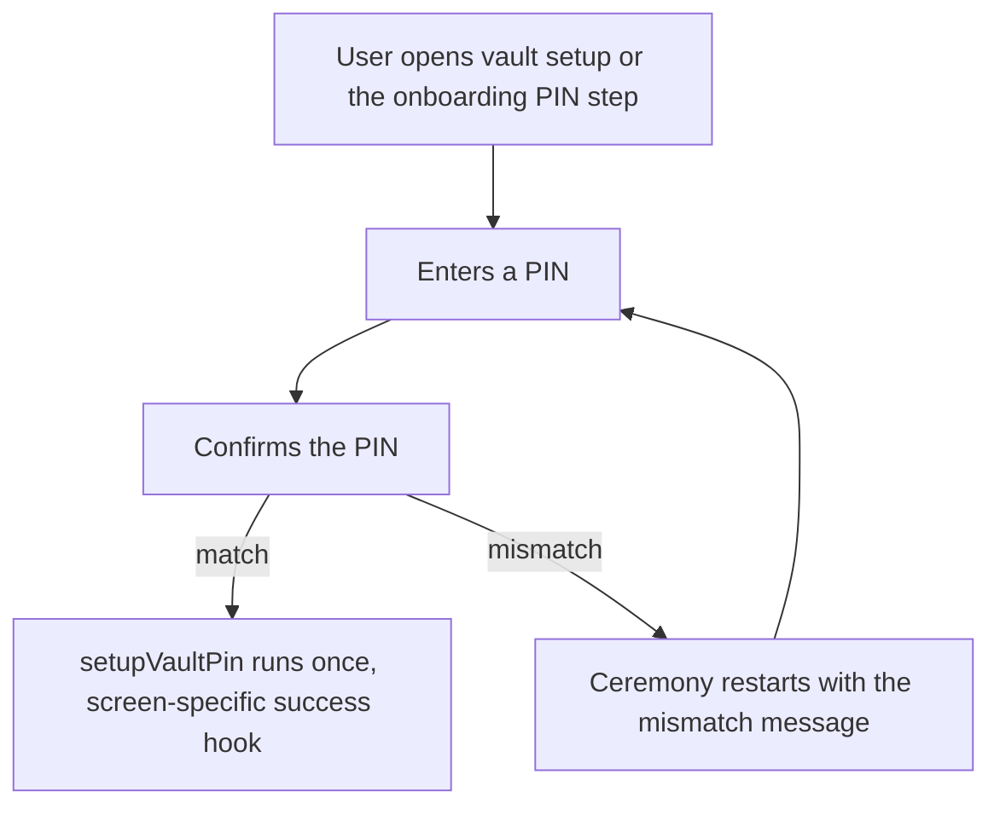
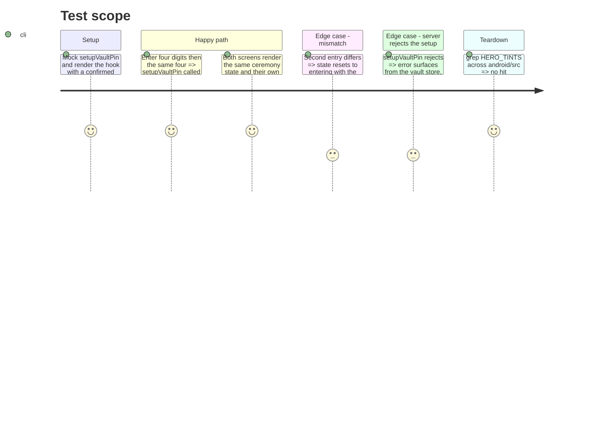

# Instruction: Housekeeping and records

## Architecture projection

> Tree of the final files. ✅ create · ✏️ modify · ❌ delete

```txt
.
├── android/src
│   ├── app/(vault)/vault-setup.tsx                         ✏️ consumes usePinCeremony, keeps its footer and post-success hook
│   ├── features/onboarding/steps/pin-setup-step.tsx        ✏️ consumes usePinCeremony, keeps its footer
│   ├── ui
│   │   ├── use-pin-ceremony.ts                             ✅ two-step PIN ceremony (enter, confirm, mismatch, submit) next to use-pin-entry.ts
│   │   └── use-pin-ceremony.spec.ts                        ✅ renderHook cases
│   └── core/ui/theme.ts                                    ✏️ HERO_TINTS export deleted
└── docs/adr
    ├── 0017-server-driven-minimum-version-gate.md          ✏️ Android store added to References; fail-open on first check named as the shared rule
    └── 0018-android-with-expo-react-native.md              ✏️ Status Accepted, 2026-08-27
```

## User Journey



## Test Scope



## Tasks to do

### `1)` Extract `usePinCeremony`

> One ceremony, two footers.

1. Create `android/src/ui/use-pin-ceremony.ts` from the duplicated block (`vault-setup.tsx:18-51`, `pin-setup-step.tsx:23-61`): `firstPin` ref, `isConfirming`, `restart`, mismatch message key, the `setupVaultPin` call and `vault.error`; signature `usePinCeremony(onConfirmed: () => void)`.
2. Both screens consume the hook and keep only their footer and success hook.
3. `use-pin-ceremony.spec.ts` with `renderHook`: match, mismatch, rejected setup.

### `2)` Delete `HERO_TINTS`

> No dead export in the token file.

1. Remove `HERO_TINTS` from `core/ui/theme.ts:156-160`; `grep -rn HERO_TINTS android/src` returns nothing.

### `3)` Bring the ADRs up to date

> The records say what ships.

1. `docs/adr/0018-android-with-expo-react-native.md`: `**Status:** Accepted`, accepted date 2026-08-27, one line naming the production channels already live (EAS production, Play internal track, OTA).
2. `docs/adr/0017-server-driven-minimum-version-gate.md`: add `android/src/core/system/system-store.ts` under References and state that the Android store applies the same fail-open-then-conservative rule; no behaviour change.

## Test acceptance criteria

| Task | Acceptance criteria                                                                                                                      |
| ---- | ---------------------------------------------------------------------------------------------------------------------------------------- |
| 1    | Vault setup and the onboarding PIN step behave as before (match submits once, mismatch restarts) with the duplicated block gone.         |
| 2    | `HERO_TINTS` has no reference left; `theme.spec.ts` and the type-check pass.                                                             |
| 3    | ADR-0018 reads Accepted with a date; ADR-0017 lists the Android store and its fail-open rule; `pnpm quality` (markdown format) is green. |
