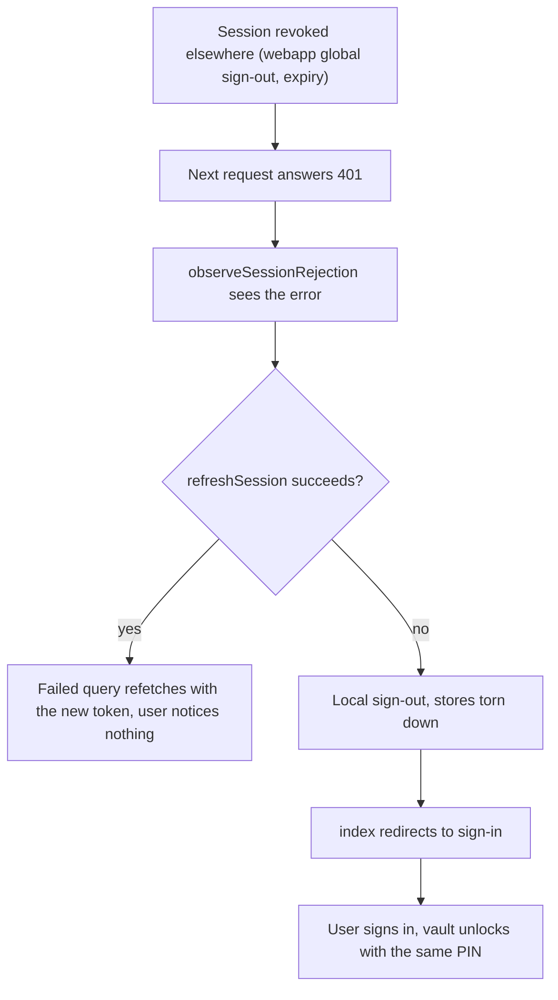
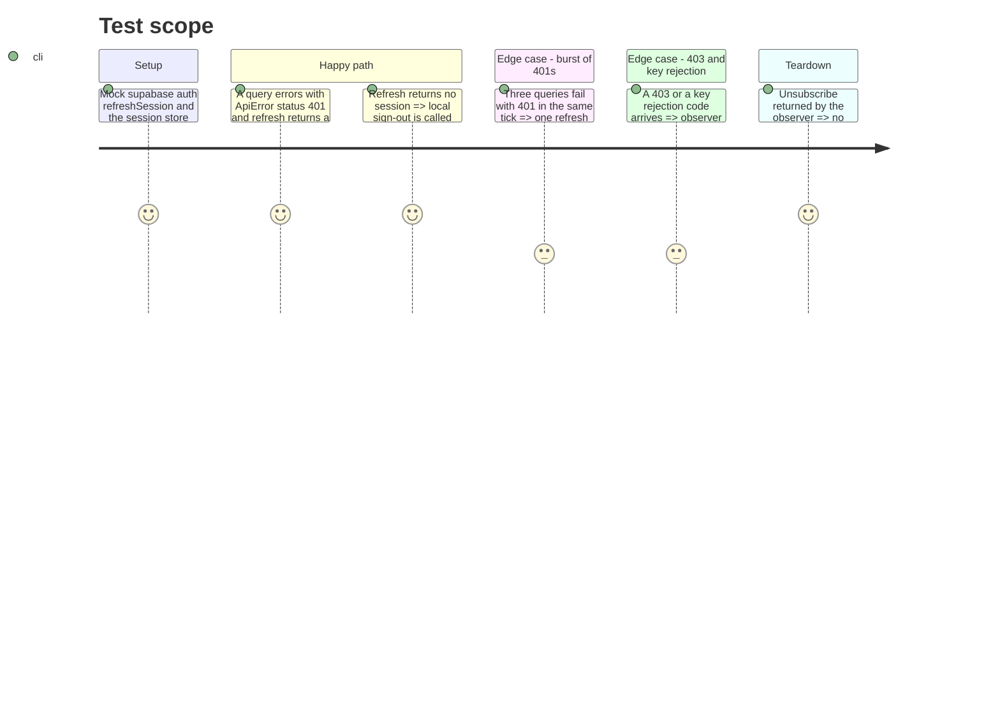

# Instruction: Dead session handling and diagnostics consent

## Architecture projection

> Tree of the final files. ✅ create · ✏️ modify · ❌ delete

```txt
android
├── docs-android
│   └── ANALYTICS.md                                  ✅ what is collected, when, the default, how to refuse
└── src
    ├── app/_layout.tsx                               ✏️ arms observeSessionRejection next to observeVaultKeyRejection
    └── core
        ├── auth
        │   ├── session-invalidation.ts               ✅ 401 observer: refresh once, then local sign-out
        │   └── session-invalidation.spec.ts          ✅
        └── observability
            └── diagnostics-consent.ts                ✏️ comment records the informed opt-out decision and points to ANALYTICS.md
```

## User Journey



## Test Scope



## Tasks to do

### `1)` `observeSessionRejection`

> A dead session lands on sign-in instead of a retry loop.

1. Create `android/src/core/auth/session-invalidation.ts` on the `key-invalidation.ts` pattern: subscribe to the query and mutation caches; on `isApiError(error) && error.status === 401`, run one in-flight `supabase.auth.refreshSession()` guarded by a shared promise.
2. Refresh with a session: `queryClient.invalidateQueries()` for the failed key only; refresh without: call the store's local sign-out (`signOutThisDevice` path) so the `SIGNED_OUT` listener tears down and, with phase 1, `index` redirects to sign-in.
3. Ignore 403 and every key rejection code (owned by `key-invalidation.ts`).
4. Arm it in `app/_layout.tsx` beside `observeVaultKeyRejection`; return the unsubscribe from the effect.
5. `session-invalidation.spec.ts` covers the Test Scope cases.

### `2)` Record the consent decision

> The presumption becomes a documented, informed opt-out.

1. Create `android/docs-android/ANALYTICS.md`: production builds only; events carry no amounts or labels (`api-error-reporting.ts` sanitizer); default on; refusal in Préférences flips the SDK `optOut` and resets it; the toggle is the single source (`diagnostics-consent.ts`).
2. Two-line comment on `diagnostics-consent.ts:22` naming the decision and the doc; no default change.

## Test acceptance criteria

| Task | Acceptance criteria                                                                                                                                                                       |
| ---- | ----------------------------------------------------------------------------------------------------------------------------------------------------------------------------------------- |
| 1    | With the session revoked from the webapp, the next Android request ends on the sign-in screen within one refresh attempt; `api-client.spec.ts` and `key-invalidation.spec.ts` stay green. |
| 2    | `ANALYTICS.md` exists and matches the code (`analytics.ts` gates, `preferences.tsx` toggle); the consent default is unchanged and its comment names the doc.                              |
