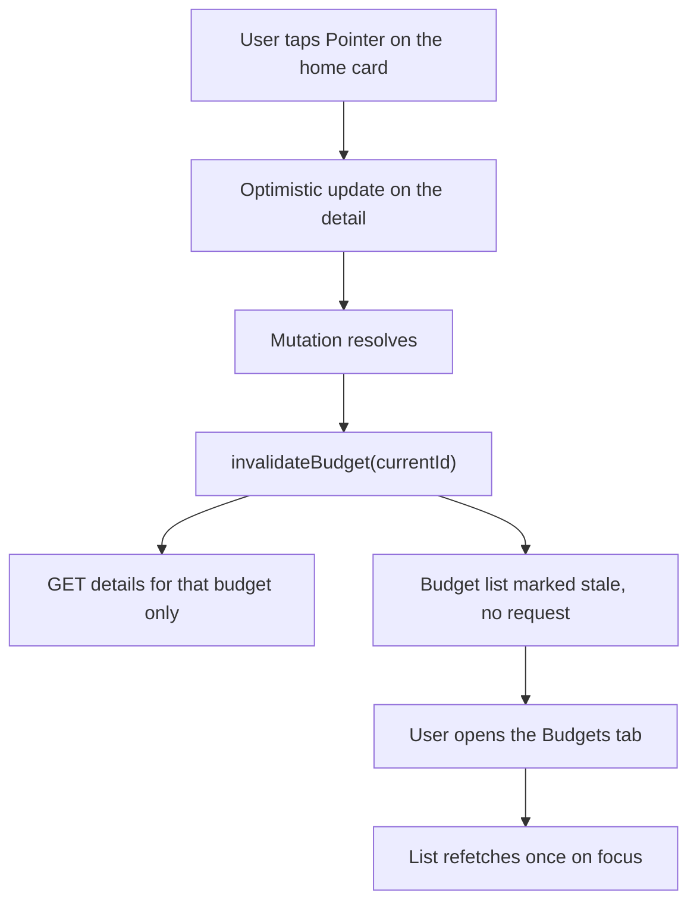
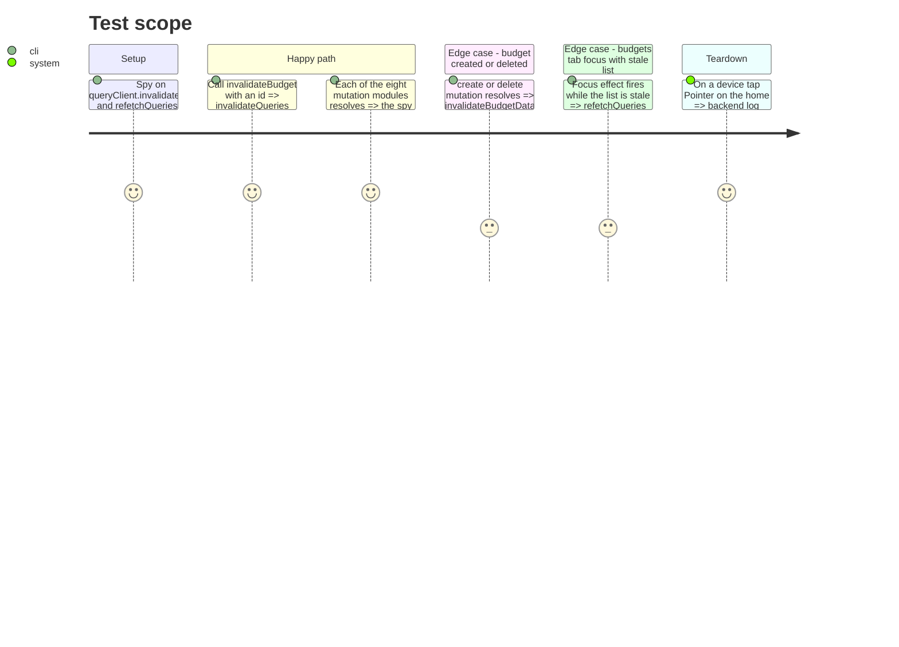

# Instruction: Targeted query invalidation

## Architecture projection

> Tree of the final files. ✅ create · ✏️ modify · ❌ delete

```txt
android/src
├── app/(main)/(tabs)/budgets.tsx                                        ✏️ refetches the stale list on focus
└── features
    ├── budgets
    │   ├── budget-queries.ts                                            ✏️ invalidateBudget(budgetId): detail active, list stale-only; sweep kept for create/delete
    │   ├── budget-queries.spec.ts                                       ✏️ key and refetchType cases
    │   └── toggle-check-mutation.ts                                     ✏️ invalidateBudget
    ├── transactions/transaction-mutations.ts                            ✏️ invalidateBudget
    ├── budget-details
    │   ├── budget-line-mutations.ts                                     ✏️ invalidateBudget
    │   ├── spread/spread-queries.ts                                     ✏️ sweep kept (a spread touches several budgets), stated in a comment
    │   └── savings-withdrawal/withdrawal-mutations.ts                   ✏️ invalidateBudget with the withdrawal's budget
    ├── tags/tag-queries.ts                                              ✏️ list stale-only plus the active detail
    ├── templates/template-queries.ts                                    ✏️ invalidateBudget when the mutation carries a budget id, else sweep
    └── savings-goals/goals-queries.ts                                   ✏️ invalidateBudget for the contributing budget, sweep on goal deletion
```

## User Journey



## Test Scope



## Tasks to do

### `1)` `invalidateBudget(budgetId)`

> One helper, two calls.

1. In `budget-queries.ts` next to `invalidateBudgetData`: `invalidateQueries({ queryKey: budgetKeys.detail(budgetId) })` plus `invalidateQueries({ queryKey: budgetKeys.list(), refetchType: "none" })`; the docblock states when the sweep still applies (create, delete, spread).
2. `budget-queries.spec.ts` asserts both calls and their `refetchType`.

### `2)` Narrow the eight call sites

> Only the budget a mutation touched refetches.

1. For each file in the projection: pass the budget id the mutation input or response already carries; keep `invalidateBudgetData()` where no single id exists (spread group, goal deletion, template mutations without a budget) and say why in one comment.
2. `toggle-check-mutation.ts` keeps its optimistic update; the settle step calls `invalidateBudget`.

### `3)` Stale list refetch on the Budgets tab

> A stale list refreshes when the user comes to it.

1. In `budgets.tsx`, `useFocusEffect` from expo-router: `queryClient.refetchQueries({ queryKey: budgetKeys.list(), stale: true })`.
2. `budgets-screen.spec.tsx`: the focus effect refetches only when stale.

## Test acceptance criteria

| Task | Acceptance criteria                                                                                                                                |
| ---- | -------------------------------------------------------------------------------------------------------------------------------------------------- |
| 1    | `invalidateBudget` invalidates the detail actively and the list stale-only; `budget-queries.spec.ts` green.                                        |
| 2    | After a pointing tap on the home, the backend log shows one `details` request and no `list` or `periods` request; every mutation spec stays green. |
| 3    | Opening the Budgets tab after a mutation shows the updated totals with one list request; the tab is silent when nothing is stale.                  |
