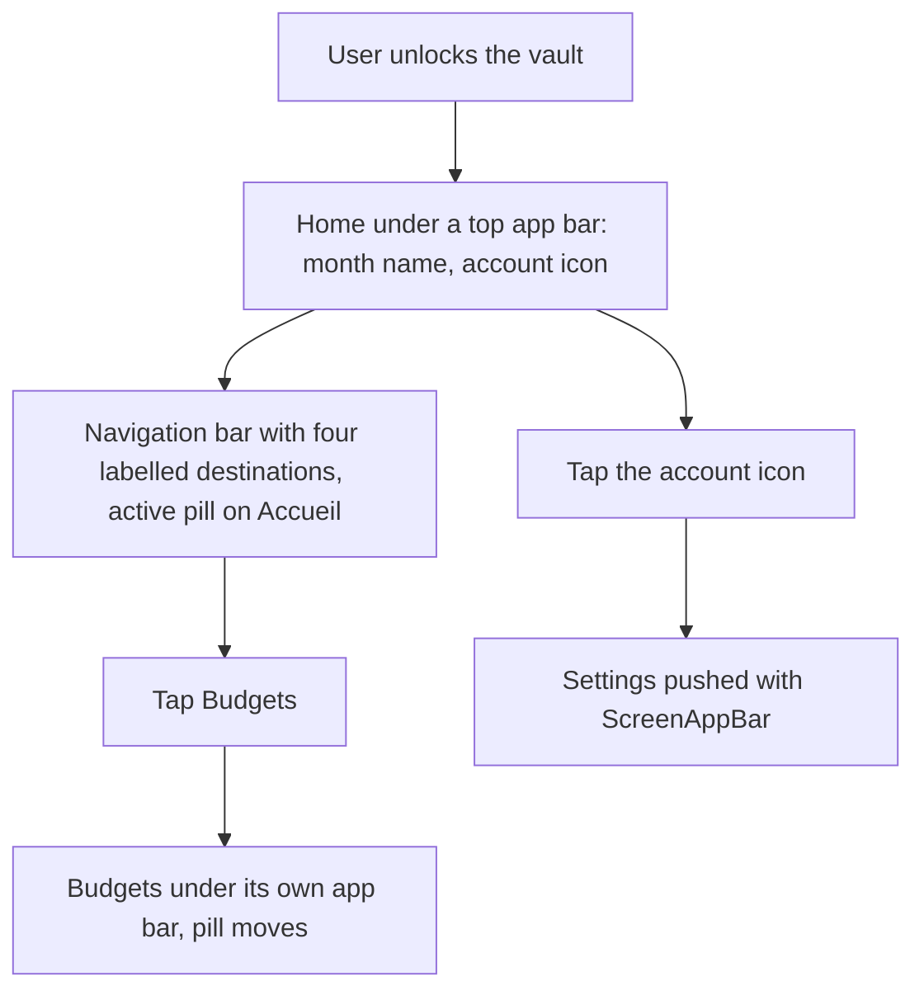
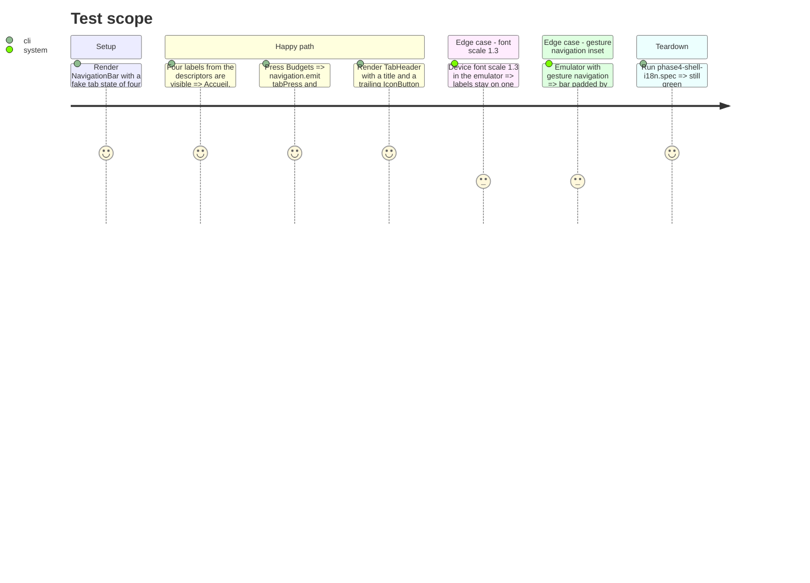

# Instruction: Material 3 shell, navigation bar and top app bar

## Architecture projection

> Tree of the final files. ✅ create · ✏️ modify · ❌ delete

```txt
android
├── DESIGN.md                                        ✏️ "Shell" section: navigation bar and top app bar come from Paper, how they are configured
└── src
    ├── app/(main)/(tabs)
    │   ├── _layout.tsx                              ✏️ tabBar={NavigationBar}; tint, style and the "would have to be our own" comment removed
    │   ├── home.tsx                                 ✏️ TabHeader with the account action replaces the headline row
    │   ├── budgets.tsx                              ✏️ TabHeader; year section headers as List.Subheader
    │   ├── goals.tsx                                ✏️ TabHeader
    │   └── templates.tsx                            ✏️ TabHeader; count label and its tooltip stay as the first content row
    ├── core/i18n/phase4-shell-i18n.spec.ts          ✏️ only if its source assertions target a prop that moved
    └── core/ui
        ├── navigation-bar.tsx                       ✅ Paper BottomNavigation.Bar adapter for the expo-router Tabs tabBar prop
        ├── navigation-bar.spec.tsx                  ✅ four tabs, press navigates, active label and icon
        ├── tab-header.tsx                           ✅ Appbar.Header (mode small, flat, background) with title and trailing slot
        └── tab-header.spec.tsx                      ✅ title and trailing action render
```

## User Journey



## Test Scope



## Wireframe

```txt
┌────────────────────────────────────────────┐
│ (1) Août 2026                          (◯) │
├────────────────────────────────────────────┤
│                                            │
│ (2) tab content, scrolls                   │
│                                            │
│                                            │
│                             ┌────────────┐ │
│                             │(3) + Ajouter│ │
│                             └────────────┘ │
├────────────────────────────────────────────┤
│ (4) ▣Accueil  ▢Budgets  ▢Objectifs ▢Modèles│
└────────────────────────────────────────────┘
```

1. Top app bar: tab title left (month name on the home, "Budgets", "Objectifs", "Modèles"), trailing slot (account icon on the home only). Flat, on `background`.
2. Content zone of the tab, unchanged in this phase.
3. FAB, unchanged, clears the bar by `FAB_CLEARANCE` and the bottom inset.
4. Material 3 navigation bar: 80 dp, four destinations, active pill in `secondaryContainer`, filled icon when active, `labelMedium` label always shown.

## Tasks to do

### `1)` `NavigationBar` on Paper `BottomNavigation.Bar`

> The tab bar reads as Material 3.

1. Create `core/ui/navigation-bar.tsx` exporting a component for the `Tabs` `tabBar` prop: `navigationState={state}`, `onTabPress={({ route, preventDefault }) => ...}` emitting `tabPress` and navigating when not prevented, `renderIcon` from a route-name map with a filled/outlined MaterialCommunityIcons pair per tab (`home-variant`/`home-variant-outline`, `calendar-month`/`calendar-month-outline`, `target` both states, `file-document`/`file-document-outline`), `getLabelText` from `descriptors[route.key].options.title`, `getAccessibilityLabel` from `options.tabBarAccessibilityLabel`, `safeAreaInsets={insets}`, `activeIndicatorStyle` on `secondaryContainer`, `shifting={false}`, `keyboardHidesNavigationBar`.
2. `(tabs)/_layout.tsx`: pass `tabBar`, remove `tabBarActiveTintColor`, `tabBarInactiveTintColor`, `tabBarStyle` and the comment; keep `title`, `tabBarAccessibilityLabel` and `sceneStyle`.
3. `navigation-bar.spec.tsx` per the Test Scope.

### `2)` `TabHeader`

> One header for the four tabs.

1. Create `core/ui/tab-header.tsx`: `Appbar.Header mode="small" elevated={false}` on `theme.colors.background`, `Appbar.Content title`, optional `trailing` node; `statusBarHeight` left to Paper.
2. Home: title = month name, trailing = the existing account `IconButton` (label and route unchanged); the headline row in `home.tsx:151-158` goes away.
3. Budgets: `TabHeader` above the `SectionList`, `ListHeaderComponent` removed; year headers become `List.Subheader`.
4. Goals and templates: `TabHeader` above their `ScrollView`; templates keeps the count label and its tooltip as the first content row.
5. `tab-header.spec.tsx` per the Test Scope.

### `3)` Record the shell in `android/DESIGN.md`

> The next contributor does not revert to stock tabs.

1. Add a "Shell" section after "Form modals": navigation bar and top app bar are Paper chrome, configured in `core/ui`; icon pairs, active pill, no elevation at rest.

## Test acceptance criteria

| Task | Acceptance criteria                                                                                                                                             |
| ---- | --------------------------------------------------------------------------------------------------------------------------------------------------------------- |
| 1    | The four tabs show an 80 dp bar with labels and an active pill; switching tabs moves the pill; `navigation-bar.spec.tsx` and `phase4-shell-i18n.spec.ts` green. |
| 2    | Every tab opens under an app bar with its title; the account icon still opens settings from the home; no `headlineSmall` title left in the four tab files.      |
| 3    | `android/DESIGN.md` describes the shell; `pnpm quality` markdown format green.                                                                                  |
| all  | Emulator at font scale 1.3 and gesture navigation: labels on one line, bar and FAB clear the inset, dark scheme has no hard-coded color.                        |
