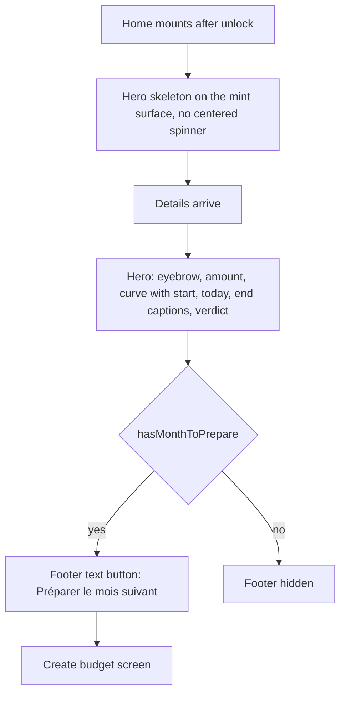
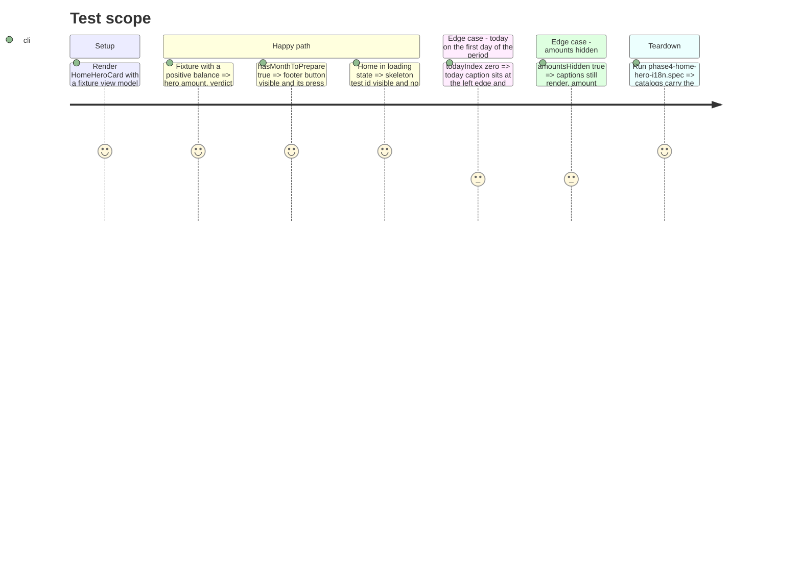

# Instruction: Home hero, chart captions, next-month action, skeleton

## Architecture projection

> Tree of the final files. ✅ create · ✏️ modify · ❌ delete

```txt
android/src
├── app/(main)/(tabs)/home.tsx                                           ✏️ HomeHeroSkeleton while loading; "Préparer le mois suivant" button removed from the page bottom
├── core/i18n
│   ├── catalogs/{fr,en,de,it}.json                                      ✏️ chart caption keys (start, today, end)
│   └── phase4-home-hero-i18n.spec.ts                                    ✏️ caption keys covered
└── features/current-month
    ├── home-screen.spec.tsx                                             ✏️ loading state expects the skeleton
    └── components
        ├── home-hero-card.tsx                                           ✏️ footer slot: next-month text button when hasMonthToPrepare
        ├── home-hero-card.spec.tsx                                      ✅ verdict, amount, footer action, pressable metrics
        ├── home-hero-skeleton.tsx                                       ✅ hero-shaped placeholder on the mint surface
        ├── balance-trajectory-chart.tsx                                 ✏️ captions row (period start, today, period end) under the canvas
        └── balance-trajectory-chart.spec.tsx                            ✅ captions and today position
```

## User Journey



## Test Scope



## Wireframe

```txt
┌────────────────────────────────────────────┐
│ (1) Août 2026                          (◯) │
├────────────────────────────────────────────┤
│ ┌────────────────────────────────────────┐ │
│ │ (2) DISPONIBLE À DÉPENSER              │ │
│ │     1 240.50                           │ │
│ │  (3) 3 à pointer ›   écart −120 ›      │ │
│ │  (4) ╭──╮__/‾‾‾\___                    │ │
│ │      25 juil.   aujourd'hui    24 août │ │
│ │  (5) Tu es dans les clous.             │ │
│ │  (6) Préparer le mois suivant ›        │ │
│ └────────────────────────────────────────┘ │
│ (7) 12 jours restants                      │
│ …content zone, phase 8…                    │
└────────────────────────────────────────────┘
```

1. Top app bar from phase 6.
2. Eyebrow and hero amount, unchanged.
3. Metrics pair, unchanged.
4. Trajectory canvas with the captions row: period start, "aujourd'hui" positioned at today's x, period end.
5. Verdict sentence, unchanged.
6. New footer slot: text button shown only when a next month can be prepared.
7. Days-remaining line, moved right under the hero.

## Tasks to do

### `1)` Chart captions

> The curve gets a scale without a Skia font.

1. In `balance-trajectory-chart.tsx`, add a row under the canvas: `labelSmall` on `onSurfaceVariant` for the period start date, "aujourd'hui" and the period end date; the today caption is absolutely positioned at the same x the canvas uses for the today marker, clamped so it never overlaps the edge captions.
2. Catalog keys in fr, en, de, it; `phase4-home-hero-i18n.spec.ts` lists them.
3. `balance-trajectory-chart.spec.tsx` per the Test Scope.

### `2)` Hero footer action

> The forward-looking action sits where the eye is.

1. `home-hero-card.tsx`: optional `onPrepareNextMonth` prop rendering a `text` `Button` with a chevron in a footer row under the verdict.
2. `home.tsx`: pass the handler when `hasMonthToPrepare`; delete the outlined button at the page bottom (`home.tsx:249-255`).
3. `home-hero-card.spec.tsx` per the Test Scope.

### `3)` Hero skeleton

> The home paints its shape before its numbers.

1. Create `home-hero-skeleton.tsx`: mint surface, `RADIUS.card`, three `surfaceVariant`-toned bars at the eyebrow, amount and chart heights, `accessibilityLabel` = the existing loading copy, no animation library.
2. `home.tsx`: render it in the loading branch instead of the centered spinner; failed and empty branches unchanged.
3. `home-screen.spec.tsx`: loading case expects the skeleton.

## Test acceptance criteria

| Task | Acceptance criteria                                                                                                                       |
| ---- | ----------------------------------------------------------------------------------------------------------------------------------------- |
| 1    | Captions show start, today and end under the curve in the four languages; today sits at the marker's x; the Skia canvas draws no text.    |
| 2    | With a month to prepare, the hero footer opens the create-budget screen; without, no footer; the page bottom holds no outlined button.    |
| 3    | The loading home shows a hero-shaped placeholder and no `ActivityIndicator`; screen readers announce the loading label.                   |
| all  | Emulator, light and dark: hero contrast unchanged (`HOME_HERO_COLORS`), captions legible at font scale 1.3, `home-screen.spec.tsx` green. |
