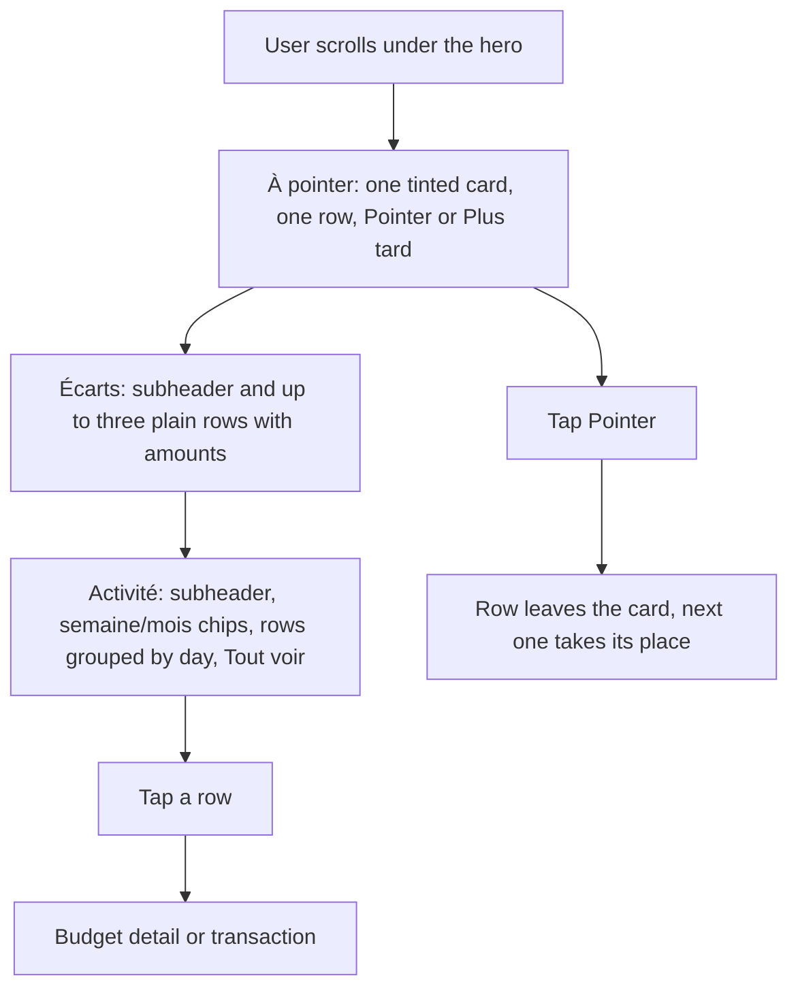
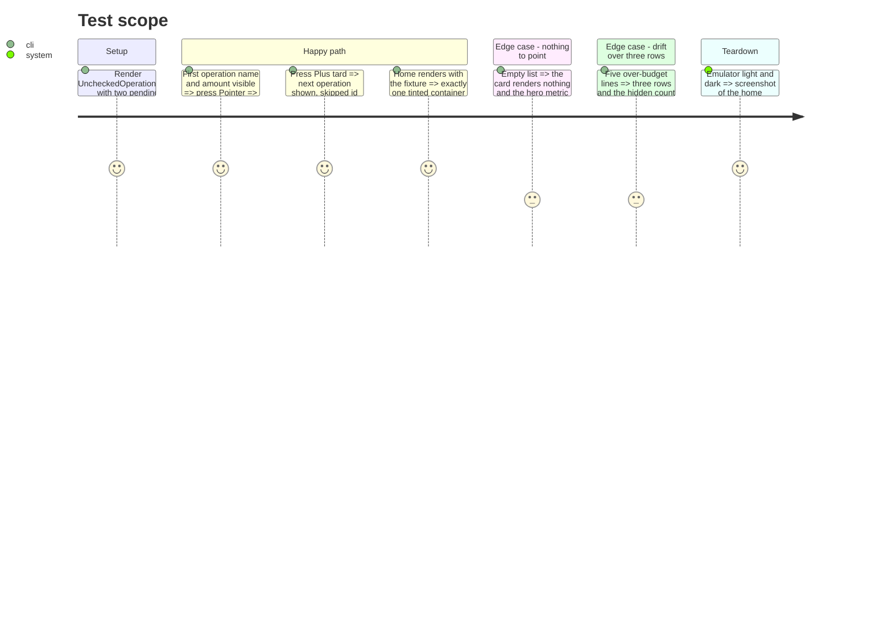

# Instruction: Home content zone, one tonal card and list rows

## Architecture projection

> Tree of the final files. ✅ create · ✏️ modify · ❌ delete

```txt
android/src
├── app/(main)/(tabs)/home.tsx                                           ✏️ content order and spacing; sections on background, no wrappers
└── features/current-month
    ├── home-screen.spec.tsx                                             ✏️ Paper mock covers List.Item and List.Subheader
    └── components
        ├── unchecked-operations-card.tsx                                ✏️ the single tonal card (secondaryContainer), heading inside, two buttons
        ├── unchecked-operations-card.spec.tsx                           ✅ confirm, later, rotation, empty
        ├── drift-card.tsx                                               ✏️ List.Subheader + up to three List.Item rows on background, track under the row
        ├── activity-card.tsx                                            ✏️ List.Subheader with net amount + chip rail + List.Item rows grouped by day
        └── savings-done-card.tsx                                        ✏️ one List.Item row with leading check disc and chevron
```

## User Journey



## Test Scope



## Wireframe

```txt
┌────────────────────────────────────────────┐
│ …hero, phase 7…                            │
│ (1) 12 jours restants                      │
│ ┌────────────────────────────────────────┐ │
│ │ (2) À POINTER · 3                      │ │
│ │  ◎ Loyer               1 450.00        │ │
│ │    Récurrent · 1 août                  │ │
│ │       [ Plus tard ]  [ Pointer ]       │ │
│ └────────────────────────────────────────┘ │
│ (3) ÉCARTS                                 │
│  Courses            +80.00  ▂▂▂▂▂▂▂▂▂▂▂    │
│  Sorties            +40.00  ▂▂▂▂▂▂▂▂       │
│ (4) ACTIVITÉ                     −320.00   │
│  [Semaine] [Mois]              Tout voir › │
│  Aujourd'hui                               │
│  ◎ Migros              −42.30              │
│  ◎ Salaire           +5 200.00             │
│  Hier                                      │
│  ◎ CFF                 −12.00              │
│                                    (+)     │
├────────────────────────────────────────────┤
│ ▣Accueil   ▢Budgets  ▢Objectifs ▢Modèles   │
└────────────────────────────────────────────┘
```

1. Days-remaining line under the hero (moved in phase 7).
2. The single tonal card: `secondaryContainer`, heading with the count inside, one operation row, `contained-tonal` "Pointer" and `text` "Plus tard".
3. Écarts: `List.Subheader`, up to three `List.Item` rows on `background`, trailing over-by amount in `hero.drift`, track bar as the row description; hidden count line when capped.
4. Activité: `List.Subheader` with the net amount at the right, `FilterChip` rail plus "Tout voir", day labels as `List.Subheader`, `List.Item` rows with `IconDisc` leading and the amount trailing; hairline `Divider` between rows only.

## Tasks to do

### `1)` `UncheckedOperationsCard` becomes the one tonal card

> After the hero, the eye lands on the one action.

1. Surface `secondaryContainer`, `RADIUS.card`, heading moved inside as an `Eyebrow`-style label with the count; keep `IconDisc`, `Amount`, the two buttons, haptics, `skippedIds` rotation and `reminders.offer()`.
2. Remove the outer `titleSmall` heading and the `surfaceVariant` pane.
3. `unchecked-operations-card.spec.tsx` per the Test Scope.

### `2)` Écarts and épargne as rows

> Secondary information stops competing with the action.

1. `drift-card.tsx`: `List.Subheader` + `List.Item` per line (`title` name, `description` renders the track bar, `right` the over-by `Amount`), `Divider` between rows, hidden-count line kept; no tinted wrapper.
2. `savings-done-card.tsx`: one `List.Item` with `IconDisc check` leading, chevron right, same `onPress`.

### `3)` Activité as rows

> The activity reads as a Material list.

1. `activity-card.tsx`: `List.Subheader` row holding the title and the net `Amount size="meta"`; keep the `FilterChip` rail and "Tout voir"; day groups as `List.Subheader`; rows as `List.Item` with `IconDisc` leading, tags text in `description`, `Amount` trailing; empty state row unchanged; no `surfaceVariant` rows container.
2. `home.tsx`: order below the hero becomes days remaining, À pointer, Écarts or Épargne faite, Activité (the tooltip `checking` stays on the pointing card); content gap `SPACING.md` between sections, `SPACING.xs` between subheader and rows; `home-screen.spec.tsx` Paper mock extended with `List.Item` and `List.Subheader`.

## Test acceptance criteria

| Task | Acceptance criteria                                                                                                                                                        |
| ---- | -------------------------------------------------------------------------------------------------------------------------------------------------------------------------- |
| 1    | Below the hero exactly one tinted container exists; Pointer and Plus tard behave as before (haptics, rotation, reminder offer); spec green.                                |
| 2    | Drift and savings-done render as rows on the page background with dividers; over-by amounts keep `hero.drift`; the three-row cap and hidden count hold.                    |
| 3    | Activity rows group by day with subheaders, chips filter week/month, "Tout voir" navigates; `home-screen.spec.tsx` green; no `surfaceVariant` left in the four components. |
| all  | Emulator light and dark, font scale 1.0 and 1.3: layout matches the wireframe, 48 dp targets kept, TalkBack reads each row's name and amount.                              |
