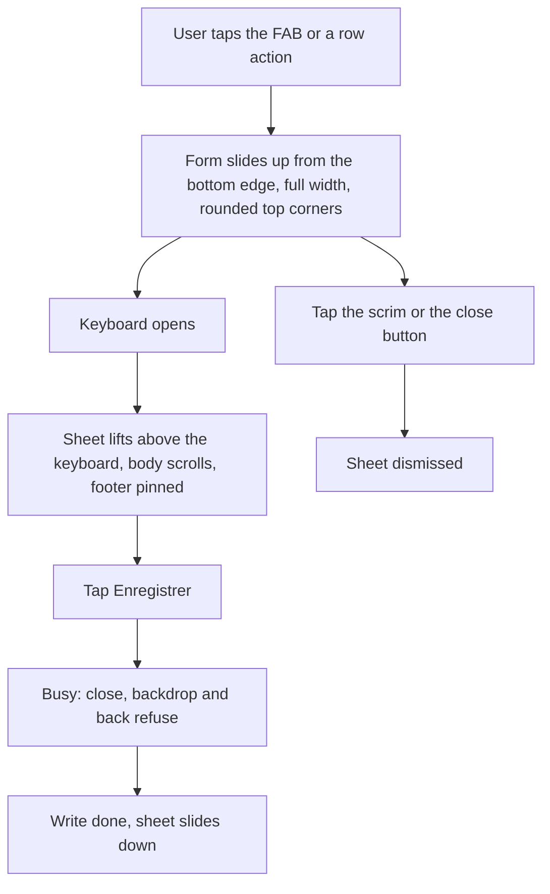
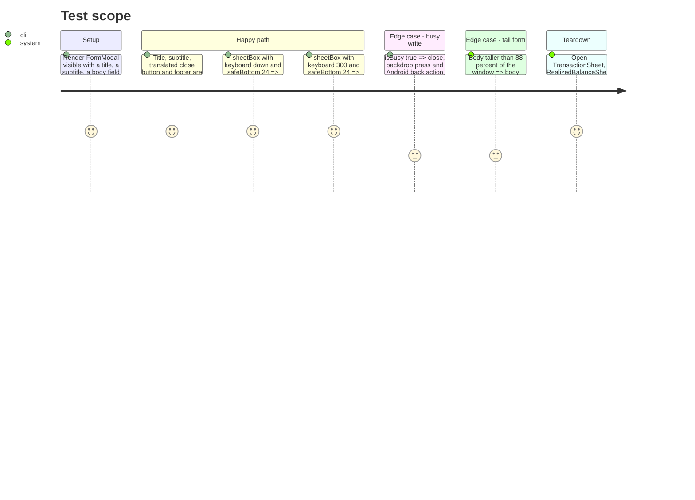

# Instruction: Bottom-anchored form modal

## Architecture projection

> Tree of the final files. ✅ create · ✏️ modify · ❌ delete

```txt
android
├── DESIGN.md                                  ✏️ "Form modals" section rewritten: bottom-anchored, top radii, still no gesture or sheet dependency
└── src/core/ui
    ├── sheet.tsx                              ✏️ backdrop flex-end, full width, top radii, slide animation, safe-bottom padding when the keyboard is down
    ├── sheet.spec.ts                          ❌ source-text spec
    ├── sheet.spec.tsx                         ✅ RNTL render: title, close, footer, busy blocks dismissal, back action
    ├── keyboard-inset.ts                      ✏️ sheetBox also returns the bottom padding to apply inside the sheet
    └── keyboard-inset.spec.ts                 ✏️ keyboard up and down cases
```

## User Journey



## Test Scope



## Wireframe

```txt
┌────────────────────────────────────────────┐
│ (1) scrim                                  │
│                                            │
│                                            │
│ ╭────────────────────────────────────────╮ │
│ │ (2) Nouvelle dépense                 ✕ │ │
│ │     Août 2026                          │ │
│ │ (3) [ Montant                    CHF ] │ │
│ │     [ Libellé                        ] │ │
│ │     [ Date                        ▾  ] │ │
│ │     …scrolls when taller…              │ │
│ ├────────────────────────────────────────┤ │
│ │ (4)           [ Annuler ] [Enregistrer]│ │
│ ╰────────────────────────────────────────╯ │
└────────────────────────────────────────────┘
```

1. Scrim over the page; tap dismisses unless a write is pending.
2. Header: title, optional subtitle, translated close button; top corners `RADIUS.md`, no drag handle.
3. Body: the form, scrolls inside the height cap (88 percent of the window minus keyboard).
4. Footer pinned above the keyboard, or above the navigation bar inset when the keyboard is down.

## Tasks to do

### `1)` Anchor `FormModal` to the bottom

> The form reads as a Material modal, not an alert.

1. `sheet.tsx`: backdrop `justifyContent: "flex-end"`, sheet `marginHorizontal: 0`, `borderTopLeftRadius`/`borderTopRightRadius: RADIUS.md`, bottom radii 0, `animationType="slide"`; header, body `ScrollView`, pinned footer, `isBusy` gating and the back handler unchanged.
2. Keep `statusBarTranslucent` and the `transparent` native `Modal`; no new dependency.

### `2)` Bottom padding when the keyboard is down

> The footer never sits on the gesture pill.

1. `keyboard-inset.ts`: `sheetBox` returns `{ maxHeight, marginBottom, paddingBottom }` where `paddingBottom = keyboardHeight === 0 ? safeBottom : 0` and `marginBottom` stays `keyboardHeight + safeBottom` while the keyboard is up; docblock updated for the bottom-anchored case.
2. `sheet.tsx` applies `paddingBottom` inside the sheet surface so its color runs under the navigation bar (edge to edge).
3. `keyboard-inset.spec.ts` covers both cases.

### `3)` Render spec and design record

> The modal is tested by what it renders and documented by what it is.

1. Replace `sheet.spec.ts` with `sheet.spec.tsx` (RNTL) per the Test Scope; the source-text assertions about the close label and `isBusy` become render assertions.
2. Rewrite `android/DESIGN.md:81-89`: bottom-anchored `FormModal`, top radii only, slide, keyboard inset kept, still not a bottom sheet (no handle, no swipe, no `@gorhom/bottom-sheet`) and why.

## Test acceptance criteria

| Task | Acceptance criteria                                                                                                                            |
| ---- | ---------------------------------------------------------------------------------------------------------------------------------------------- |
| 1    | Every `FormModal` consumer opens from the bottom edge, full width, rounded top corners; busy state still refuses close, scrim and back.        |
| 2    | Keyboard down: footer clears the navigation bar inset; keyboard up: sheet bottom sits on the keyboard top; `keyboard-inset.spec.ts` green.     |
| 3    | `sheet.spec.tsx` renders and passes; `sheet.spec.ts` is gone; `android/DESIGN.md` describes the bottom-anchored modal and the kept exclusions. |
| all  | Emulator with gesture navigation, light and dark: the three home sheets and one detail-screen sheet match the wireframe at font scale 1.3.     |
