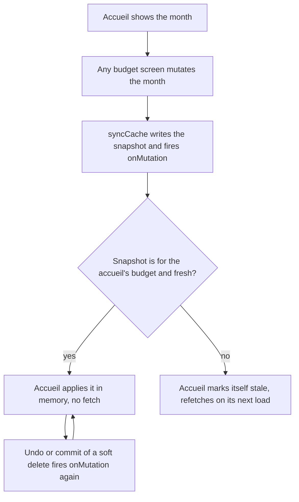
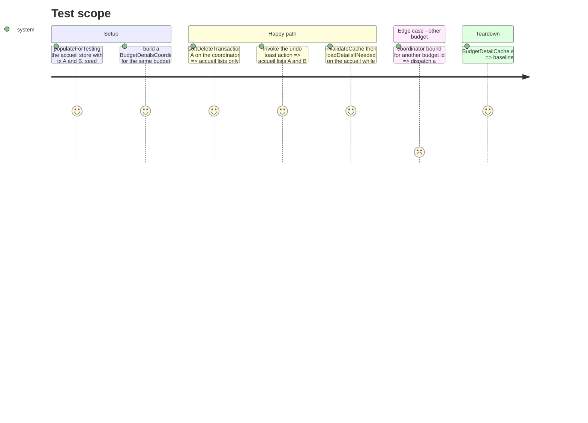

# Instruction: Accueil adopts the shared detail snapshot

## Architecture projection

> Tree of the final files. ✅ create · ✏️ modify · ❌ delete

```txt
.
└── ios
    ├── Pulpe
    │   ├── Domain/Store/CurrentMonthStore.swift                                   ✏️ adopt a fresh BudgetDetailCache entry in loadDetails() and on demand; keep history; store-write split from apply
    │   └── Features/Budgets/BudgetDetails/Coordinator/BudgetDetailsCoordinator+Mutations.swift ✏️ bind(): onMutation adopts the snapshot on the accueil instead of only invalidating it
    └── PulpeTests/Domain/Store/CurrentMonthStoreSharedSnapshotTests.swift          ✅ soft delete / undo / unwind refresh seen from the accueil, no network
```

## User Journey



## Test Scope



## Tasks to do

### `1)` Adopt the shared snapshot in `CurrentMonthStore`

> The accueil trusts a fresh `BudgetDetailCache` entry for its own budget before it trusts a fetch.

1. Split `applyDetails(_:)` into the in-memory apply and the `BudgetDetailCache.store` write, so adopting a cached entry does not refresh the entry's `fetchedAt`.
2. Add `adoptSharedSnapshotIfFresh() -> Bool`: `BudgetDetailCache.shared.get(budgetId:)` for `budget?.id`; on a hit, apply it keeping the current `history` (the cache carries none), set `lastLoadTime`, return true; otherwise `invalidateCache()` and return false.
3. In `loadDetails()`, after the `budget` guard and before `getBudgetWithDetails`, return early when `adoptSharedSnapshotIfFresh()` succeeds. `forceRefresh` keeps hitting the network.
4. Doc comment on the method: why the cache wins during the undo window (server keeps the row until the toast commits) and the 30 s cross-device lag it accepts, same as the budget page.

### `2)` Fire the adoption from the mutation seam

> One fact, stated once: a detail mutation happened, the accueil takes the snapshot.

1. In `BudgetDetailsCoordinator.bind(...)`, replace `currentMonthStore.invalidateCache()` by `_ = currentMonthStore.adoptSharedSnapshotIfFresh()` (the method already falls back to invalidation).
2. Update the comment above it: adoption covers undo, commit rollback and cross-month spreads (the latter wipe the cache, so the accueil refetches).

### `3)` Tests

> Prove the three moments of a soft delete as the accueil sees them, without a server.

1. New `PulpeTests/Domain/Store/CurrentMonthStoreSharedSnapshotTests.swift`, `@Suite(.serialized) @MainActor`, following `CrossStoreSyncTests` (seed via `cache.store`, `populateForTesting`, `coordinator.bind`).
2. Cases per the Test Scope: delete hides the row, undo restores it (`ToastManager` injected in the `ToastContext`, call `currentToast?.undoAction`), unwind refresh keeps the adopted rows, other budget still invalidates.
3. Keep `CrossStoreSyncTests.invalidateCache_makesNextLoadDetailsIfNeededRefetch` green: with no fresh entry the behavior is unchanged.

## Test acceptance criteria

| Task | Acceptance criteria                                                                                                                                              |
| ---- | ---------------------------------------------------------------------------------------------------------------------------------------------------------------- |
| 1    | After a coordinator soft-deletes a row of the accueil's budget, `CurrentMonthStore.transactions` no longer contains it and `error` stays nil, with no fetch made. |
| 1    | After `invalidateCache()` + `loadDetailsIfNeeded()` with a fresh cache entry, rows come from the entry and `history` is unchanged.                                |
| 2    | Undoing from the toast restores the row on the accueil without any navigation or fetch.                                                                          |
| 2    | A mutation on another budget leaves the accueil rows untouched and stale, as today.                                                                              |
| 3    | `xcodebuild test -scheme PulpeLocal -only-testing:PulpeTests/CurrentMonthStoreSharedSnapshotTests` passes; `CrossStoreSyncTests` still pass.                     |
