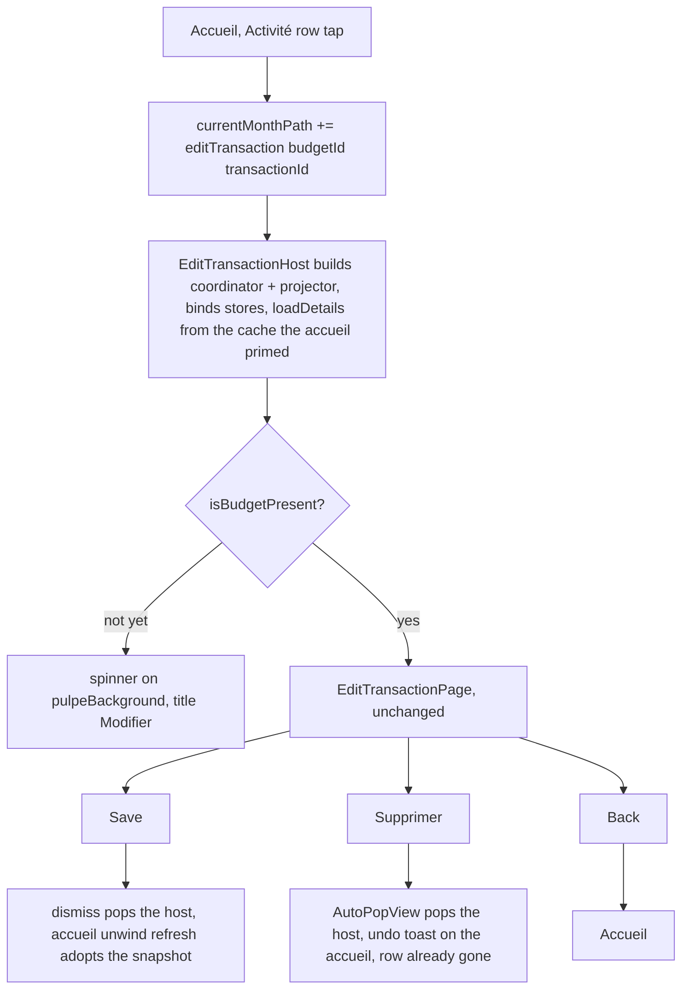
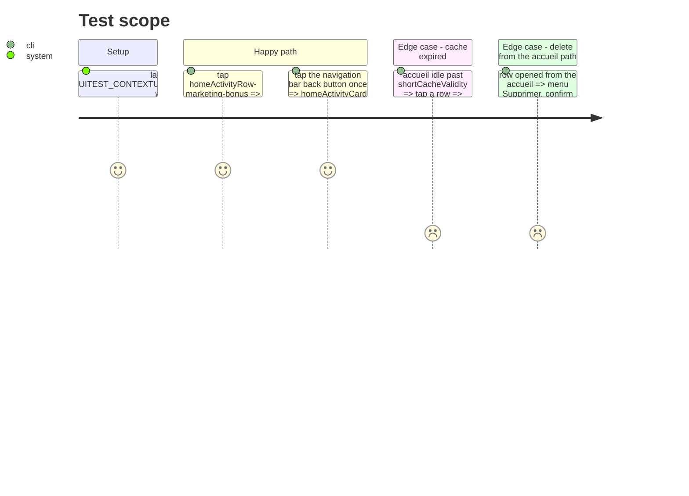

# Instruction: Direct route from the accueil to the operation's page

## Architecture projection

> Tree of the final files. ✅ create · ✏️ modify · ❌ delete

```txt
.
└── ios
    ├── Pulpe
    │   ├── App
    │   │   ├── AppState.swift                                             ✏️ drop pendingTransactionEdit (handoff no longer exists)
    │   │   ├── AppState+Navigation.swift                                  ✏️ BudgetDestination.editTransaction(budgetId:transactionId:)
    │   │   └── MainTabView.swift                                          ✏️ resolve the new case in budgetDestination(_:) and in BudgetsTab's switch
    │   ├── Features/CurrentMonth/CurrentMonthView.swift                   ✏️ editTransaction pushes the new destination; comment says Back = accueil
    │   └── Features/Budgets/BudgetDetails
    │       ├── EditTransactionHost.swift                                  ✅ owns coordinator + projector, binds stores, loads from cache, gates on isBudgetPresent, hosts the page and its sheet slot
    │       ├── BudgetDetailsView.swift                                    ✏️ .task no longer calls pushPendingTransactionEdit(); sheet renders BudgetDetailSheetContent with the coordinator in its environment
    │       ├── BudgetDetailsView+Routing.swift                            ✏️ remove pushPendingTransactionEdit() and the moved sheet builders; keep pushDestination(for:) and toastContext
    │       └── Routing/BudgetDetailSheetContent.swift                     ✅ the sheetContent(for:) switch and its two private builders, as one view reading coordinator/router/settings/appState from the environment
    └── PulpeUITests/ContextualCreationUITests.swift                       ✏️ the row test also taps Back and expects the accueil card
```

## User Journey



## Test Scope



## Wireframe

```txt
┌──────────────────────────────────────┐
│ (1) ‹ Août            Modifier     ⋯ │
├──────────────────────────────────────┤
│ (2) form of the existing page        │
│     name · amount · kind · date      │
│     tags                             │
│                                      │
│     (2') while the snapshot loads:   │
│          centered spinner, same bg   │
├──────────────────────────────────────┤
│ (3) [ Enregistrer ]                  │
└──────────────────────────────────────┘
```

1. Navigation bar: Back carries the accueil's title (its month), the `⋯` menu keeps delete / report / spread.
2. Body: `EditTransactionPage` untouched; (2') is the host's only own UI, shown only when the cache expired.
3. Sticky CTA of the existing page.

## Tasks to do

### `1)` Destination and push

> One typed value carries both ids; the handoff through `AppState` disappears.

1. `AppState+Navigation.swift`: add `case editTransaction(budgetId: String, transactionId: String)` to `BudgetDestination`.
2. `MainTabView.budgetDestination(_:)` and `BudgetsTab`'s switch: return `EditTransactionHost(budgetId:transactionId:)` (BudgetsTab passes its injected services, like it does for `BudgetDetailsView`).
3. `CurrentMonthView.editTransaction`: `appState.currentMonthPath.append(BudgetDestination.editTransaction(...))`; rewrite the doc comment (Back returns here).
4. Delete `AppState.pendingTransactionEdit`, `BudgetDetailsView+Routing.pushPendingTransactionEdit()` and its call in `BudgetDetailsView`'s `.task`.

### `2)` Shared sheet content

> One switch for the budget page and the host.

1. New `Routing/BudgetDetailSheetContent.swift`: `struct BudgetDetailSheetContent: View { let destination: BudgetDetailDestination }` reading `BudgetDetailsCoordinator`, `BudgetDetailsRouter`, `UserSettingsStore`, `AppState` from the environment; move `sheetContent(for:)`, `addBudgetLineSheet`, `editBudgetLineSheet(for:)` and a local `toastContext` into it, bodies unchanged.
2. `BudgetDetailsView`: `.sheet(item: $router.sheet) { BudgetDetailSheetContent(destination: $0).environment(coordinator) }`.
3. `BudgetDetailsView+Routing.swift` keeps `toastContext`, `handlePointGesture`, `pushDestination(for:)`.

### `3)` The host

> Supplies what `BudgetDetailsView` supplied, nothing more.

1. New `EditTransactionHost.swift` in the feature folder (≤ 350 LOC rule): `init(budgetId:transactionId:budgetService:budgetLineService:)` building `BudgetDetailsCoordinator` and `BudgetDetailsProjector` exactly like `BudgetDetailsView.init`.
2. Body: `if projector.screenState.isBudgetPresent { EditTransactionPage(transactionId:) } else if errorIsTerminal { ErrorView(retry: loadDetails) } else { ProgressView on pulpeBackground, localizedNavigationTitle Modifier }`, then `.environment(coordinator).environment(projector)`, `.sheet(item: $router.sheet) { BudgetDetailSheetContent(destination: $0).environment(coordinator) }`.
3. `.task(id: budgetId)`: `coordinator.bind(budgetListStore:dashboardStore:currentMonthStore:savingsGoalStore:)` (rule 11), then `await coordinator.dispatch(.loadDetails(force: false))` (cache hit primed by the accueil, network only when expired), then `tagStore.loadIfNeeded(for: screenState.referencedTagIds)`.
4. Doc comment: why the gate exists (`AutoPopView` dismisses after `autoPopGraceMs` when the transaction is not in the store yet) and why the host owns its own coordinator.
5. No `trackScreen("BudgetDetails")`: the budget page is not shown on this path.

### `4)` UI test

> The behavior that changed, asserted end to end.

1. Rename `testTappingAnActivityRowOpensItsEditPage` to `testTappingAnActivityRowOpensItsEditPageAndBackReturnsToTheAccueil`; after the Modifier bar exists, tap `app.navigationBars.firstMatch.buttons.element(boundBy: 0)` and assert `app.otherElements["homeActivityCard"]` (or the row button) `waitForExistence(timeout: 5)`.
2. Run on the 'Pulpe Tests' simulator only: `xcodebuild test -scheme PulpeUITests -only-testing:PulpeUITests/ContextualCreationUITests/<name>`.

## Test acceptance criteria

| Task | Acceptance criteria                                                                                                                                                       |
| ---- | ------------------------------------------------------------------------------------------------------------------------------------------------------------------------- |
| 1    | Tapping an Activité row shows exactly one push animation ending on « Modifier »; one Back lands on the accueil.                                                            |
| 1    | No reference to `pendingTransactionEdit` remains in `ios/`.                                                                                                               |
| 2    | Every sheet reachable from the budget page still opens (add line, edit line, previous budget, realized balance, spread occurrences, spread existing, savings withdrawal). |
| 3    | From the accueil path: « Lisser » and the occurrences affordance open their sheets; saving pops to the accueil with the toast « Modifié » and the edited values visible.   |
| 3    | Deleting pops to the accueil with the row absent and the « Annuler » toast; undo brings the row back on the accueil (phase 1).                                             |
| 3    | With an expired cache the host shows a spinner then the page; it never pops on its own.                                                                                   |
| 4    | The renamed UI test passes on 'Pulpe Tests'; `HomeActivityCardArchitectureTests` and `BudgetDetailsArchitectureTests` (≤ 350 LOC) stay green; `swiftlint --strict` clean. |
