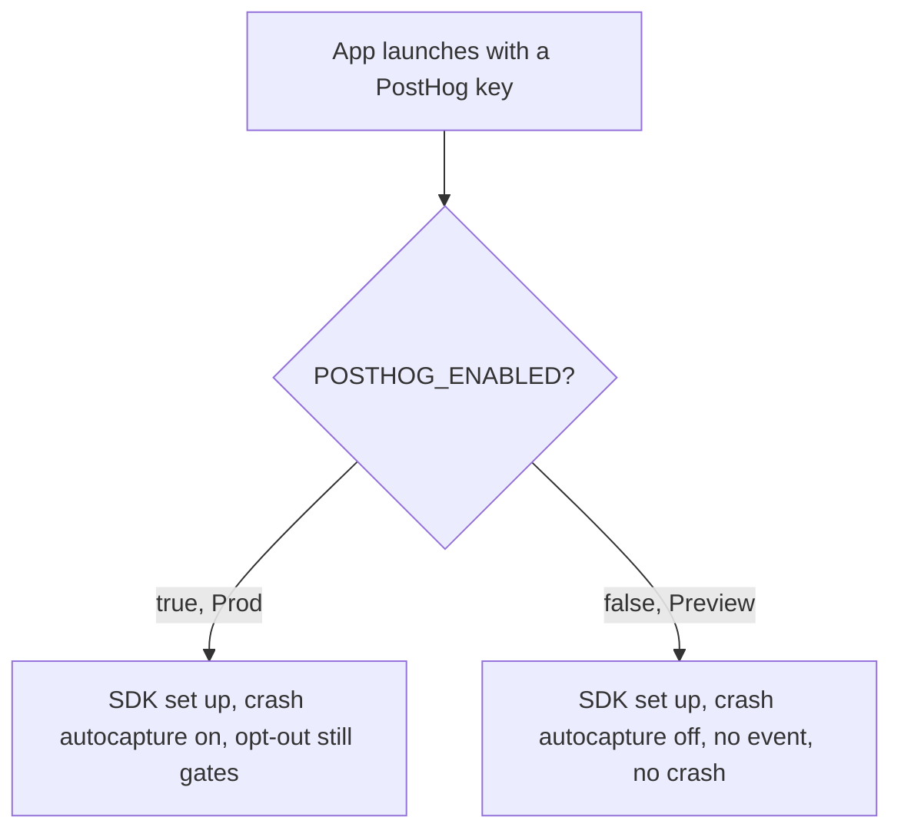
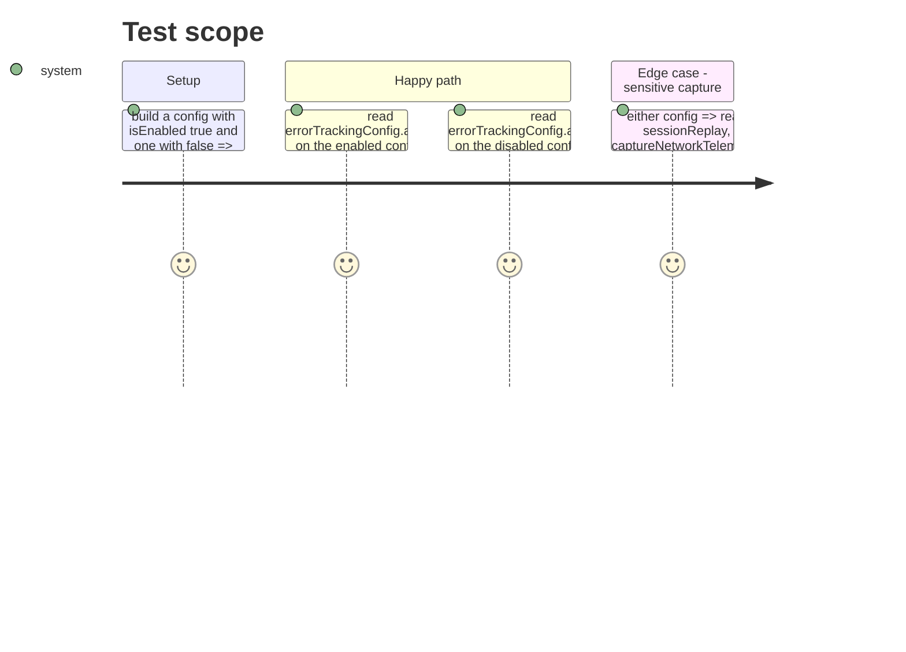

# Instruction: preview-builds-send-no-crash

## Architecture projection

> Tree of the final files. ✅ create · ✏️ modify · ❌ delete

```txt
ios/Pulpe/Core/Analytics/AnalyticsService.swift            ✏️ `makeConfig(apiKey:host:isEnabled:)`; `errorTrackingConfig.autoCapture = isEnabled`; `initialize()` passes `isConfiguredEnabled`
ios/PulpeTests/Core/Analytics/AnalyticsServiceTests.swift  ✏️ the config test covers both values of `isEnabled`
```

## User Journey



## Test Scope



## Tasks to do

### `1)` Gate autocapture on the configured switch

> Preview carries the production key with `POSTHOG_ENABLED = false` and must send nothing, crashes included.

1. `makeConfig(apiKey:host:isEnabled:)`, `config.errorTrackingConfig.autoCapture = isEnabled`; update the comment to say the config switch and the opt-out both gate it.
2. `initialize()` passes `isConfiguredEnabled`.

### `2)` Test both values

> The existing config test only proves the enabled shape.

1. `postHogConfig_capturesCrashesOnlyWhenEnabled`: `isEnabled: true` → `autoCapture == true`; `isEnabled: false` → `autoCapture == false`; the four sensitive flags false in both.

## Test acceptance criteria

| Task | Acceptance criteria                                                                                                  |
| ---- | -------------------------------------------------------------------------------------------------------------------- |
| 1    | `makeConfig(..., isEnabled: false)` yields `errorTrackingConfig.autoCapture == false`; `initialize()` passes the configured switch |
| 2    | `AnalyticsServiceTests` asserts both values and stays green in `PulpeTests`                                          |
