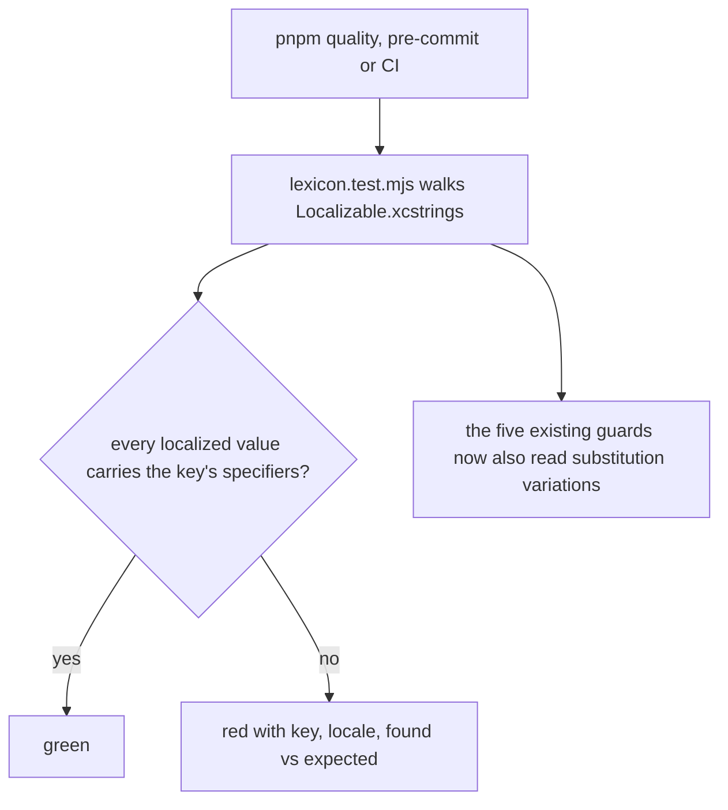
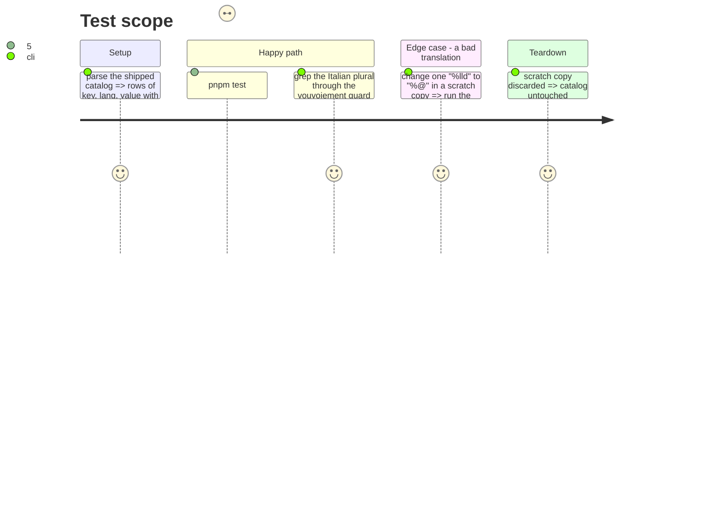

# Instruction: catalog-parity-in-the-lexicon-guard

## Architecture projection

> Tree of the final files. ✅ create · ✏️ modify · ❌ delete

```txt
.github/scripts/lexicon.test.mjs                          ✏️ `stringUnits` descends into `substitutions`; new `iosFormats()` (substitution-aware, `%arg` → `%<formatSpecifier>`, top-level `%#@name@` skipped); new test "chaque traduction iOS garde les spécificateurs de sa clé" with a non-zero row assertion
ios/PulpeTests/Resources/LocalizableCatalogTests.swift     ❌ superseded by the lexicon guard (then `xcodegen generate --use-cache`)
```

## User Journey



## Test Scope



## Tasks to do

### `1)` Teach the walker substitutions

> A node with both `stringUnit` and `substitutions` returned only `%#@digits@`; the two Italian sentences were invisible to all five guards.

1. `stringUnits`: when the node has `substitutions`, return its own unit plus the units under each substitution's `variations`.

### `2)` Specifier parity, pre-commit

> `%@` for `%lld` is a segfault in `String(localized:)`; the compiler accepts it.

1. `specifiers(format)`: strip `%%`, match `/%(?:\d+\$)?(lld|ld|d|@|f|s|u)/g`, keep the type, sort.
2. `iosFormats()`: per key and localization, the `stringUnit` values of the node (variations included) unless the node has `substitutions`, in which case the substitution variations with `%arg` replaced by `%<formatSpecifier>` and the top-level `%#@…@` value skipped.
3. Test: every row's specifiers equal the key's; `assert.ok(rows.length > 1000)` so a shape change cannot pass on zero rows; failure message lists `key [lang]: found vs expected`.

### `3)` Delete the Swift suite

> One walker, one place.

1. `trash ios/PulpeTests/Resources/LocalizableCatalogTests.swift`, `xcodegen generate --use-cache`, `PulpeTests` still green.

## Test acceptance criteria

| Task | Acceptance criteria                                                                                                              |
| ---- | -------------------------------------------------------------------------------------------------------------------------------- |
| 1    | The values walked for `%lld chiffres sur %lld saisis` / `it` include "cifra" and "cifre"                                          |
| 2    | `pnpm test:lexicon` is green on the shipped catalog and turns red on a copy where one `%lld` became `%@`, naming key and locale   |
| 3    | No `LocalizableCatalogTests` in the tree; `PulpeTests` passes                                                                     |
