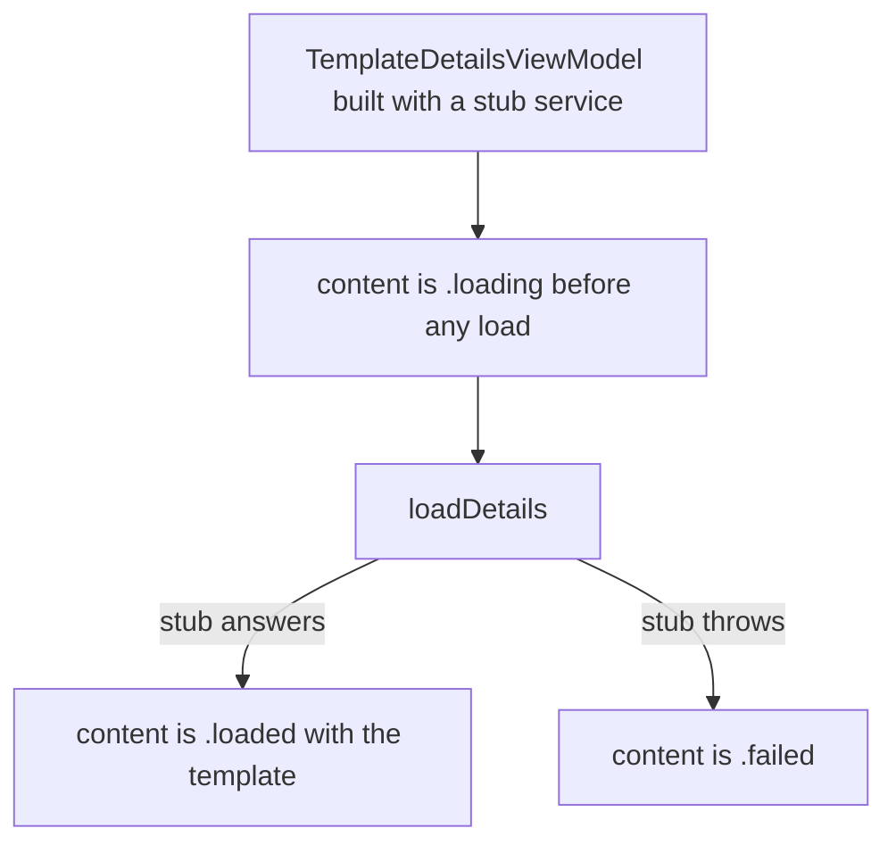
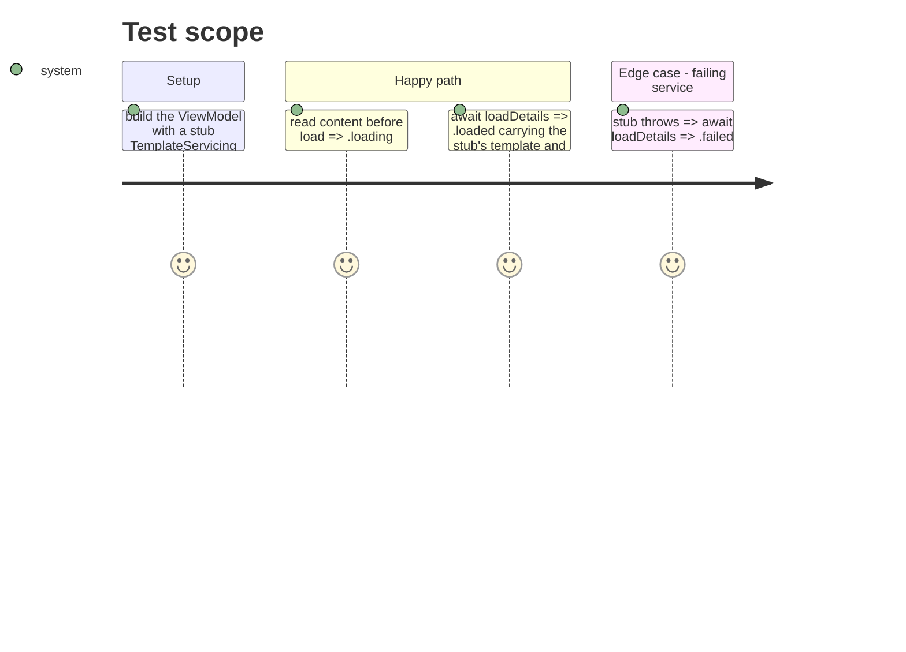

# Instruction: template-page-cold-load-through-seam

## Architecture projection

> Tree of the final files. ✅ create · ✏️ modify · ❌ delete

```txt
ios/PulpeTests/Features/Templates/TemplateDetails/TemplateDetailsViewModelTests.swift  ✅ stub `TemplateServicing`; cold → `.loading`, after `loadDetails()` → `.loaded`, throwing stub → `.failed`
ios/Pulpe/Features/Templates/TemplateDetails/TemplateDetailsView.swift                  ✏️ `Content: Equatable` (case-wise; `failed` compares `localizedDescription`); animation keyed on `viewModel.content`
ios/Pulpe/Features/Budgets/BudgetDetails/BudgetDetailsView.swift                        ✏️ one comment on the `terminalError ??` fallback stating the projector invariant
ios/Pulpe/Features/Budgets/BudgetDetails/EditTransactionHost.swift                      ✏️ same comment
```

## User Journey



## Test Scope



## Tasks to do

### `1)` The seam gets its test

> The protocol exists so a test can drive the page without the network; the test was never written.

1. Stub struct in the test file: returns a fixed `BudgetTemplate` and two `TemplateLine`s, or throws when told.
2. Three tests as in the journey; `.serialized` suite, `@MainActor`.

### `2)` One rule for the transition

> The body switches on `content` while the animation still keys on `isLoading`.

1. `extension TemplateDetailsViewModel.Content: Equatable` comparing cases (`loaded` by template, `failed` by `localizedDescription`).
2. `.animation(..., value: viewModel.content)`.

### `3)` Name the invariant behind the fallback

> `projector.terminalError ?? APIError.invalidResponse` reads as a live path.

1. One comment above each `??`: the projector sets `terminalError` in the same pass that yields `.failed`; the fallback is defensive only.

## Test acceptance criteria

| Task | Acceptance criteria                                                                                            |
| ---- | -------------------------------------------------------------------------------------------------------------- |
| 1    | The three ViewModel tests run and pass in `PulpeTests`, without `TemplateService.shared`                        |
| 2    | `TemplateDetailsView` animates on `viewModel.content`; `isLoading` no longer keys a modifier                   |
| 3    | Both fallbacks carry the invariant comment; `BudgetDetailsArchitectureTests` still green                        |
