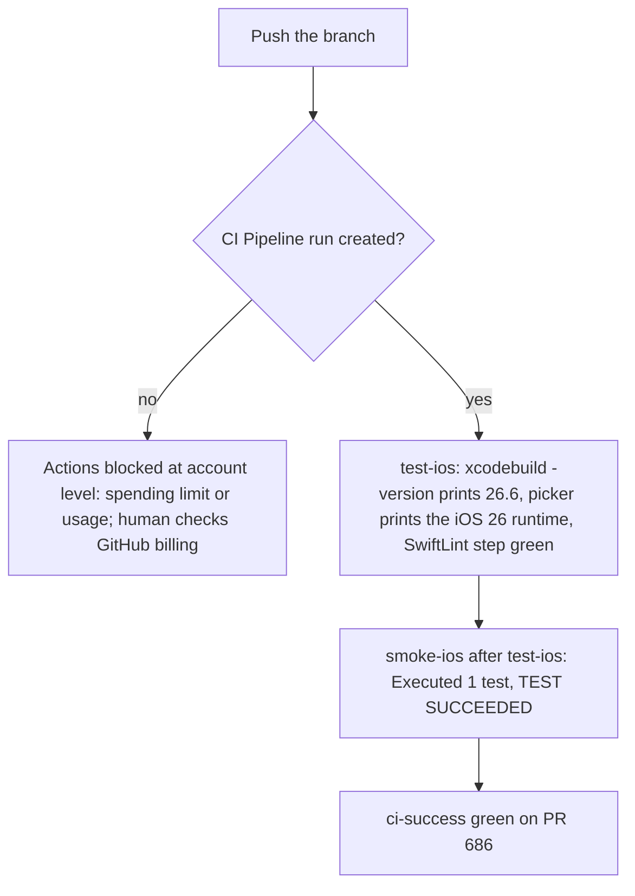
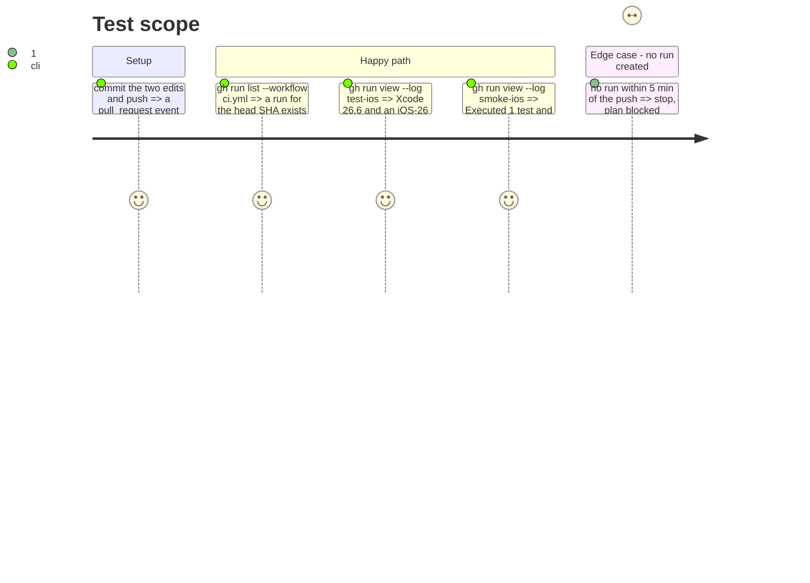

# Instruction: one-ci-run-proves-the-gates

## Architecture projection

> Tree of the final files. ✅ create · ✏️ modify · ❌ delete

```txt
.github/workflows/ci.yml                                            ✏️ `smoke-ios` gets `needs: test-ios`
ios/PulpeUITests/BudgetDetails/BudgetOpensFromListUITests.swift     ✏️ title check scoped to `app.navigationBars.staticTexts`
```

## User Journey



## Test Scope



## Tasks to do

### `1)` Two small edits

> The smoke must not boot a second macOS runner when the unit job already failed, and the title check must look at the bar.

1. `smoke-ios: needs: test-ios`.
2. `app.navigationBars.staticTexts.matching(predicate).firstMatch`.

### `2)` Make the run happen and read it

> No `CI Pipeline` run was created for the 8 pushes of 2026-08-28 while CodeQL and Vercel received the same events; the workflow is `active`.

1. Push; if no run appears, the block is the account's Actions spending limit or usage (`/settings/billing/actions` needs the `user` scope): mark the plan `blocked` and stop.
2. When the run exists: read `xcodebuild -version` and the picked runtime in `test-ios`, `Executed 1 test` in `smoke-ios`, and `ci-success` on the PR.

## Test acceptance criteria

| Task | Acceptance criteria                                                                                                        |
| ---- | -------------------------------------------------------------------------------------------------------------------------- |
| 1    | `smoke-ios` lists `needs: test-ios`; the smoke still passes locally on the dedicated simulator with the scoped title check  |
| 2    | The CI log of the head SHA shows Xcode 26.6, an iOS 26 runtime, a green SwiftLint step, `Executed 1 test`, and `ci-success` green |
