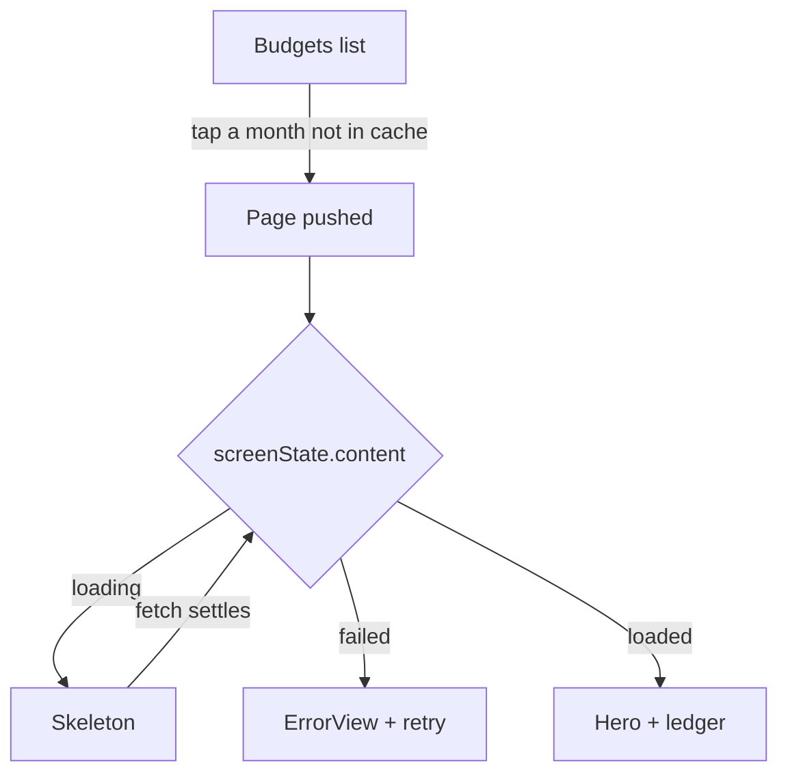
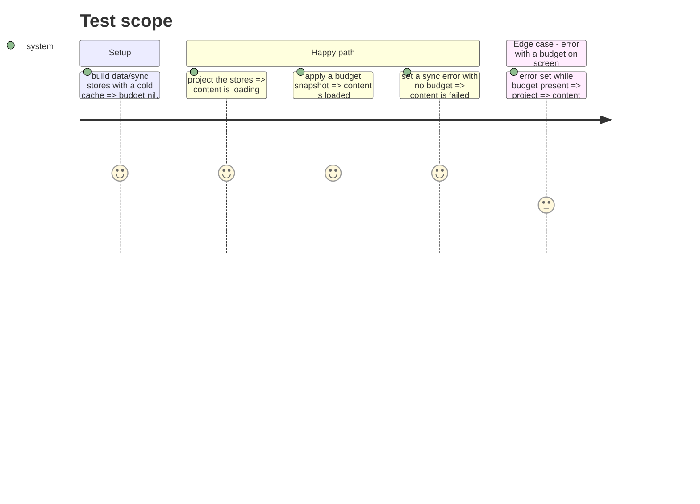

# Instruction: exhaustive-page-content-state

## Architecture projection

> Tree of the final files. ✅ create · ✏️ modify · ❌ delete

```txt
ios/Pulpe
├── Domain/Services/TemplateService.swift                                   ✏️ declare `TemplateServicing` (getTemplate, getTemplateLines) and conform
├── Features/Budgets/BudgetDetails
│   ├── Projection/BudgetDetailsScreenState.swift                            ✏️ add `enum Content: Equatable { loading, failed, loaded }` + `let content`
│   ├── Projection/BudgetDetailsProjector.swift                              ✏️ derive `content` from dataStore.budget / syncStore.error in `project`
│   ├── BudgetDetailsView.swift                                             ✏️ body `switch screenState.content`; toolbar/hero read `content == .loaded`
│   └── EditTransactionHost.swift                                           ✏️ same switch (it already had an else; 2 lines)
├── Features/Templates/TemplateDetails/TemplateDetailsView.swift            ✏️ VM gains `content` + injected `templateService: any TemplateServicing`; body switches
├── PulpeTests/Features/Budgets/BudgetDetails/Projection/BudgetDetailsContentStateTests.swift ✅ content mapping, the cold row first
├── PulpeTests/Architecture/BudgetDetailsArchitectureTests.swift            ✏️ line 291 regex reads `isBudgetPresent`; point it at `content == .loaded`
└── .claude/rules/00-architecture/ios-architecture.md                       ✏️ one line: a page body switches on a content enum; a container that can be empty never runs its modifiers
```

## User Journey



## Test Scope



## Tasks to do

### `1)` Name the page content state

> Replace the three booleans the body reads by one exhaustive enum.

1. In `BudgetDetailsScreenState`, add `enum Content: Equatable { case loading, failed, loaded }` and `let content: Content`; keep `hasAllBudgets`.
2. In `BudgetDetailsProjector.project`, compute: budget present → `.loaded`; else error set → `.failed`; else `.loading` (this is where "idle" lands, on purpose).
3. Readers, inventoried on 2026-08-28: `BudgetDetailsView.swift` (6 sites), `EditTransactionHost.swift` (2), `BudgetDetailsProjector.swift:152-154`, `BudgetDetailsScreenState.swift` (fields + `.empty`), `BudgetDetailsArchitectureTests.swift:291`. Nothing else; the other `isLoading` in the feature are local form flags. Migrate each to `content`, then delete the three fields. Keep `terminalError` on the projector (Error is not Equatable).
4. `BudgetDetailsView.body`: `switch screenState.content` with the three cases; `.animation(value: screenState.content)`; drop the comment added in `dff8a4ba6`, the `switch` says it.

### `2)` Same shape for the template page

> The template page had the same three booleans and the same hole.

1. Declare `protocol TemplateServicing: Sendable` with `getTemplate(id:)` and `getTemplateLines(templateId:)`; `actor TemplateService: TemplateServicing`.
2. `TemplateDetailsViewModel.init(templateId:, templateService: any TemplateServicing = TemplateService.shared)`.
3. Add `var content: Content` (same enum shape, local to the VM) and `switch` on it in `TemplateDetailsView.body`.

### `3)` Pin the mapping

> One test that fails if "not started" ever maps to nothing again.

1. In a new projection test file, use `ProjectionTestStack` to build the stores cold and assert `content == .loading` before any load.
2. Cover `.loaded` after `applyDetails`, `.failed` after `setError` with no budget, and error-with-budget staying `.loaded`.

### `4)` Say it once in the rule file

> The `switch` enforces it; the rule says why, in the file every iOS edit loads.

1. Add one line to `ios-architecture.md`: a page body renders exactly one of loading / failed / loaded through a `switch` on an enum; lifecycle modifiers on a container that can render nothing never run.

## Test acceptance criteria

| Task | Acceptance criteria                                                                                                     |
| ---- | ----------------------------------------------------------------------------------------------------------------------- |
| 1    | `BudgetDetailsView.body` contains one `switch screenState.content` and no `isLoading`/`errorIsTerminal`/`isBudgetPresent` |
| 1    | Budgets → a month absent from the cache shows the skeleton, then its hero and ledger, on the simulator                   |
| 2    | `TemplateDetailsView.body` switches on `viewModel.content`; Modèles → a template opens on its skeleton then its content   |
| 2    | `TemplateDetailsViewModel` can be built with a test double and never touches `TemplateService.shared` when one is passed |
| 3    | The projection test asserts the cold stores project `.loading`, and the suite is green in `PulpeTests`                   |
| 4    | `ios-architecture.md` states the rule in one line, no mechanics                                                          |
