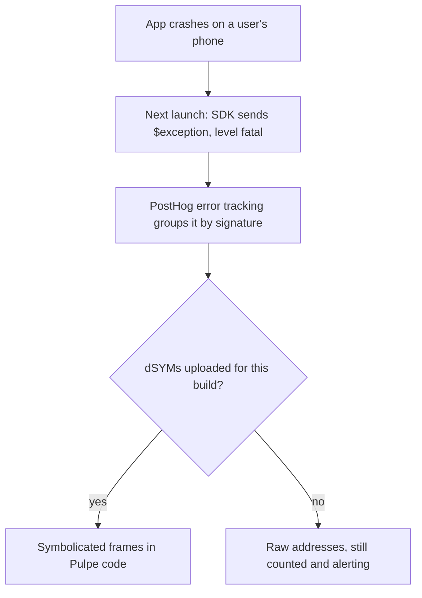
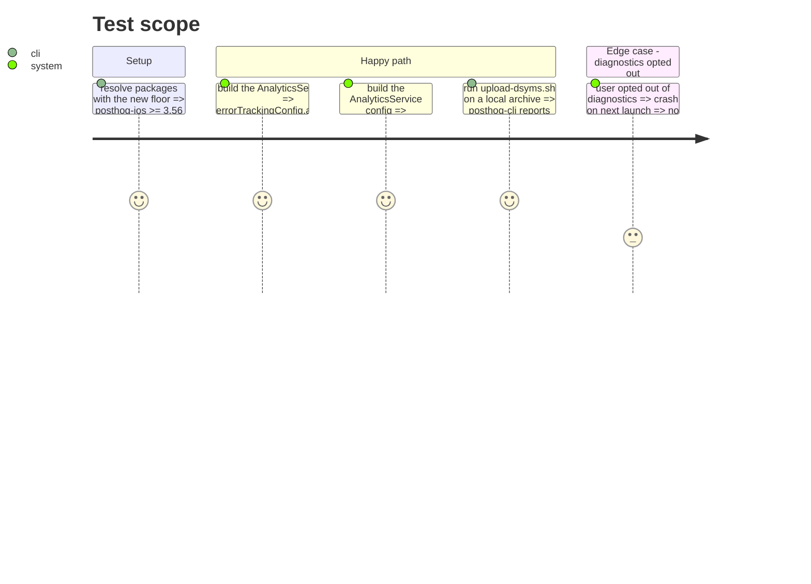

# Instruction: crash-reporting-through-posthog

## Architecture projection

> Tree of the final files. ✅ create · ✏️ modify · ❌ delete

```txt
ios
├── project.yml                                        ✏️ `posthog-ios` `from: "3.0.0"` → `from: "3.56.0"` (exception autocapture ships in 3.56)
├── Pulpe.xcodeproj/…/Package.resolved                 ✏️ resolved from 3.42.0 to the current 3.x (regenerated, not hand-edited)
├── Pulpe/Core/Analytics/AnalyticsService.swift        ✏️ `config.errorTrackingConfig.autoCapture = true` next to the other config lines (l.107-111)
├── PulpeTests/Core/Analytics/AnalyticsServiceTests.swift ✏️ one case: the config the service builds has autocapture on and session replay off
└── scripts/upload-dsyms.sh                            ✅ `posthog-cli dsym upload` on `ios/build/Pulpe.xcarchive/dSYMs`, called after the archive step of the publish flow
```

## User Journey



## Test Scope



## Tasks to do

### `1)` Raise the SDK floor

> Autocapture needs 3.56; the project resolves 3.42 against a `3.0.0` floor.

1. `project.yml`: `from: "3.56.0"`; `xcodegen generate --use-cache`; `xcodebuild -resolvePackageDependencies`; commit `Package.resolved`.
2. Build all three configs once; read the release notes between 3.42 and the resolved version for API breaks on `PostHogConfig` and `capture`.

### `2)` Turn autocapture on

> One line in the config; the existing opt-out already gates it.

1. In `AnalyticsService.initialize()`: `config.errorTrackingConfig.autoCapture = true`.
2. Extend `AnalyticsServiceTests` with the config assertion; keep `disableSensitiveCapture` untouched (session replay and network telemetry stay off, per the posthog-events privacy rule).
3. Check the landing's privacy page names crash diagnostics under what PostHog receives; add the sentence if it does not.

### `3)` Symbolicate

> A crash without symbols is a count; with them it is a file and a line.

1. `ios/scripts/upload-dsyms.sh`: `posthog-cli dsym upload --host https://eu.posthog.com <archive>/dSYMs`, env `POSTHOG_CLI_PROJECT_ID` / `POSTHOG_CLI_API_KEY` from the shell, never from the repo.
2. Document the step in the publish flow (step 2 bis, after `xcodebuild archive`) in `aidd_docs/memory/deployment.md`.
3. No Xcode run-script phase: it needs `ENABLE_USER_SCRIPT_SANDBOXING=NO` and runs on every local build; the archive step is the one place a release dSYM exists.

## Test acceptance criteria

| Task | Acceptance criteria                                                                                              |
| ---- | ---------------------------------------------------------------------------------------------------------------- |
| 1    | `Package.resolved` pins posthog-ios ≥ 3.56 and the three configurations build                                     |
| 2    | `AnalyticsServiceTests` proves autocapture on, session replay off; opted-out users send nothing                   |
| 3    | After archiving locally, the symbol set for that build appears under PostHog › Error tracking › Symbol sets       |
