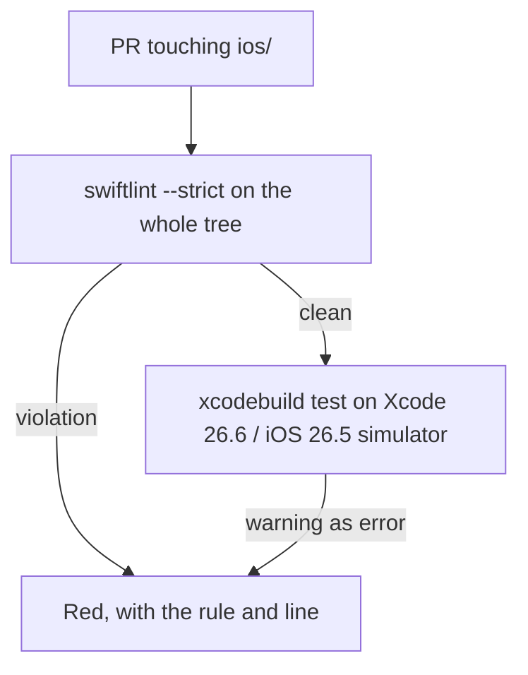
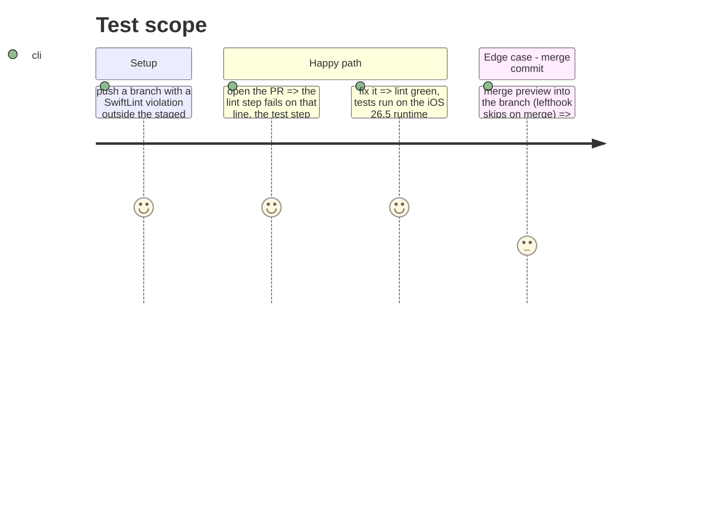

# Instruction: ci-gates-that-match-the-release

## Architecture projection

> Tree of the final files. ✅ create · ✏️ modify · ❌ delete

```txt
.github/workflows/ci.yml                                   ✏️ test-ios: Xcode 26.2 → 26.6 (runner default, the toolchain build 10 was archived with); a `swiftlint lint --strict` step on ios/ before the tests
ios/PulpeTests/Features/Budgets/BudgetDetails/Spread/AddBudgetLineSpreadLogicTests.swift ✏️ 4 lines over 120 chars (74, 100, 130, 206)
ios/PulpeTests/Domain/Formulas/BudgetFormulasExtendedTests.swift ✏️ struct body 301 lines, limit 300: split one case out
ios/Pulpe/Shared/Components/PulpeChip.swift                ✏️ the `() -> Trailing` default-expression inference warning, emitted 17 times from one `init`
```

## User Journey



## Test Scope



## Tasks to do

### `1)` Lint the tree, not the staged files

> lefthook lints staged files only and skips on merge and rebase; nothing lints in CI.

1. Step before "Run Unit Tests": `swiftlint lint --strict --reporter github-actions-logging` in `ios/` (SwiftLint 0.65 ships on macos-26; local is 0.63.2, expect a rule or two to differ).
2. The tree on 2026-08-28 has exactly 5 strict violations, all in `PulpeTests` (listed in the projection); fix them so the first CI run is green.

### `2)` Test on the toolchain that ships

> CI on 26.2 while the store build comes from 26.6 tests a runtime users no longer have.

1. `xcode-version: "26.6"`; the simulator picker's comment says 26.2, make it pick the newest available iOS 26 runtime instead of a hard-coded one.
2. Keep the post-test hang workaround; re-check it still triggers on 26.6 (issue 13143).

### `3)` Bring the warning count to the four deliberate ones

> Clean build on 2026-08-28: 23 warnings. 17 come from one `PulpeChip.init` (default expression inferable from the trailing closure, "will be an error in a future Swift language mode"), 2 from the Italian plural of `%lld chiffres sur %lld saisis` (phase 5 fixes the catalog), 4 from the `-warn-long-function-bodies` / `-warn-long-expression-type-checking` guards (`UncheckedOperationsCard.deck`, two `body`, one expression).

1. Fix the `PulpeChip` initializer: give the trailing-closure parameter no default that the compiler must infer.
2. Do not enable `SWIFT_TREAT_WARNINGS_AS_ERRORS`: the four type-check-time warnings are performance guards meant to be read, not to block, and they fluctuate with the toolchain. State it in the CI step comment.

## Test acceptance criteria

| Task | Acceptance criteria                                                                                    |
| ---- | ------------------------------------------------------------------------------------------------------ |
| 1    | A SwiftLint violation on a file not in the commit turns the PR red                                      |
| 2    | The CI log shows Xcode 26.6 and an iOS 26.5 simulator                                                   |
| 3    | A clean build lists only the four type-check-time warnings; the `Trailing` warning is gone                 |
