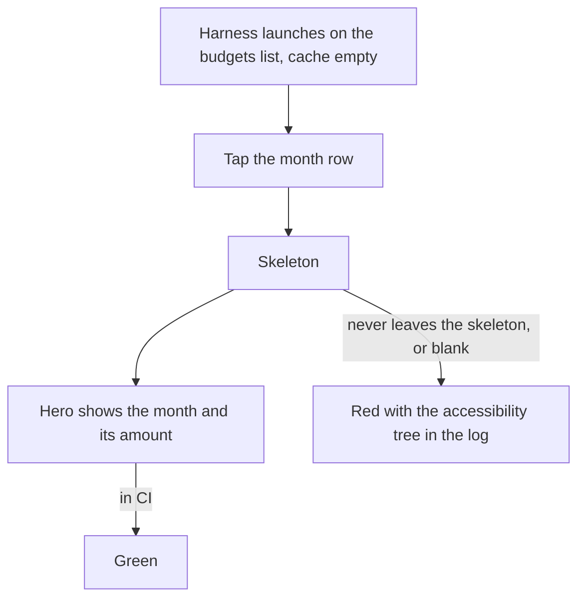
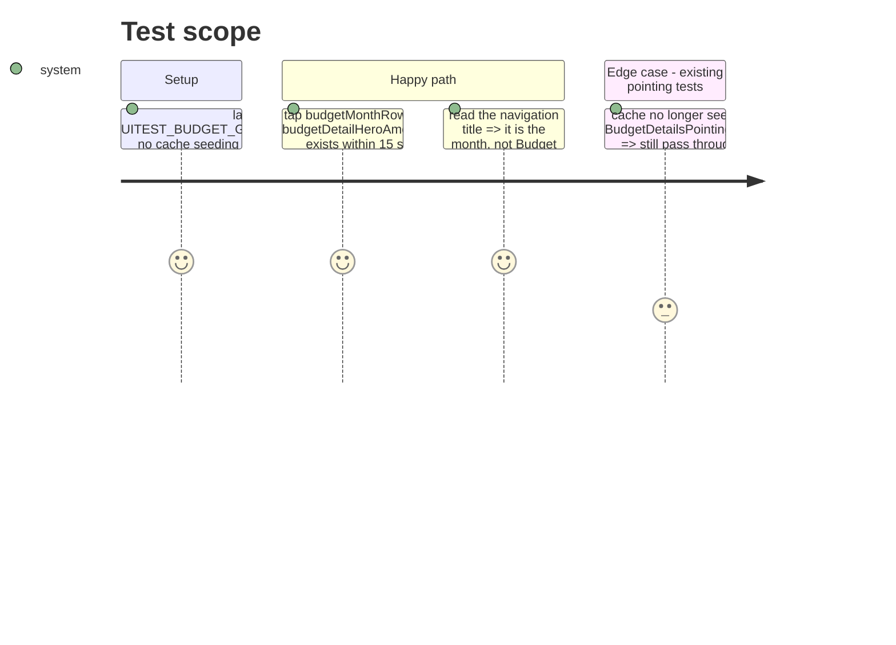

# Instruction: ui-smoke-in-ci-on-the-cold-path

## Architecture projection

> Tree of the final files. ✅ create · ✏️ modify · ❌ delete

```txt
ios/Pulpe/App/BudgetLongPressUITestHarness.swift        ✏️ drop the `BudgetDetailCache.shared.store(...)` / `storeAllBudgets` seeding (l.215-221): the stub service answers the fetch, the page must load it
ios/PulpeUITests/BudgetDetails/BudgetOpensFromListUITests.swift ✅ tap a month row → skeleton → hero with the amount; one test, the smoke
.github/workflows/ci.yml                                 ✏️ job `smoke-ios`: `xcodebuild test -scheme PulpeUITests -only-testing:PulpeUITests/BudgetOpensFromListUITests`, needs test-ios
```

## User Journey



## Test Scope



## Tasks to do

### `1)` Make the harness cold

> Seeding the cache made every budget UI test take the one path that never broke.

1. Remove the two `BudgetDetailCache.shared` calls in the harness; keep the stub service (`getBudgetWithDetails`, `getBudgetsSparse` already answer).
2. Run the existing `BudgetDetails*UITests` locally on the dedicated simulator; they now see the skeleton first, their 15 s waits absorb it.

### `2)` One smoke test

> The journey the user hit: list → month → page.

1. XCTest (the UI target stays on XCTest): launch, tap `budgetMonthRow-goal-spread-budget`, `waitForExistence` on `budgetDetailHeroAmount`, assert the back button label is the list and the title is the month.
2. On failure, attach `app.debugDescription` so a blank page shows as an empty tree in the CI log.

### `3)` Run it in CI, and only it

> The full UI suite flakes under load (memory: SavingsGoal interval tests); the smoke is one test on a dedicated runner.

1. New job after `test-ios`, same Xcode and simulator steps, `-only-testing:PulpeUITests/BudgetOpensFromListUITests`, `timeout-minutes: 20`.
2. XCTest honours `-only-testing`; the Swift Testing zero-test trap does not apply here, still assert the executed count in the log is 1.

## Test acceptance criteria

| Task | Acceptance criteria                                                                                                  |
| ---- | -------------------------------------------------------------------------------------------------------------------- |
| 1    | No `BudgetDetailCache` call remains in the harness; `BudgetDetailsPointingUITests` passes locally                     |
| 2    | With the two views checked out at `23ee00bf2`, the smoke test fails; at HEAD it passes                                |
| 3    | The CI job reports exactly one executed test and blocks the PR when it fails                                          |
