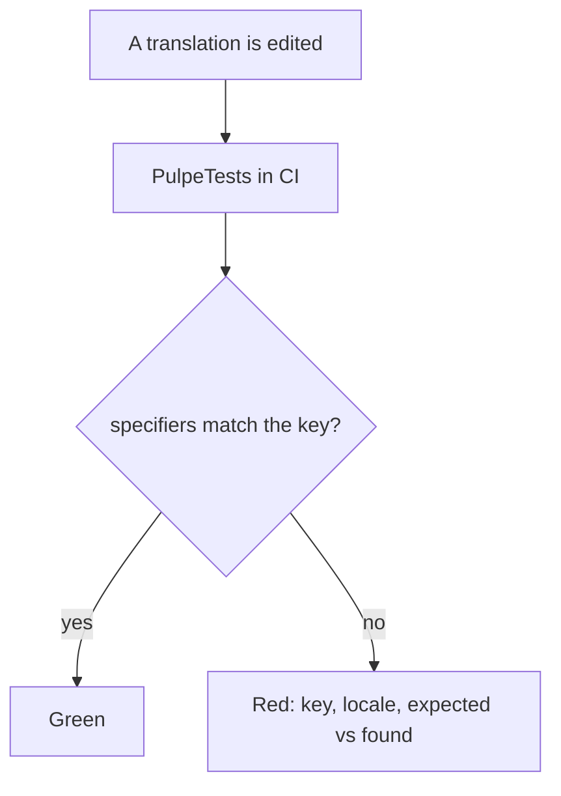
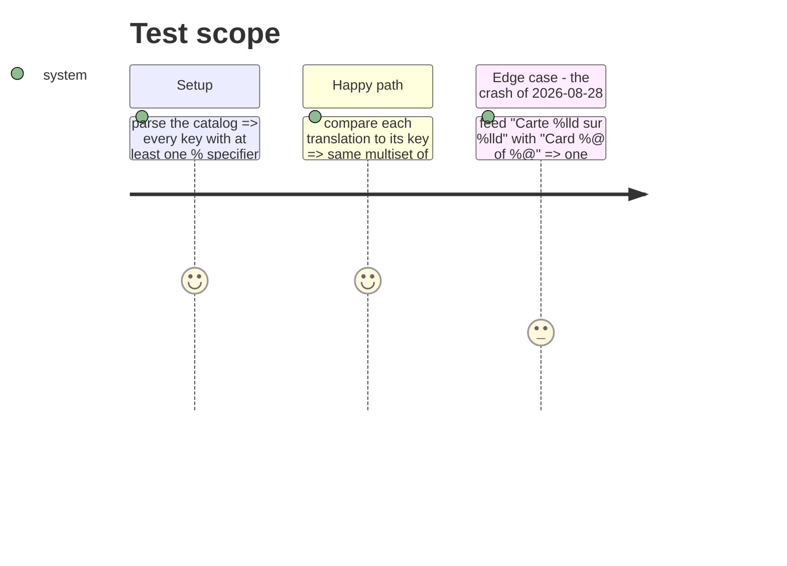

# Instruction: string-catalog-specifier-parity

## Architecture projection

> Tree of the final files. ✅ create · ✏️ modify · ❌ delete

```txt
ios/PulpeTests/Resources/LocalizableCatalogTests.swift   ✅ reads Localizable.xcstrings from #filePath; every translation's specifier list equals its key's
ios/Pulpe/Resources/Localizable.xcstrings                ✏️ Italian plural of `%lld chiffres sur %lld saisis`: the compiler cannot tell which %lld drives the plural; use an explicit substitution
```

## User Journey



## Test Scope



## Tasks to do

### `1)` Pure comparison first

> `%1$lld` and `%lld` are the same slot; `%@` for `%lld` is a segfault.

1. `static func specifiers(_ s: String) -> [String]`: regex `%(?:\d+\$)?(lld|ld|d|@|f|s|u)`, keep the type only, sorted.
2. `static func mismatches(in catalog: Data) -> [(key: String, locale: String, found: [String])]`.

### `2)` Assert on the shipped catalog

> The scan of 2026-08-28 found exactly one real mismatch; the test keeps it at zero.

1. Load `ios/Pulpe/Resources/Localizable.xcstrings` from `#filePath` like the architecture suites.
2. `#expect(mismatches.isEmpty, "\(key) [\(locale)]: \(found)")`; plus the fixture case from the journey.

### `3)` Fix what the compiler already flags

> `xcstringstool` warns twice on the Italian plural at every build; nobody reads build warnings.

1. Rewrite the `it` plural variation of `%lld chiffres sur %lld saisis` with a named substitution so the plural argument is explicit.
2. Confirm the clean build no longer prints the two `Cannot reliably infer argument number for plural variation` lines.

## Test acceptance criteria

| Task | Acceptance criteria                                                                                     |
| ---- | ------------------------------------------------------------------------------------------------------- |
| 1    | The fixture with `%@` for `%lld` yields one mismatch; positional variants yield none                     |
| 2    | The suite is green on the current catalog and appears in the executed tests of `PulpeTests`             |
| 3    | A clean build emits no plural-variation warning for the catalog                                          |
