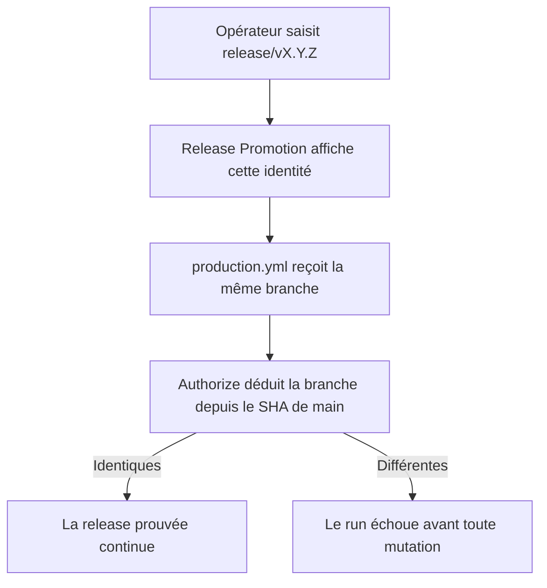
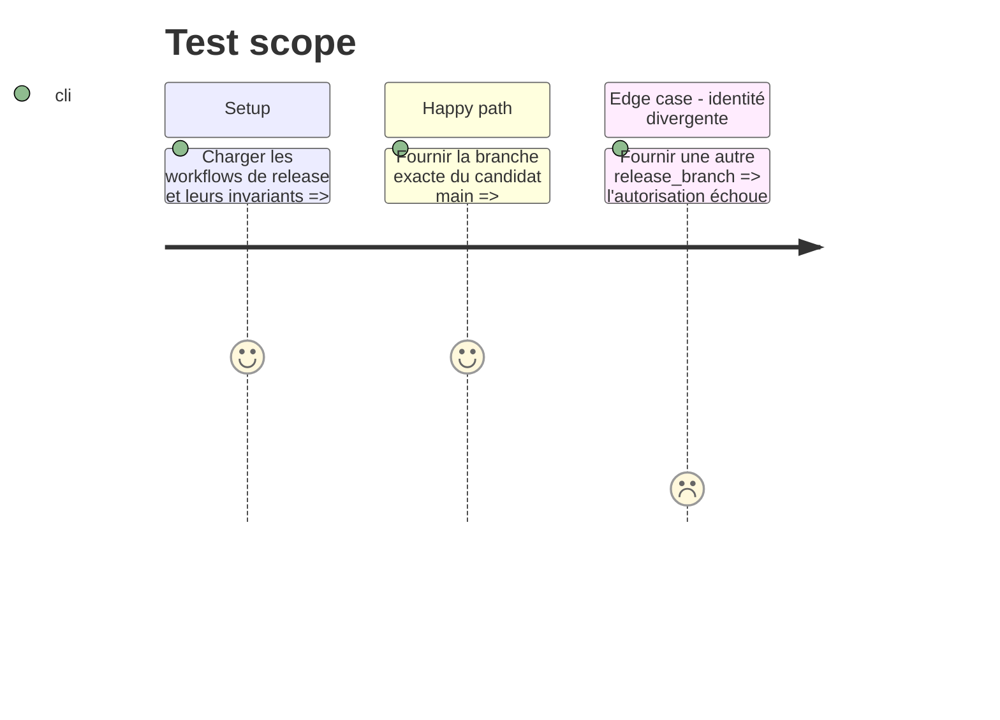

# Instruction: Lier l'intention à la release publiée

## Architecture projection

> Tree of the final files. ✅ create · ✏️ modify · ❌ delete

```txt
.
├── .github/
│   ├── scripts/
│   │   └── ci-security.test.mjs                 ✏️ verrouille le passage et la comparaison de l'identité
│   └── workflows/
│       ├── production.yml                       ✏️ déclare l'input requis et refuse toute divergence
│       └── release-promotion.yml                 ✏️ transmet la branche affichée au workflow appelé
└── docs/
    └── DEPLOYMENT.md                             ✏️ documente l'échec fail-closed d'une saisie incohérente
```

## User Journey



## Test Scope



## Tasks to do

### `1)` Relier l'input au workflow réutilisable

> Faire de l'identité affichée une condition d'autorisation, pas une simple étiquette.

1. Déclarer `release_branch` comme input `string` requis de `production.yml`.
2. Le transmettre avec `with` depuis le job `production` de `release-promotion.yml`.
3. Comparer cet input à `head.ref` de la PR déduite de `GITHUB_SHA`, avant toute mutation, tout en gardant les contrôles SHA, parents, version, staging et tip de `main`.

### `2)` Verrouiller et documenter le contrat

> Empêcher une future suppression accidentelle du binding.

1. Étendre `ci-security.test.mjs` pour exiger la déclaration, le passage exact et la comparaison fail-closed.
2. Documenter dans `DEPLOYMENT.md` qu'une branche mal saisie fait échouer `publish` sans toucher la production.

## Test acceptance criteria

| Task | Acceptance criteria                                                                                                                  |
| ---- | ------------------------------------------------------------------------------------------------------------------------------------ |
| 1    | Une branche identique à celle de la PR autorisée poursuit le flux; toute divergence arrête `authorize` avant le premier job protégé. |
| 2    | Le gate d'automatisation échoue si l'input n'est plus requis, transmis ou comparé, et la procédure opérateur décrit ce comportement. |
