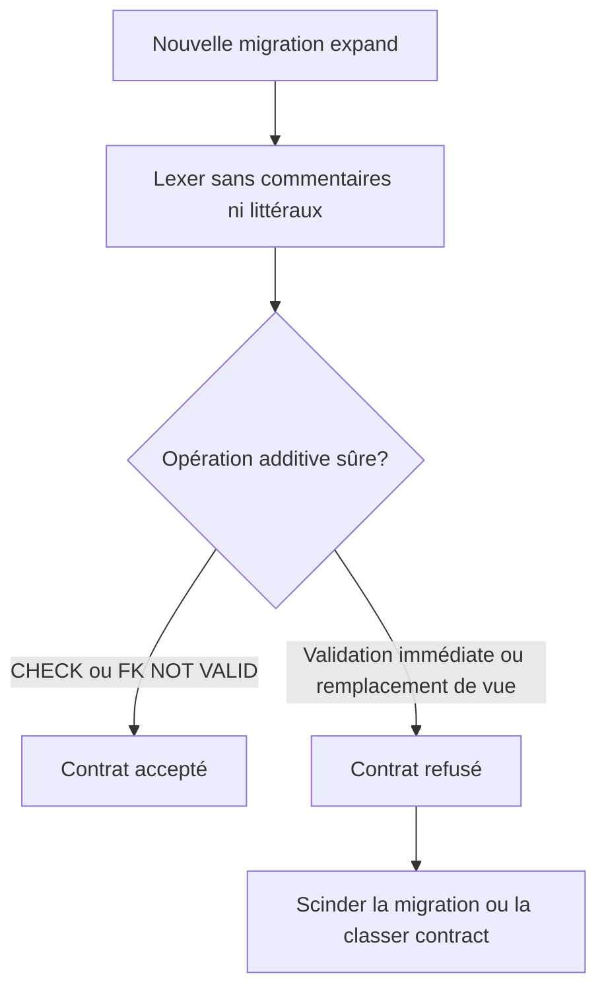
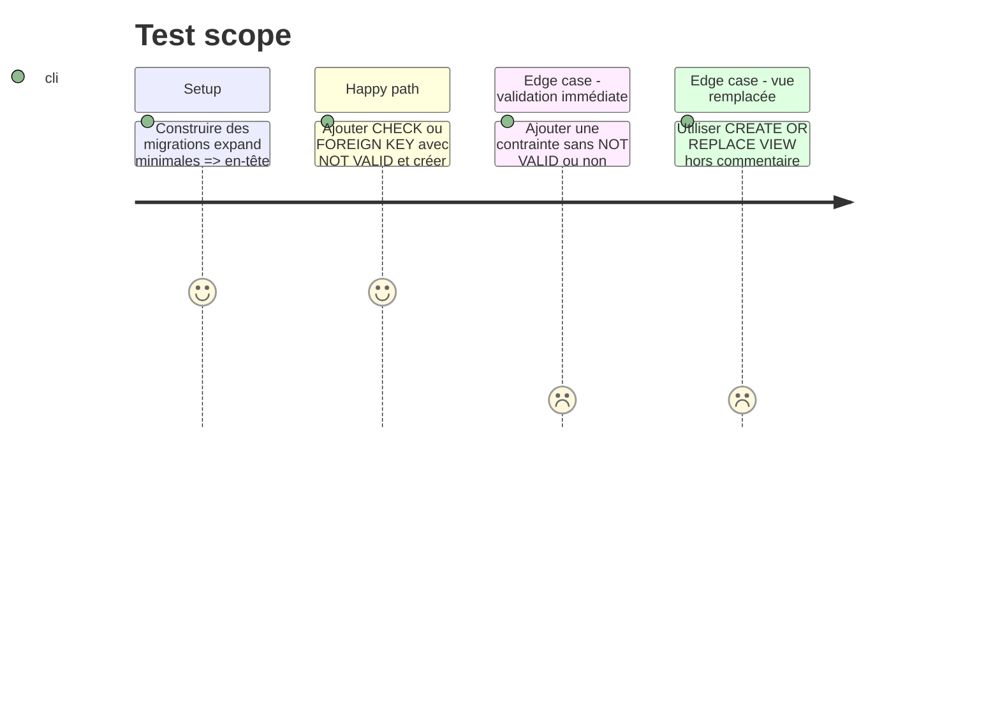

# Instruction: Durcir le contrat SQL expand

## Architecture projection

> Tree of the final files. ✅ create · ✏️ modify · ❌ delete

```txt
.
├── .github/
│   └── scripts/
│       ├── check-migration-contract.cjs          ✏️ refuse les contraintes et remplacements de vue ambigus
│       └── migration-contract.test.cjs           ✏️ couvre les formes SQL acceptées et refusées
└── docs/
    └── DEPLOYMENT.md                             ✏️ précise la règle expand et sa limite lexicale
```

## User Journey



## Test Scope



## Tasks to do

### `1)` Fermer les formes ambiguës

> Rester conservateur sans introduire de parseur ou de dépendance.

1. Dans `expand`, détecter toute contrainte de table ajoutée, nommée ou non, et accepter seulement `CHECK` et `FOREIGN KEY` portant `NOT VALID`.
2. Refuser les autres contraintes immédiates (`UNIQUE`, `PRIMARY KEY`, `EXCLUDE` ou forme inconnue) avec une consigne de migration explicite.
3. Refuser `CREATE OR REPLACE VIEW`; conserver `CREATE VIEW` pour un nouvel objet.
4. Préserver le traitement actuel des commentaires, chaînes, dollar quotes et listes d'altérations.

### `2)` Prouver les frontières lexicales

> Un cas accepté et les refus dangereux suffisent; pas de matrice décorative.

1. Ajouter les fixtures positives `CHECK/FK ... NOT VALID` et `CREATE VIEW`.
2. Ajouter les fixtures négatives nommées, anonymes et séparées par des virgules pour validation immédiate, types de contrainte non compatibles et remplacement de vue.
3. Vérifier que les mêmes mots dans des commentaires ou littéraux restent inertes et que les tests d'immuabilité/contract existants passent encore.

### `3)` Expliquer la limite restante

> Ne pas présenter le checker comme une preuve de compatibilité client.

1. Documenter la règle PostgreSQL 17 et rappeler que `NOT VALID` évite le scan initial mais s'applique aux nouvelles écritures.
2. Maintenir l'exigence de revue SQL et de découpage `expand/contract` pour toute évolution comportementale.

## Test acceptance criteria

| Task | Acceptance criteria                                                                                                                    |
| ---- | -------------------------------------------------------------------------------------------------------------------------------------- |
| 1    | Le contrat refuse les deux familles risquées identifiées sans bloquer une nouvelle vue ni une contrainte CHECK/FK marquée `NOT VALID`. |
| 2    | Les tests échouent si l'une de ces frontières régresse et restent verts pour le texte SQL inerte et les contrats historiques.          |
| 3    | La documentation distingue clairement réduction de scan/verrou et compatibilité avec les anciens clients.                              |
