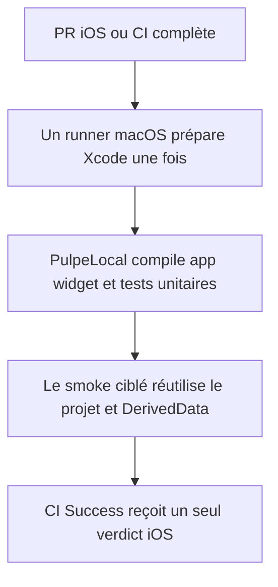
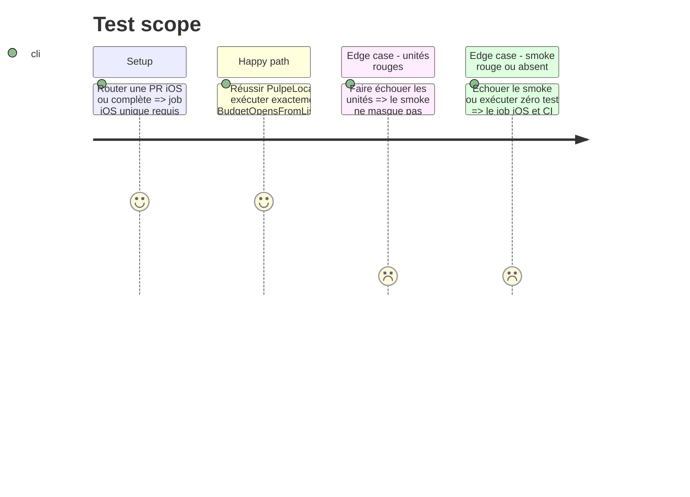

# Instruction: Réutiliser le runner iOS et mesurer le gain

## Architecture projection

> Tree of the final files. ✅ create · ✏️ modify · ❌ delete

```txt
.
├── .github/
│   ├── scripts/
│   │   └── ci-security.test.mjs                  ✏️ exige une seule unité macOS contenant les deux preuves
│   └── workflows/
│       └── ci.yml                                ✏️ exécute le smoke après les unités sur le même runner
└── docs/
    └── CI.md                                     ✏️ décrit la structure et consigne la mesure observée
```

## User Journey



## Test Scope



## Tasks to do

### `1)` Consolider uniquement la chaîne iOS

> Réutiliser les ressources déjà présentes plutôt que transférer ou reconstruire ailleurs.

1. Déplacer les étapes du smoke dans `test-ios`, après la preuve `PulpeLocal` et avant le nettoyage du simulateur.
2. Garder deux invocations lisibles de `xcodebuild` sur le même runner : unités puis unique XCUITest ciblé, avec leurs marqueurs de succès et gardes anti-faux-vert actuels.
3. Supprimer le job `smoke-ios`, son second checkout/XcodeGen/cache et son résultat séparé dans `ci-success`; augmenter seulement le timeout du job consolidé si nécessaire.
4. Ne modifier ni les schémas Xcode, ni les tests iOS, ni la chaîne `Workspace → E2E`.

### `2)` Verrouiller la preuve consolidée

> Un seul résultat iOS doit signifier que les deux suites ont réellement tourné.

1. Adapter `ci-security.test.mjs` pour exiger l'absence du second job, les deux commandes ciblées dans `test-ios`, `Executed 1 test` et la dépendance unique de `ci-success`.
2. Exécuter les gates d'automatisation et la validation de syntaxe des workflows.

### `3)` Mesurer avant de déclarer la victoire

> Conserver le changement seulement si le run réel raccourcit la chaîne sans affaiblir ses preuves.

1. Sur la CI complète naturelle de la PR, relever durée du job iOS, runner-minutes totales et durée murale.
2. Comparer à la chaîne iOS de référence à deux jobs : 18,8 puis 21,7 macOS-minutes, et 20,2 puis 23,1 minutes de durée CI murale.
3. Conserver la consolidation si les deux tests sont prouvés et que la chaîne iOS diminue sans régression murale; sinon la retirer et garder seulement les phases de sécurité.
4. Consigner le run et le résultat dans `docs/CI.md` comme observation, sans annoncer de tendance stable avant cinq CI complètes comparables.

## Test acceptance criteria

| Task | Acceptance criteria                                                                                                                                |
| ---- | -------------------------------------------------------------------------------------------------------------------------------------------------- |
| 1    | Une PR iOS utilise un seul runner macOS et échoue dès que les unités ou l'unique smoke échouent ou ne s'exécutent pas.                             |
| 2    | Les invariants d'automatisation interdisent le retour d'un second job iOS et tout faux vert du smoke.                                              |
| 3    | Le gain ou l'absence de gain est relié à un run réel; aucune optimisation distante, aucun sharding et aucune promesse statistique ne sont ajoutés. |
