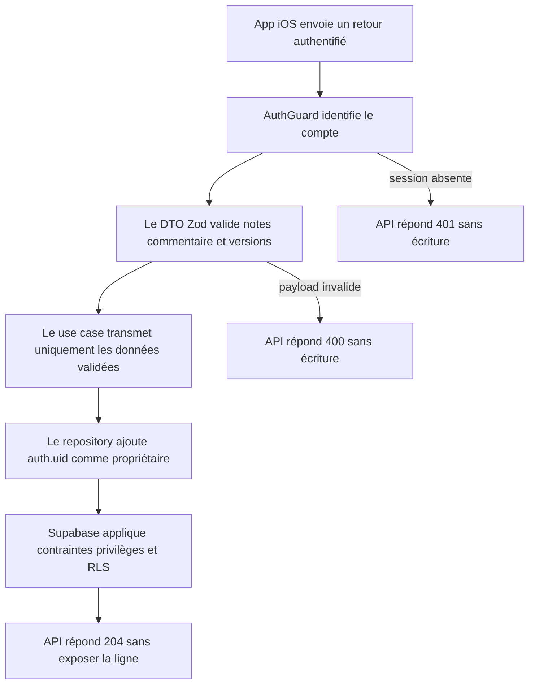
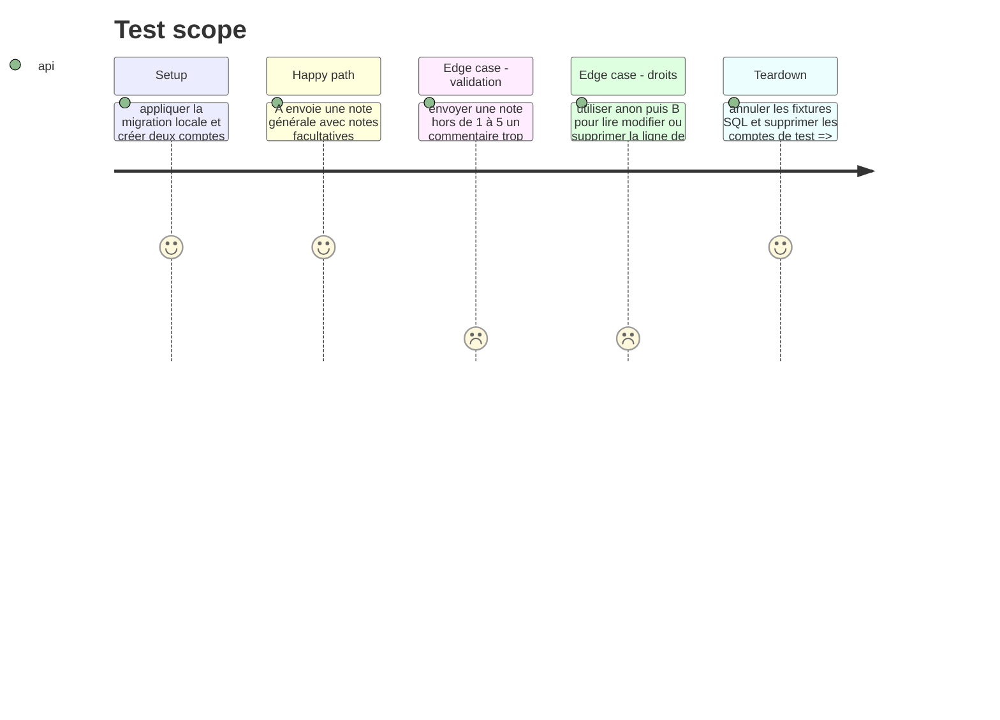

# Instruction: Enregistrer un retour first-party en écriture seule

## Architecture projection

> Tree of the final files. ✅ create · ✏️ modify · ❌ delete

```txt
.
├── shared
│   ├── schemas.ts                                                               ✏️ contrat strict de soumission et types de notes par zone
│   ├── index.ts                                                                 ✏️ exports publics du contrat feedback
│   └── src/feedback-schema.spec.ts                                              ✅ bornes, champs facultatifs et rejet des clés inconnues
└── backend-nest
    ├── .prettierignore                                                        ✏️ exclut le fichier de types généré du formatage
    ├── supabase
    │   ├── migrations/20260901130000_create_user_feedback.sql                   ✅ table contrainte, privilège INSERT seul et policy propriétaire
    │   └── tests/user_feedback_rls.sql                                           ✅ matrice anon/authenticated/service-role et isolation
    └── src
        ├── app.module.ts                                                         ✏️ enregistre FeedbackModule et masque le commentaire dans les logs détaillés
        ├── common/constants/error-definitions.ts                                ✏️ erreur stable d'échec d'enregistrement
        ├── modules/feedback
        │   ├── application/submit-feedback.use-case.ts                          ✅ orchestre l'écriture sans journaliser le contenu
        │   ├── domain/ports/feedback-repository.port.ts                         ✅ port d'insertion minimal et token d'injection
        │   ├── infrastructure/http/dto/feedback-swagger.dto.ts                  ✅ DTO Zod/Swagger dérivé du contrat partagé
        │   ├── infrastructure/http/feedback.controller.ts                       ✅ POST authentifié avec réponse 204
        │   ├── infrastructure/persistence/supabase-feedback.repository.ts       ✅ insert associé à auth.uid(), sans SELECT de retour
        │   ├── feedback.integration.spec.ts                                     ✅ validation HTTP, écriture et refus hors propriétaire
        │   └── feedback.module.ts                                               ✅ câblage NestJS
        └── types/database.types.ts                                               ✏️ types régénérés après migration
```

## User Journey



## Test Scope



## Tasks to do

### `1)` Définir le contrat de soumission

> Une seule source Zod borne toutes les données acceptées avant l'accès à la base.

1. Ajouter un `feedbackCreateSchema.strict()` dans `shared/schemas.ts` : `overallRating` entier de 1 à 5 ; cinq notes facultatives de 1 à 5 (`onboarding`, `budgetClarity`, `currentMonth`, `futurePlanning`, `homeClarity`) ; `comment` facultatif, trimé et limité à 1 000 caractères ; `appVersion` et `iosVersion` non vides, limités à 32 caractères.
2. Exporter `FeedbackCreate` et le schéma depuis `shared/index.ts`.
3. Tester le payload minimal, le payload complet, chaque borne, le commentaire vide normalisé en absence et le rejet des propriétés inconnues.

### `2)` Créer une table d'avis volontairement write-only

> La base garantit l'appartenance et la qualité minimale même si un client contourne NestJS.

1. Créer `public.user_feedback` avec UUID, `user_id` vers `auth.users` en cascade, note générale, cinq colonnes de notes facultatives, commentaire, versions et `created_at`.
2. Poser des `CHECK` SQL pour toutes les notes, les longueurs du commentaire et des versions, puis indexer `(user_id, created_at DESC)`.
3. Activer RLS, révoquer tous les privilèges de `anon` et `authenticated`, rendre uniquement `INSERT` à `authenticated`, puis ajouter `WITH CHECK ((SELECT auth.uid()) = user_id)` ; ne créer aucune policy de lecture, modification ou suppression.
4. Ajouter le test SQL `user_feedback_rls.sql` qui prouve l'insertion propriétaire et le refus des quatre opérations non autorisées.
5. Appliquer la migration localement et régénérer `src/types/database.types.ts` avec la commande du projet ; exclure ce fichier généré de Prettier afin que son contenu reste identique à la sortie vérifiée en CI.

### `3)` Ajouter le module NestJS minimal

> Le backend valide, associe le compte et écrit ; il ne relit pas la contribution.

1. Créer le DTO Swagger depuis `feedbackCreateSchema`, puis `POST /v1/feedback` protégé par `AuthGuard`, documenté en 204 et sans DTO d'identité fourni par le client.
2. Faire exécuter au use case un unique port `insert`, en ne journalisant que `userId` et `operation`.
3. Dans le repository, construire la ligne avec `AuthenticatedSupabaseProvider.user.id`, effectuer `.insert()` sans `.select()`, et mapper l'échec vers une nouvelle définition `FEEDBACK_SUBMIT_FAILED`.
4. Enregistrer `FeedbackModule` dans `AppModule` et ajouter `req.body.comment` à la liste de redaction Pino pour que le texte libre ne sorte pas dans les logs détaillés.

### `4)` Prouver le contrat HTTP et l'isolation

> Un test vertical couvre le chemin utile et les frontières de confiance, sans suite CRUD inexistante.

1. Tester le POST minimal et complet avec la base Supabase locale, puis vérifier la ligne avec le client de test privilégié.
2. Tester 400 pour les bornes et champs inconnus, 401 sans session, et l'absence de nouvelle ligne après chaque refus.
3. Exécuter le test SQL RLS, le test de schéma partagé et le test d'intégration du module.

## Test acceptance criteria

| Task | Acceptance criteria                                                                                                                                                       |
| ---- | ------------------------------------------------------------------------------------------------------------------------------------------------------------------------- |
| 1    | Un payload valide minimal ou complet est accepté ; toute note hors de 1 à 5, tout commentaire supérieur à 1 000 caractères et toute propriété inconnue sont rejetés.      |
| 2    | Le compte A peut insérer sa ligne ; anon et le compte B ne peuvent ni lire, ni modifier, ni supprimer cette ligne, et aucun rôle client ne reçoit de privilège superflu.  |
| 3    | `POST /v1/feedback` authentifié répond 204 et crée une seule ligne avec l'identifiant du token ; ni le commentaire ni les notes ne sont écrits dans les logs applicatifs. |
| 4    | Les tests du schéma partagé, de l'endpoint d'intégration et de `user_feedback_rls.sql` passent sur Supabase local.                                                        |
