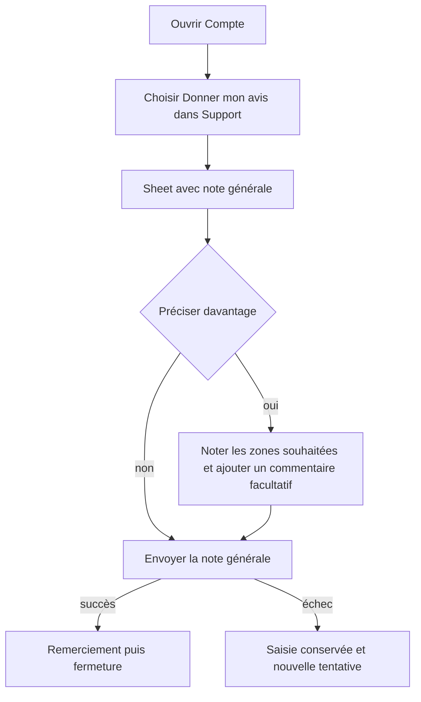
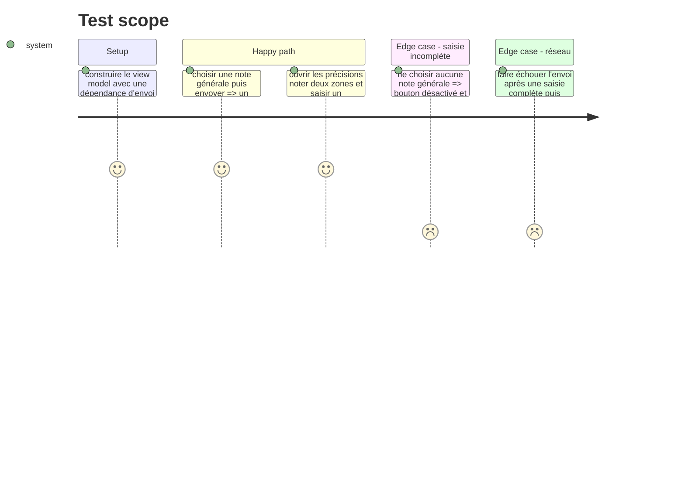

# Instruction: Offrir le formulaire rapide depuis le menu Compte

## Architecture projection

> Tree of the final files. ✅ create · ✏️ modify · ❌ delete

```txt
.
└── ios
    ├── Pulpe
    │   ├── Core/Network/Endpoints.swift                                          ✏️ endpoint POST /feedback
    │   ├── Domain
    │   │   ├── Models/Feedback.swift                                             ✅ échelle, zones et payload Codable/Sendable
    │   │   └── Services/FeedbackService.swift                                   ✅ envoi via APIClient.requestVoid
    │   ├── Features/Account/AccountView.swift                                    ✏️ ligne Donner mon avis dans Support et présentation manuelle
    │   ├── Resources/Localizable.xcstrings                                       ✏️ microcopy FR, DE, EN et IT
    │   └── Shared/Components
    │       ├── FeedbackSheet.swift                                               ✅ formulaire, états envoi/erreur/succès et view model local
    │       └── SegmentedPicker.swift                                              ✏️ sélection facultative sans valeur précochée
    └── PulpeTests
        ├── Domain/Services/FeedbackServiceTests.swift                            ✅ méthode, chemin et JSON transmis
        └── Shared/Components/FeedbackViewModelTests.swift                        ✅ validation, conservation de saisie et succès
```

## User Journey



## Test Scope



## Wireframe

```txt
Écran Compte
┌─────────────────────────────────────┐
│ (1) Barre de navigation              │
├─────────────────────────────────────┤
│ (2) Sections existantes              │
├─────────────────────────────────────┤
│ (3) Section d'aide                   │
│     [lien d'aide]                  › │
│     [entrée de retour]             › │
│     [lien nouveautés]              › │
└─────────────────────────────────────┘

1. Navigation : titre de l'écran et action de fermeture existante.
2. Sections existantes : profil et réglages inchangés.
3. Aide : la porte d'entrée permanente reste groupée avec les ressources de contact.

Sheet — état compact
┌─────────────────────────────────────┐
│ (1) Fermer · titre                   │
├─────────────────────────────────────┤
│ (2) Contexte bref                    │
│                                     │
│ (3) Question générale               │
│     [ 1 ][ 2 ][ 3 ][ 4 ][ 5 ]       │
│     repère bas          repère haut  │
│                                     │
│ (4) Bloc facultatif                › │
│                                     │
│ (5) Erreur réservée                  │
│ (6) [ Action principale ]            │
└─────────────────────────────────────┘

1. En-tête : fermeture immédiate et objet de la sheet.
2. Contexte : confidentialité et distinction avec une note publique.
3. Note générale : choix unique à cinq niveaux, seul champ obligatoire.
4. Précisions : accès secondaire aux évaluations détaillées et au texte libre.
5. Erreur : emplacement stable qui ne déplace pas la saisie de façon inattendue.
6. Action : envoi unique, visible sans parcourir les détails facultatifs.

Sheet — précisions ouvertes
┌─────────────────────────────────────┐
│ (1) Note générale conservée          │
├─────────────────────────────────────┤
│ (2) Zones facultatives               │
│     [zone]                         › │
│       [ 1 ][ 2 ][ 3 ][ 4 ][ 5 ]     │
│     [zone]                         › │
│     [zone]                         › │
│     [zone]                         › │
│     [zone]                         › │
│     [autre]                        › │
│                                     │
│ (3) Champ texte multiligne           │
│ (4) [ Action principale ]            │
└─────────────────────────────────────┘

1. Note générale : reste lisible pendant la précision.
2. Zones : une ligne par partie de l'app, avec échelle seulement dans la ligne ouverte.
3. Texte : commentaire libre facultatif, borné et adapté au clavier.
4. Action : même envoi que dans l'état compact.

Sheet — succès
┌─────────────────────────────────────┐
│ (1) Repère de réussite               │
│                                     │
│ (2) Message bref                     │
│                                     │
│ (3) [ Fermer ]                       │
└─────────────────────────────────────┘

1. Réussite : confirmation visuelle et accessible.
2. Message : remerciement sans promesse de réponse.
3. Fermeture : retour explicite à l'écran précédent.
```

## Tasks to do

### `1)` Relier l'app au nouvel endpoint

> Le client envoie un objet typé et n'attend aucun contenu de réponse.

1. Ajouter `.feedback` à `Endpoint`, avec chemin `/feedback` et méthode POST.
2. Définir `FeedbackRating` de 1 à 5, les six `FeedbackArea`, et `FeedbackSubmission` avec les noms JSON du contrat, `AppConfiguration.appVersion` et `UIDevice.current.systemVersion`.
3. Créer `FeedbackService.submit(_:)` autour de `APIClient.requestVoid`.
4. Tester méthode, URL, authentification héritée d'`APIClient` et encodage du payload minimal puis complet.

### `2)` Construire une sheet progressive et courte

> La note générale part en deux gestes ; tout le reste demeure facultatif.

1. Construire `FeedbackSheet` avec `SheetFormContainer`, un view model local injectable et un callback `onSubmitted` ; aucune nouvelle dépendance UI.
2. Afficher `Ton avis sur Pulpe`, la phrase `Ton avis reste privé. Il n'est pas publié sur l'App Store.`, puis `Comment ça se passe avec Pulpe ?`.
3. Étendre `SegmentedPicker` avec un initializer acceptant `Binding<T?>`, sans modifier ses appelants non optionnels, afin qu'un choix requis puisse démarrer sans valeur précochée.
4. Utiliser ce `SegmentedPicker` pour les cinq valeurs numériques, avec les libellés VoiceOver `À améliorer`, `Difficile`, `Correct`, `Bien`, `Très bien` ; ne pas afficher d'étoiles.
5. Garder `Préciser mon avis` replié par défaut. À l'ouverture, proposer les six zones dans des `DisclosureGroup` et n'afficher l'échelle que pour la ligne ouverte, puis un `TextField(axis: .vertical)` facultatif limité à 1 000 caractères.
6. Utiliser les libellés courts `Bien démarrer`, `Comprendre mon budget`, `Budget du mois`, `Mois à venir`, `Écran d'accueil`, `Autre`, puis l'action `Envoyer`.

### `3)` Traiter réussite et échec sans perdre de temps

> Une erreur réseau ne fait jamais recommencer la contribution.

1. Désactiver `Envoyer` tant que la note générale manque ou pendant l'envoi, et conserver toutes les valeurs si la dépendance lève une erreur.
2. Afficher `Ton avis n'est pas parti. Réessaie.` dans `ErrorBanner`, puis autoriser une nouvelle tentative identique.
3. Remplacer le formulaire réussi par `Merci. Ton avis fait progresser Pulpe.` et une action `Fermer`, avec retour haptique de succès.
4. Ajouter des labels VoiceOver explicites, des identifiants d'accessibilité, des cibles de 44 pt et vérifier le layout aux tailles Dynamic Type d'accessibilité.

### `4)` Ajouter l'entrée permanente au bon endroit

> La contribution spontanée se trouve sans chercher dans des réglages techniques.

1. Ajouter une ligne native `Donner mon avis` dans `AccountView.supportSection`, entre `FAQ et support` et `Nouveautés`, avec le sous-titre `Partage une impression en 30 secondes`.
2. Présenter `FeedbackSheet` localement depuis `AccountView`, pour qu'elle se superpose proprement à la sheet Compte existante.
3. Ajouter les traductions DE, EN et IT de toute la microcopy, avec le même ton direct et sans faux collectif.

### `5)` Tester le parcours minimal et la reprise

> Les tests portent sur les décisions et le payload, pas sur l'apparence interne de SwiftUI.

1. Tester que la note générale seule active l'envoi et produit le payload minimal attendu.
2. Tester la soumission avec plusieurs zones et commentaire.
3. Tester que l'échec conserve la note, les zones et le commentaire, puis qu'une seconde tentative réussit sans doublon.
4. Vérifier sur simulateur la sheet compacte, les précisions, le clavier, VoiceOver et les tailles de texte standard puis accessibilité.

## Test acceptance criteria

| Task | Acceptance criteria                                                                                                                                                       |
| ---- | ------------------------------------------------------------------------------------------------------------------------------------------------------------------------- |
| 1    | Le service émet un POST `/v1/feedback` dont le JSON correspond exactement au contrat, avec versions de l'app et d'iOS, puis accepte une réponse 204.                      |
| 2    | À l'ouverture, aucune note n'est précochée et seule la note générale requiert une décision ; les six zones et le commentaire restent repliés et facultatifs, sans étoile. |
| 3    | Après un échec, toutes les valeurs restent visibles et réutilisées ; après succès, le texte exact `Merci. Ton avis fait progresser Pulpe.` apparaît.                      |
| 4    | `Compte → Support → Donner mon avis` ouvre la même sheet, et toute la microcopy est disponible en FR, DE, EN et IT.                                                       |
| 5    | Les tests `FeedbackServiceTests` et `FeedbackViewModelTests` passent ; le formulaire reste utilisable avec VoiceOver et aux tailles Dynamic Type d'accessibilité.         |
