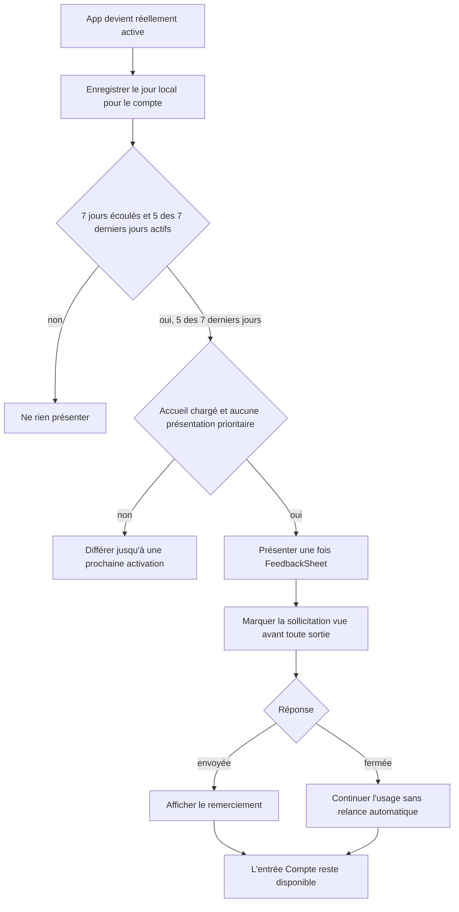
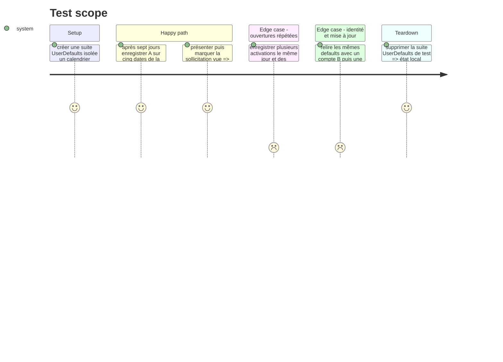

# Instruction: Solliciter une seule fois après un usage régulier

## Architecture projection

> Tree of the final files. ✅ create · ✏️ modify · ❌ delete

```txt
.
└── ios
    ├── Pulpe
    │   ├── App
    │   │   ├── FeedbackPromptPreferences.swift                                 ✅ état Codable par compte dans UserDefaults et règle d'éligibilité
    │   │   ├── PulpeApp.swift                                                   ✏️ enregistre le premier jour authentifié d'un lancement froid
    │   │   └── Runtime/AppRuntimeCoordinator.swift                              ✏️ signale les vrais retours background vers active au tracker
    │   ├── Features
    │   │   ├── Account/AccountView.swift                                        ✏️ une soumission manuelle neutralise la future sollicitation
    │   │   └── CurrentMonth/CurrentMonthView.swift                              ✏️ gate calme et destination FeedbackSheet automatique
    │   └── Domain/Store/AppVersionStore.swift                                   ✏️ expose si une présentation de priorité inférieure est permise
    └── PulpeTests
        ├── App/FeedbackPromptPreferencesTests.swift                             ✅ seuils, jours distincts, persistance, comptes et changements de fuseau
        └── App/Runtime/AppRuntimeCoordinatorTests.swift                          ✏️ callback au lancement et après background seulement
```

## User Journey



## Test Scope



## Tasks to do

### `1)` Persister une règle d'éligibilité par compte

> Trois faits locaux suffisent : première utilisation, jours actifs distincts, sollicitation déjà traitée.

1. Créer `FeedbackPromptPreferences` autour d'un `UserDefaults` injectable et d'un état `Codable` indexé par `UserInfo.id`.
2. Conserver `firstUseAt`, les identifiants de jours calendaires locaux de la fenêtre glissante de sept jours et `hasHandledAutomaticPrompt`; élaguer les jours plus anciens et n'inclure ni version de l'app dans la clé ni compteur brut d'ouvertures.
3. Rendre éligible uniquement si `now` est au moins sept jours après `firstUseAt`, cinq des sept derniers jours calendaires sont présents et la sollicitation n'a pas été traitée.
4. Fournir `recordActiveDay`, `isEligible` et `markAutomaticPromptHandled`, idempotents et testables avec date et calendrier injectés.

### `2)` Compter uniquement les vraies utilisations

> Le signal existant `appOpened` reste la définition unique d'une ouverture.

1. Ajouter à `AppRuntimeCoordinator` un callback injecté appelé au même endroit que `.appOpened` : première activation du processus ou retour `.background → .active`, jamais `.inactive → .active`.
2. Depuis `PulpeApp`, connecter ce callback à `recordActiveDay` quand `currentUser` existe.
3. Après `appState.start()` authentifié, enregistrer aussi le jour courant pour couvrir le lancement froid où l'identité n'était pas encore chargée lors de la première activation.
4. Étendre `AppRuntimeCoordinatorTests` pour prouver l'appel unique au démarrage, le rappel après background et l'absence d'appel après Centre de contrôle ou notifications.

### `3)` Présenter seulement sur un accueil calme

> L'invitation attend la fin du chargement et cède la place à tout message plus important.

1. Ajouter `.feedback` à `CurrentMonthView.SheetDestination` et présenter la `FeedbackSheet` existante.
2. Évaluer l'éligibilité après le chargement de l'accueil et à un vrai retour au premier plan, uniquement si la scène est active, la navigation de l'accueil est à sa racine et `activeSheet == nil`.
3. Ajouter `AppVersionStore.allowsLowerPriorityPresentation` et exiger simultanément l'absence de force update/update proposée, `WhatsNewStore.allowsLowerPriorityPresentation` et l'absence du handoff post-onboarding.
4. Si une présentation prioritaire ou une action bloque l'invitation, ne rien empiler et réessayer à une activation ultérieure plutôt qu'immédiatement après sa fermeture.
5. Marquer la sollicitation traitée dès l'apparition effective de la sheet, avant qu'un swipe, une fermeture ou une interruption puisse la faire revenir.

### `4)` Éviter une sollicitation redondante après un avis spontané

> Une personne qui a déjà aidé Pulpe n'est pas relancée automatiquement.

1. Dans `AccountView`, utiliser le callback de succès de `FeedbackSheet` pour appeler `markAutomaticPromptHandled` avec l'identifiant du compte.
2. Ne jamais masquer ni désactiver la ligne `Donner mon avis` : seule la sollicitation automatique devient inéligible.
3. Vérifier qu'une fermeture sans envoi depuis le menu n'altère pas l'éligibilité, tandis qu'un envoi réussi la neutralise.

### `5)` Tester les seuils et la continuité

> Les tests figent la règle calendaire et l'isolation, pas les détails de stockage.

1. Couvrir 6 jours + 5 jours actifs dans la fenêtre, 7 jours + 4 jours actifs, puis 7 jours + 5 jours actifs parmi les sept derniers jours.
2. Couvrir plusieurs ouvertures le même jour, un passage de minuit, un changement de fuseau et l'idempotence de `markAutomaticPromptHandled`.
3. Recréer le store sur la même suite pour simuler relance et mise à jour, puis utiliser un autre identifiant pour vérifier l'isolation entre comptes.
4. Construire l'app et vérifier sur simulateur qu'aucune sheet de feedback ne se superpose au PIN, au post-onboarding, aux nouveautés, à une mise à jour ou à une action de l'accueil.

## Test acceptance criteria

| Task | Acceptance criteria                                                                                                                                                                |
| ---- | ---------------------------------------------------------------------------------------------------------------------------------------------------------------------------------- |
| 1    | L'éligibilité reste fausse tant que les deux seuils ne sont pas atteints, devient vraie à 7 jours et 5 des 7 derniers jours actifs, puis reste fausse après traitement.            |
| 2    | Un lancement froid authentifié et chaque retour depuis le background comptent ; plusieurs activations le même jour et une transition inactive ne créent aucun jour supplémentaire. |
| 3    | La sollicitation apparaît une seule fois sur l'accueil chargé et libre ; toute présentation plus prioritaire la diffère jusqu'à une activation ultérieure sans empilement modal.   |
| 4    | Un avis envoyé depuis Compte empêche la sollicitation automatique future, mais `Donner mon avis` reste toujours accessible.                                                        |
| 5    | Les tests de préférences et de runtime passent, et une nouvelle instance utilisant les mêmes defaults retrouve exactement l'état du compte après une relance ou mise à jour.       |
