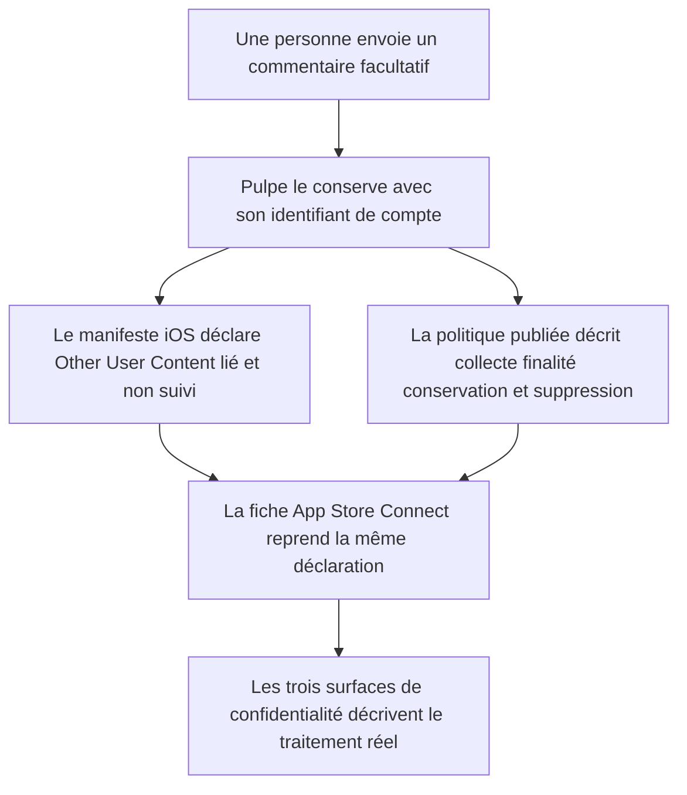
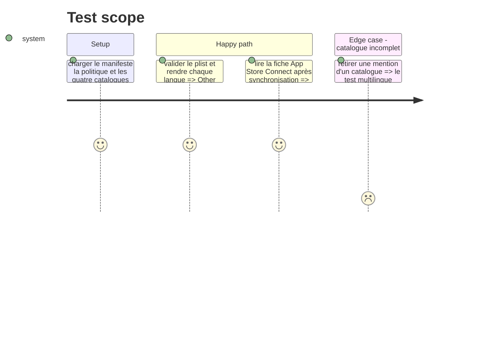

# Instruction: Aligner les déclarations de confidentialité

## Architecture projection

> Tree of the final files. ✅ create · ✏️ modify · ❌ delete

```txt
.
├── ios
│   └── Pulpe/Resources/PrivacyInfo.xcprivacy                                  ✏️ déclare le commentaire libre comme Other User Content lié, non suivi et utilisé pour l'analyse
└── frontend/projects/webapp
    ├── public/i18n
    │   ├── fr.json                                                              ✏️ source de vérité collecte, finalité, conservation et suppression du feedback
    │   ├── de.json                                                              ✏️ version allemande du même contrat de confidentialité
    │   ├── en.json                                                              ✏️ version anglaise du même contrat de confidentialité
    │   └── it.json                                                              ✏️ version italienne du même contrat de confidentialité
    └── src/app/feature/legal/components
        ├── privacy-policy.ts                                                    ✏️ rend les nouvelles mentions et actualise la date du document
        └── privacy-policy.spec.ts                                               ✏️ vérifie les mentions dans les quatre langues sans clé manquante
```

## User Journey



## Test Scope



## Tasks to do

### `1)` Déclarer le contenu utilisateur dans le manifeste iOS

> Le manifeste décrit exactement le commentaire libre déjà conservé côté serveur.

1. Ajouter `NSPrivacyCollectedDataTypeOtherUserContent` à `NSPrivacyCollectedDataTypes` avec `NSPrivacyCollectedDataTypeLinked = true`, `NSPrivacyCollectedDataTypeTracking = false` et `NSPrivacyCollectedDataTypePurposeAnalytics`.
2. Conserver les déclarations existantes inchangées et valider la structure du plist.

### `2)` Rendre le traitement explicite dans la politique complète

> La politique publiée nomme le feedback à chaque étape utile de son cycle de vie.

1. Ajouter en français une donnée fournie `feedback`, une finalité d'amélioration produit et une durée de conservation liée au compte ; préciser que la suppression du compte efface aussi ces retours sous le délai existant.
2. Reporter les mêmes clés et le même sens en allemand, anglais et italien, dans le registre déjà utilisé par chaque catalogue.
3. Rendre les nouvelles lignes dans les sections collecte, utilisation et conservation de `privacy-policy.ts`, puis actualiser la date de dernière mise à jour au 1er septembre 2026.

### `3)` Verrouiller la cohérence multilingue

> Un oubli de traduction ou de rendu doit casser le test du document légal.

1. Étendre `privacy-policy.spec.ts` avec une formulation caractéristique du feedback pour chacune des quatre langues et les dates localisées du 1er septembre 2026.
2. Conserver les invariants légaux existants et vérifier qu'aucune clé `legal.privacy` n'apparaît dans le rendu.

### `4)` Synchroniser la fiche App Store Connect

> La Privacy Nutrition Label reste cohérente avec le binaire et la politique publique.

1. Ajouter `Other User Content` dans App Store Connect avec finalité `Analytics`, lié à l'identité et non utilisé pour le suivi.
2. Relire l'état publié avant merge ; le manifeste local ne remplace pas cette déclaration externe.

## Test acceptance criteria

| Task | Acceptance criteria                                                                                                                                                     |
| ---- | ----------------------------------------------------------------------------------------------------------------------------------------------------------------------- |
| 1    | Le manifeste est un plist valide et déclare Other User Content comme lié au compte, non suivi et utilisé pour l'analyse.                                                |
| 2    | La politique complète expose, en FR, DE, EN et IT, la collecte du feedback, sa finalité d'amélioration, sa conservation avec le compte et sa suppression avec celui-ci. |
| 3    | Le test du composant rend les mentions propres à chaque langue, la date du 1er septembre 2026 et aucune clé de traduction brute.                                        |
| 4    | App Store Connect affiche Other User Content avec les mêmes valeurs de finalité, lien à l'identité et suivi que le manifeste.                                           |
