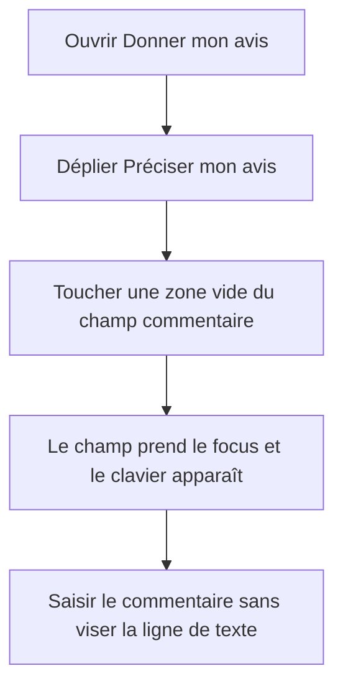
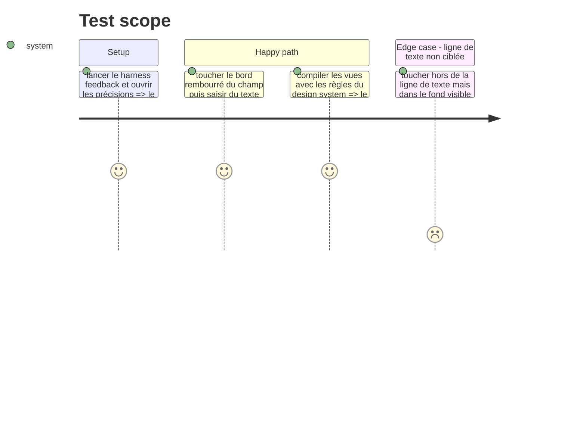

# Instruction: Lever les écarts SwiftUI et design system

## Architecture projection

> Tree of the final files. ✅ create · ✏️ modify · ❌ delete

```txt
.
└── ios
    ├── Pulpe
    │   ├── Features/Account/AccountView.swift                                  ✏️ remplace l'espacement brut par le token existant
    │   └── Shared/Components/FeedbackSheet.swift                               ✏️ rend tout le champ commentaire focalisable et utilise la typographie partagée
    └── PulpeUITests/FeedbackUITests.swift                                       ✏️ prouve le focus depuis la surface rembourrée du commentaire
```

## User Journey



## Test Scope



## Tasks to do

### `1)` Étendre le focus à toute la surface du commentaire

> Toute la zone dessinée comme champ se comporte comme un champ.

1. Après le `clipShape`, ajouter `.contentShape(.interaction, Rectangle())` et `.onTapGesture { focusedField = .comment }` au `TextField` multiligne de `FeedbackSheet`.
2. Conserver le `FocusState`, la limite de texte, l'overlay et l'identifiant d'accessibilité existants.

### `2)` Remplacer les deux valeurs visuelles ad hoc

> La correction réutilise les tokens déjà présents, sans nouveau composant ni nouveau token.

1. Remplacer `.title2.bold()` par `PulpeTypography.title2` sur le titre de la sheet.
2. Remplacer `spacing: 2` par `DesignTokens.Spacing.xxs` dans la ligne Support de `AccountView`.

### `3)` Couvrir la régression tactile

> Le test vise une partie rembourrée, pas seulement le texte du placeholder.

1. Étendre `FeedbackUITests` pour toucher une coordonnée intérieure proche du bord du champ `feedbackComment` et vérifier que le clavier devient visible.
2. Saisir ensuite un commentaire et conserver l'audit existant Dynamic Type, régions tactiles et libellés accessibles.

## Test acceptance criteria

| Task | Acceptance criteria                                                                                                                                              |
| ---- | ---------------------------------------------------------------------------------------------------------------------------------------------------------------- |
| 1    | Un toucher n'importe où dans le fond visible du commentaire lui donne le focus et permet la saisie.                                                              |
| 2    | Le titre de la sheet utilise `PulpeTypography.title2` et la pile de la ligne Support utilise `DesignTokens.Spacing.xxs`, sans valeur visuelle brute équivalente. |
| 3    | Le test UI reproduit un toucher hors de la ligne de texte, observe le clavier, saisit le commentaire et conserve l'audit d'accessibilité existant.               |
