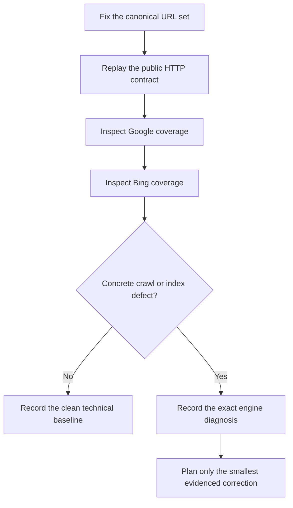
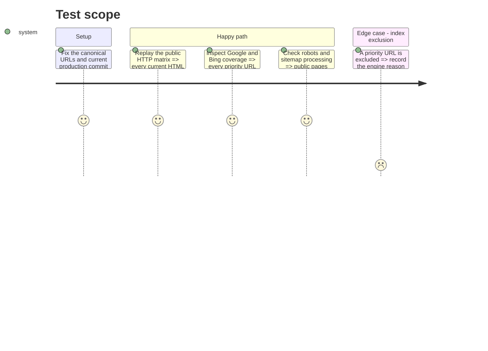

# Instruction: prove crawlability and index coverage

## Blocker

All public and repository-controlled checks pass. Google URL coverage and Bing
URL Inspection cannot be completed without access to the verified properties;
the public response also does not expose its Vercel deployment commit. The
missing access and completed baseline are recorded in
[`verification.md`](./verification.md). Later phases were not started.

## Architecture projection

> Tree of the final files. ✅ create · ✏️ modify · ❌ delete

```txt
aidd_docs/tasks/2026_09/2026_09_01_public-agent-discoverability/
└── verification.md  ✅ textual production, Google, Bing, and crawler evidence
```

## User Journey



## Test Scope



## Tasks to do

### `1)` Fix the canonical evidence set

> Measure the pages that can actually support a recommendation.

1. Use `/`, `/about`, `/privacy`, `/support`, `/conseils-budget`, `/conseils-budget/meilleure-app-budget-suisse`, `/conseils-budget/alternative-ynab-suisse`, and `/conseils-budget/comment-faire-son-budget-en-suisse` as the initial URL set.
2. Record the production commit, date, locale, canonical URL, and sitemap membership for every entry.

### `2)` Replay the existing technical contract

> Prove the deployed baseline instead of reopening already solved Ora findings.

1. Run the landing test suite and the existing production agent verifier.
2. Confirm raw homepage HTML still has one H1, useful visible text, and an ordered heading outline without JavaScript.
3. Confirm negotiated Markdown, recoverable 404s, `/llms.txt`, `/index.md`, trust pages, sitemap, robots, and Organization JSON-LD remain publicly readable and match their declared status, type, and cache key.

### `3)` Inspect Google and Bing rather than guessing

> Separate a crawler defect from an authority or freshness delay.

1. With authorized Google Search Console access, inspect each priority URL, submit the existing sitemap if absent, and record the coverage reason and last crawl.
2. Import the verified property into Bing Webmaster Tools or use the existing property, then record sitemap processing and URL Inspection results for the same set.
3. Confirm the generic `User-agent: *` rule grants crawler access, then request indexing only for canonical URLs that are not already queued or indexed.

### `4)` Store a textual baseline

> Leave one durable source for later comparison.

1. Create `verification.md` with the exact commands, status, content type, index state, engine reason, and observation date.
2. If credentials are unavailable, name the exact missing access and leave the phase blocked rather than inferring index state from a public result; keep binary evidence out of the tracked folder.

## Test acceptance criteria

| Task | Acceptance criteria                                                                                                                   |
| ---- | ------------------------------------------------------------------------------------------------------------------------------------- |
| 1    | Every priority URL is canonical, present in the sitemap where intended, and tied to a recommendation-relevant user need.              |
| 2    | The repository tests and production verifier pass, and the deployed representations match their declared status, type, and cache key. |
| 3    | Google and Bing report an explicit state for every priority URL, and no public crawler needed for the objective is blocked.           |
| 4    | `verification.md` contains dated textual evidence and distinguishes missing credentials, index delay, and concrete technical defects. |
