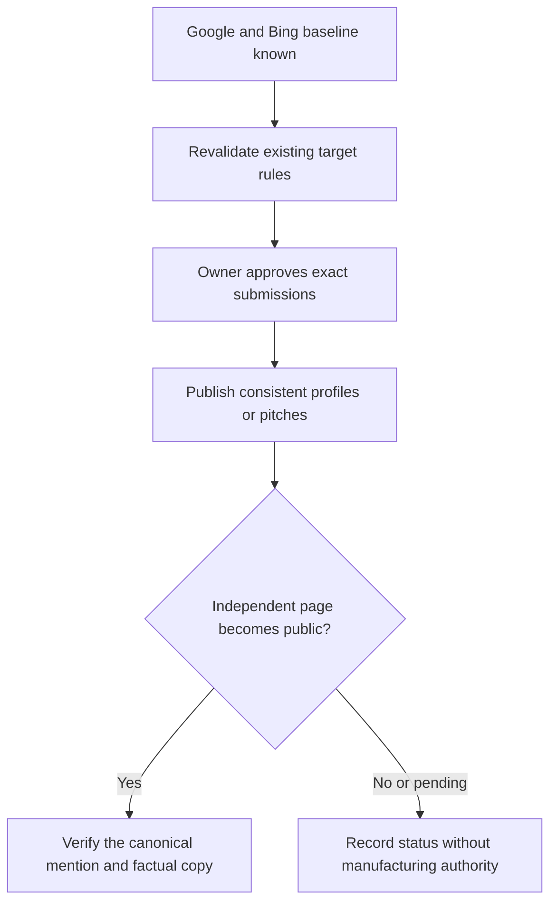
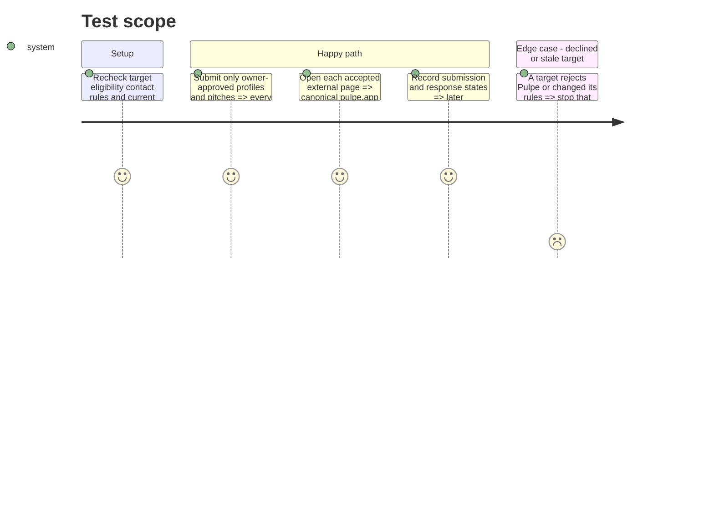

# Instruction: earn consistent independent citations

## Architecture projection

> Tree of the final files. ✅ create · ✏️ modify · ❌ delete

```txt
aidd_docs/tasks/2026_09/2026_09_01_public-agent-discoverability/
└── verification.md  ✏️ authorized submissions, responses, and live canonical mentions
```

## User Journey



## Test Scope



## Tasks to do

### `1)` Reuse the existing distribution assets

> Start from verified work already in the repository.

1. Re-read `2026_07_23_growth-seo-assets/outreach-directories.md` and `outreach-listicles.md` immediately before any external action because eligibility and contacts can change.
2. Keep Product Hunt deferred, skip communities that prohibit self-promotion, and do not create another outreach corpus.

### `2)` Freeze one factual entity description

> Make independent sources describe the same product without inflated claims.

1. Use the current product truth: Pulpe helps people in Switzerland and France plan their budget across the year, see what remains in future months, and works without a bank connection.
2. Use `https://pulpe.app` as the canonical domain and link to the relevant public page when a target accepts a deep link.
3. Verify time-sensitive claims such as price, platforms, languages, and Android availability on the day of submission.

### `3)` Activate the smallest useful external set

> Prefer a few relevant sources to a broad low-quality campaign.

1. After explicit owner approval, submit the already prepared profiles to AlternativeTo and Les Pépites Tech when their current rules still allow it.
2. After separate approval of each final message, contact at most two editorial targets whose current audience matches annual budget planning in France or Switzerland.
3. Use App Store and GitHub as corroborating first-party identities, not independent citations, then wait for responses before opening more channels.

### `4)` Verify and record outcomes

> Count only public, factual evidence.

1. Add each authorized submission date, target, final copy, state, and public URL to `verification.md`.
2. Verify accepted links and copy; record declines, non-responses, and rule changes without fake profiles or reciprocal-link schemes.

## Test acceptance criteria

| Task | Acceptance criteria                                                                                                                     |
| ---- | --------------------------------------------------------------------------------------------------------------------------------------- |
| 1    | Every used target was revalidated immediately before action, and no duplicate outreach corpus was created.                              |
| 2    | Every external description uses the canonical domain and only claims supported by the current product and public pages.                 |
| 3    | Only the explicitly approved minimal set is contacted, with no prohibited community promotion or deferred Product Hunt launch.          |
| 4    | Every submission and response is dated in `verification.md`; every live mention resolves to `pulpe.app` and describes Pulpe accurately. |
