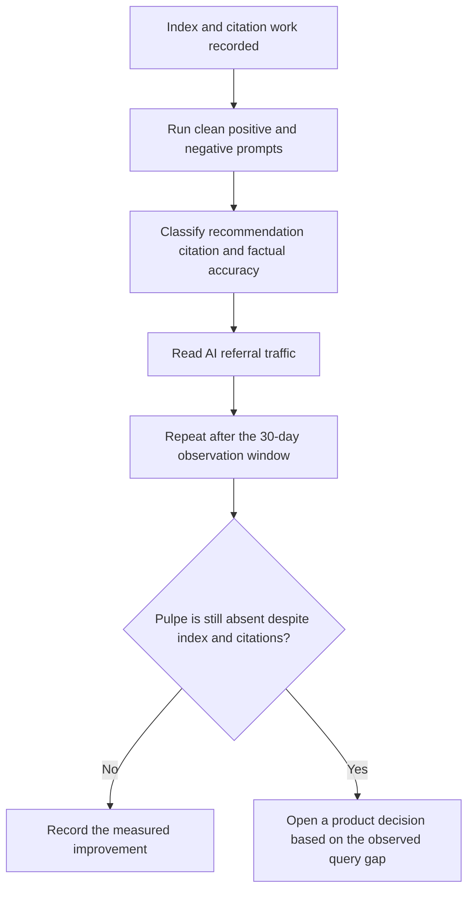
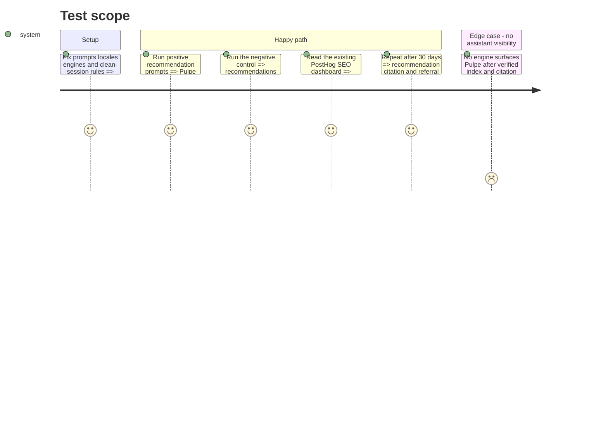

# Instruction: measure assistant recommendations

## Architecture projection

> Tree of the final files. ✅ create · ✏️ modify · ❌ delete

```txt
aidd_docs/tasks/2026_09/2026_09_01_public-agent-discoverability/
└── verification.md  ✏️ prompt matrix, citations, referrals, and dated comparison
```

## User Journey



## Test Scope



## Tasks to do

### `1)` Define a stable prompt matrix

> Test the user need, not the brand name.

1. Run French prompts for a free annual budget planner in CHF or EUR without bank synchronization, planning taxes and holidays across future months, and a simpler alternative to a spreadsheet or YNAB.
2. Add one negative control asking for automatic bank synchronization and a shared household budget, where Pulpe should not be presented as the best fit.
3. Use fresh sessions in ChatGPT Search, Google AI Mode or Gemini with search, and Perplexity; record engine, date, locale, personalization state, and keep prompt wording unchanged.

### `2)` Score observable recommendation quality

> Separate being mentioned from being recommended correctly.

1. For each response, record whether Pulpe is surfaced, recommended for the stated need, linked to the canonical domain, and described without false capabilities.
2. Record every cited URL and whether it is a Pulpe page or an independent source.
3. Keep the exact `Pulpe` search secondary and store only compact surfaced/recommended/cited/accurate observations, not full copyrighted responses.

### `3)` Reuse existing traffic measurement

> Measure downstream evidence without another analytics implementation.

1. Read the existing PostHog `SEO — pulpe.app` dashboard for the 30-day baseline and follow-up window.
2. Separate search-engine referrers from AI referrers and inspect `utm_source=chatgpt.com` when present, as documented by OpenAI.
3. Record absolute visitors and conversions rather than percentages at the current low traffic volume.

### `4)` Decide from evidence after 30 days

> Avoid another round of agent-specific plumbing when the gap is authority or content.

1. Repeat the exact prompt and referral matrix after 30 days.
2. If Pulpe appears with a correct canonical citation for matching use cases, record the engines and prompts where it succeeds without claiming a permanent rank.
3. If Pulpe remains absent despite index and citations, ask for one decision between unique expert content for the observed query gap and continued targeted authority work; do not add speculative machine files, schema, or generated articles.

## Test acceptance criteria

| Task | Acceptance criteria                                                                                                                                              |
| ---- | ---------------------------------------------------------------------------------------------------------------------------------------------------------------- |
| 1    | The same positive prompts and negative control are run in clean sessions across the selected assistants with date and locale recorded.                           |
| 2    | Every response is classified for surfacing, recommendation, canonical citation, and factual accuracy, with cited URLs retained.                                  |
| 3    | The existing dashboard provides absolute search and AI-referral observations for the baseline and follow-up windows without new tracking code.                   |
| 4    | The 30-day comparison is recorded, and any remaining zero-visibility result leads to one evidence-based product decision rather than speculative technical work. |
