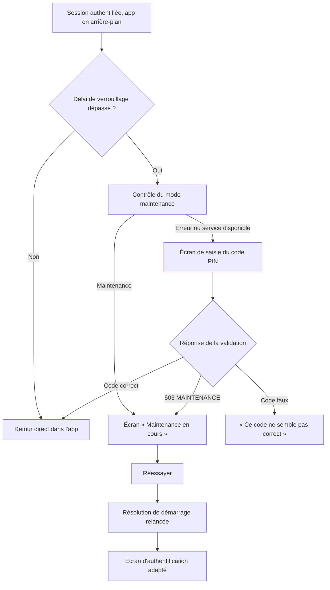
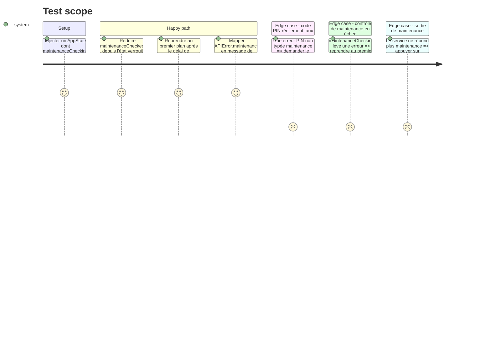

# Instruction: Prioriser la maintenance sur le déverrouillage iOS

## Architecture projection

> Tree of the final files. ✅ create · ✏️ modify · ❌ delete

```txt
.
└── ios/
    ├── Pulpe/
    │   ├── App/
    │   │   ├── Core/
    │   │   │   └── AppFlowReducer.swift                    ✏️ `.maintenanceChecked(true)` devient une transition globale
    │   │   ├── AppState+Maintenance.swift                  ✏️ helper de contrôle « fail-open » pour la reprise à chaud
    │   │   └── AppState+SessionReset.swift                 ✏️ la reprise à chaud teste la maintenance avant de router vers le PIN
    │   ├── Features/
    │   │   ├── Auth/Pin/PinCryptoProtocols.swift           ✏️ `.maintenance` sort du `default` de `pinValidationMessage`
    │   │   └── Maintenance/MaintenanceView.swift           ✏️ le réessai relance `retryStartup()`
    └── PulpeTests/
        ├── App/
        │   ├── Core/AppFlowReducerTests.swift              ✏️ maintenance depuis `.locked` et les autres états
        │   └── AppStateMaintenanceForegroundTests.swift    ✅ reprise à chaud sous maintenance
        └── Features/Auth/PinMaintenanceMessageTests.swift  ✅ mapping du message PIN
```

## User Journey



## Test Scope



## Tasks to do

### `1)` Rendre la maintenance prioritaire sur les écrans de déverrouillage

> Un `503 MAINTENANCE` reçu pendant l'authentification ou le déverrouillage doit basculer l'app en maintenance.

1. Dans `AppFlowReducer`, faire de `.maintenanceChecked(true)` une transition vers `.maintenance` depuis `.initializing`, `.unauthenticated`, `.securitySetup`, `.locked` et `.recovering`, en un seul point plutôt qu'une garde recopiée dans chaque `reduce*`.
2. Laisser `.authenticated` inchangé : hors périmètre du ticket, un 503 en pleine session ne doit pas éjecter l'utilisateur.
3. Laisser `.maintenanceChecked(false)` aux états concernés : `reduceMaintenance` garde son retour vers `.initializing`.
4. Ne toucher à aucun autre événement.

### `2)` Ne jamais présenter la maintenance comme une erreur de saisie

> Le message affiché sous l'écran PIN doit dire la vérité.

1. Dans `APIError.pinValidationMessage`, ajouter un `case .maintenance` renvoyant un message de maintenance passé par `AppLocale.string`, aligné sur le vocabulaire de `MaintenanceView`.
2. Conserver `.rateLimited`, `.networkError` et le `default` existants inchangés.

### `3)` Contrôler la maintenance avant de demander le code PIN

> La reprise à chaud ne doit pas ouvrir l'écran PIN quand le serveur est en maintenance.

1. Dans `AppState+Maintenance.swift`, ajouter un helper qui appelle `maintenanceChecking()` et renvoie `false` sur toute erreur — surtout pas la sémantique « fail-closed » de `checkMaintenanceStatus()`.
2. Dans `AppState.handleEnterForeground()`, sur `.lockRequired` et `.staleKeyLockRequired`, appeler ce helper avant de poser `authState = .needsPinEntry`.
3. Quand il renvoie `true`, envoyer `.maintenanceChecked(isInMaintenance: true)` et ne pas poser `.needsPinEntry`.
4. Ne pas ajouter ce contrôle sur `.noLockNeeded` ni `.biometricUnlockSuccess` : aucun écran PIN n'y est affiché.

### `4)` Relancer la résolution de démarrage à la sortie de maintenance

> Sortir de maintenance doit mener à un écran, pas à un spinner.

1. Dans `MaintenanceView.checkAndRetry()`, remplacer le `MaintenanceService.shared.checkStatus()` + `setMaintenanceMode(false)` par un `await appState.retryStartup()`.
2. Après le retour, si `appState.isInMaintenance` est toujours vrai, afficher le message « toujours en maintenance » existant ; sinon ne rien afficher.
3. Conserver l'état `isChecking`, le libellé du bouton et le style existants.

### `5)` Couvrir les régressions par des tests

> Chaque défaut corrigé doit être tenu par un test qui échoue sans le correctif.

1. Étendre `AppFlowReducerTests` : `.maintenanceChecked(true)` depuis `.locked`, `.unauthenticated`, `.securitySetup` et `.recovering` donne `.maintenance` ; depuis `.authenticated` il reste sans effet ; `.maintenanceChecked(false)` depuis `.maintenance` donne toujours `.initializing`.
2. Créer un test de reprise à chaud : `maintenanceChecking` renvoyant `true` ⇒ `isInMaintenance` vrai et `authState != .needsPinEntry` ; `maintenanceChecking` levant une erreur ⇒ `authState == .needsPinEntry`.
3. Créer un test de message : `APIError.maintenance.pinValidationMessage` diffère du message d'un code faux, et une erreur non typée maintenance garde le message existant.
4. Suivre les conventions du projet : Swift Testing, `nonisolated(unsafe)` pour les compteurs de test, locale épinglée pour toute assertion sur un texte.

## Test acceptance criteria

| Task | Acceptance criteria                                                                                                                                            |
| ---- | -------------------------------------------------------------------------------------------------------------------------------------------------------------- |
| 1    | Un `.maintenanceChecked(true)` reçu alors que l'app est verrouillée bascule sur l'écran de maintenance ; la sortie de maintenance reste possible.                |
| 2    | Un `503 MAINTENANCE` pendant la validation du PIN n'affiche jamais « Ce code ne semble pas correct » ; un code réellement faux affiche toujours ce message.       |
| 3    | Avec le serveur en maintenance, un retour au premier plan après le délai de verrouillage affiche la maintenance sans demander le code PIN ; un contrôle en échec continue d'afficher l'écran PIN. |
| 4    | Une fois la maintenance terminée, « Réessayer » relance la résolution de démarrage et mène à l'écran d'authentification attendu, jamais à un écran de chargement figé. |
| 5    | La suite iOS s'exécute et chaque test ajouté échoue si l'on annule le correctif qu'il couvre.                                                                    |
