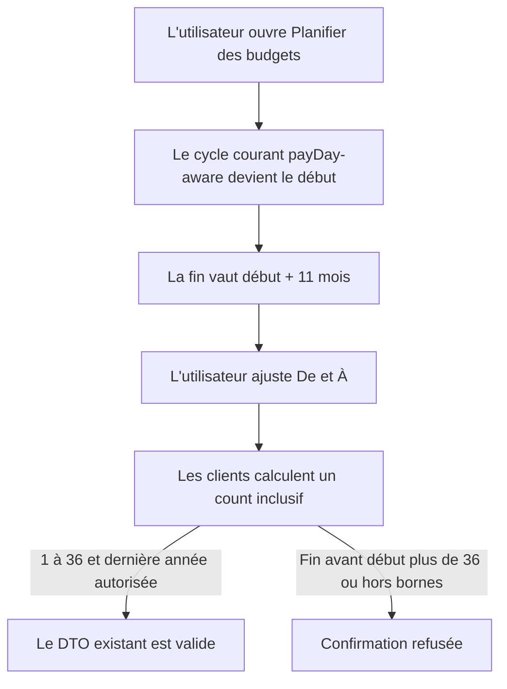
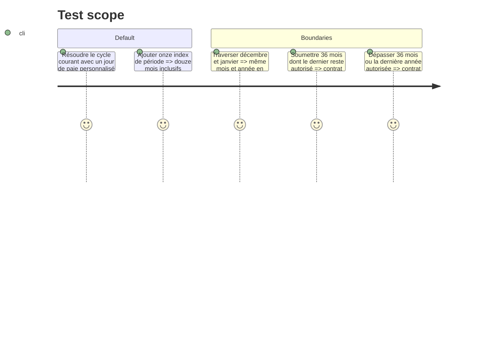

# Instruction: Verrouiller le contrat de période partagé

## Architecture projection

> Tree of the final files. ✅ create · ✏️ modify · ❌ delete

```txt
.
├── docs/
│   └── BUSINESS_WORKFLOW.md                                      ✏️ aligne le scénario sur une période inclusive payDay-aware
├── shared/
│   ├── schemas.ts                                                ✏️ refuse une dernière période hors bornes
│   └── src/
│       ├── budget-generate-schema.spec.ts                        ✅ couvre les limites du contrat de génération
│       └── calculators/
│           └── budget-period.spec.ts                             ✏️ fixe les conversions d'index utilisées par les clients
└── ios/
    ├── Pulpe/Domain/Formulas/BudgetPeriodCalculator.swift        ✏️ ajoute le miroir Swift index ↔ période
    └── PulpeTests/Domain/Formulas/BudgetPeriodCalculatorTests.swift ✏️ rejoue les mêmes passages d'année
```

## User Journey



## Test Scope



## Tasks to do

### `1)` Fermer la validation de la dernière période

> Le trust boundary partagé doit valider la série calculée, pas seulement son premier mois et sa longueur.

1. Étendre `budgetGenerateSchema` avec une validation croisée de `startMonth`, `startYear` et `count` qui refuse toute dernière période au-delà de la borne annuelle existante.
2. Garder le body strict, le défaut à 12 et la limite à 36 afin de ne casser aucun appel d'onboarding valide.
3. Tester les cas 1, 12 et 36 mois, le passage d'année, les limites de début et le dépassement de la dernière année.

### `2)` Donner à Swift la même arithmétique de période

> Réutiliser les fonctions TypeScript déjà exportées et ne compléter que le miroir manquant.

1. Ajouter `periodIndex` et `periodFromIndex` à `BudgetPeriodCalculator` avec la formule exacte de `shared/src/calculators/budget-period.ts`.
2. Ajouter de part et d'autre les mêmes fixtures janvier/décembre et multi-années, dont le calcul inclusif `endIndex - startIndex + 1`.

### `3)` Aligner le workflow métier

> Le document de référence doit décrire le comportement que les quatre applications livreront.

1. Remplacer le défaut « année civile » par 12 cycles consécutifs depuis le cycle courant payDay-aware.
2. Documenter la période inclusive, la limite de 36, l'ignorance des budgets existants et le compte rendu créé/ignoré.

## Test acceptance criteria

| Task | Acceptance criteria                                                                                                                                                 |
| ---- | ------------------------------------------------------------------------------------------------------------------------------------------------------------------- |
| 1    | Le schéma accepte les appels existants valides et refuse avant le backend toute série dont le dernier mois dépasse les bornes ou dont la longueur sort de `1...36`. |
| 2    | Les fixtures TypeScript et Swift produisent les mêmes index, périodes et comptes inclusifs, notamment sur décembre → janvier.                                       |
| 3    | `docs/BUSINESS_WORKFLOW.md` décrit exactement le défaut payDay-aware, la sélection inclusive, les mois ignorés et les deux compteurs du résultat.                   |
