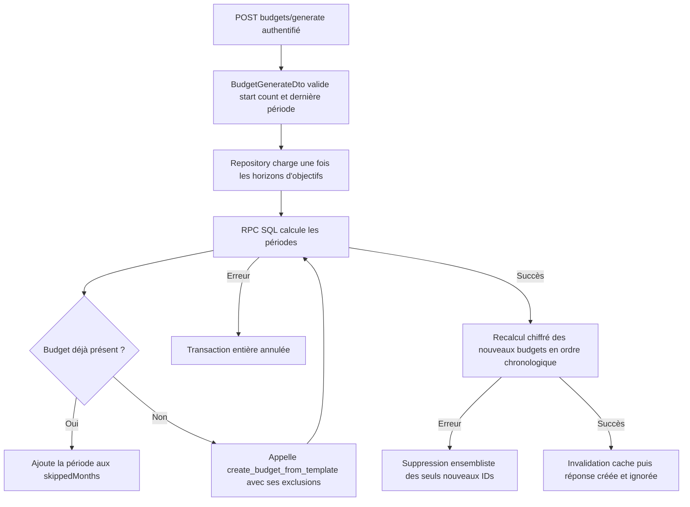
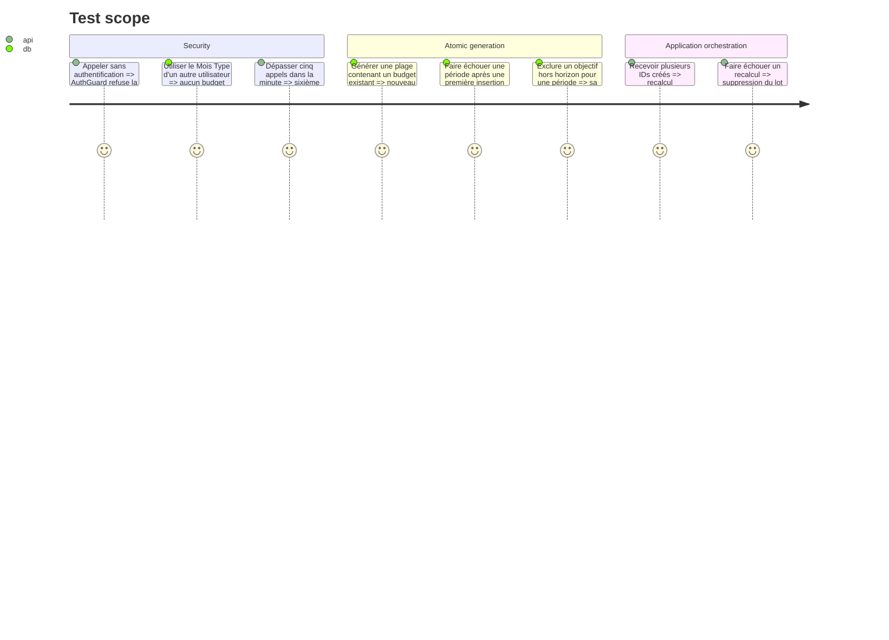

# Instruction: Rendre la génération backend atomique

## Architecture projection

> Tree of the final files. ✅ create · ✏️ modify · ❌ delete

```txt
.
└── backend-nest/
    ├── src/
    │   ├── modules/budget/
    │   │   ├── application/
    │   │   │   ├── generate-budgets.use-case.ts                 ✏️ orchestre un RPC unique puis les recalculs ordonnés
    │   │   │   └── generate-budgets.use-case.spec.ts            ✅ couvre succès skips ordre et rollback
    │   │   ├── budget.rate-limit.spec.ts                         ✅ verrouille la limite de 5 requêtes par minute
    │   │   ├── domain/ports/budget-repository.port.ts            ✏️ expose la création atomique d'une série
    │   │   ├── infrastructure/persistence/
    │   │   │   ├── supabase-budget.repository.ts                ✏️ calcule les exclusions une fois et appelle le RPC de série
    │   │   │   └── supabase-budget.repository.spec.ts           ✏️ valide payload réponse stricte et erreurs
    │   │   └── schemas/
    │   │       ├── rpc-responses.schema.ts                       ✏️ parse le résultat JSON du nouveau RPC
    │   │       └── rpc-responses.schema.spec.ts                  ✅ refuse les résultats incomplets ou mal typés
    │   └── types/database.types.ts                               ✏️ régénère la signature Supabase locale
    └── supabase/
        ├── migrations/
        │   └── 20260901120000_generate_budgets_atomically.sql    ✅ crée le RPC invoker et ses grants minimaux
        └── tests/
            ├── README.md                                         ✏️ inventorie la nouvelle preuve SQL
            ├── generate_budgets_atomically.sql                   ✅ prouve transaction skips ownership et exclusions
            └── security_definer_function_privileges.sql          ✏️ ajoute le RPC à l'inventaire invoker authentifié
```

## User Journey



## Test Scope



## Tasks to do

### `1)` Créer la primitive SQL de série

> La boucle PostgreSQL est une seule transaction et réutilise le RPC feuille éprouvé.

1. Ajouter `generate_budgets_from_template` en `SECURITY INVOKER`; valider utilisateur, Mois Type, mois/année de départ, `count` et dernière période avant la première écriture.
2. Prendre un advisory lock transactionnel par utilisateur avant les tests d'existence, calculer chaque période, ignorer les mois déjà présents, puis appeler `create_budget_from_template` avec la liste d'objectifs à exclure pour ce mois.
3. Retourner dans l'ordre `created_budget_ids` et `skipped_months`, révoquer `PUBLIC`/`anon`, accorder uniquement `authenticated` et `service_role`, puis régénérer `database.types.ts` avec `bun run generate-types:local`.

### `2)` Remplacer la boucle applicative par un appel atomique

> Le HTTP public reste inchangé; seul le port de persistence gagne l'opération ensembliste nécessaire.

1. Ajouter au repository port une méthode recevant l'utilisateur, le Mois Type et les périodes cibles.
2. Charger une seule fois les horizons d'objectifs, produire la table d'exclusions payDay-aware et appeler le nouveau RPC.
3. Parser strictement le JSON retourné avec Zod et traduire les échecs selon les erreurs métier actuelles.
4. Dans `GenerateBudgetsUseCase`, recalculer uniquement les IDs créés en ordre chronologique, conserver l'invalidation utilisateur et la suppression ensembliste existante comme compensation d'un échec post-commit.

### `3)` Prouver les invariants du ticket

> Les tests doivent faire échouer toute régression de sécurité ou d'atomicité, pas seulement compter des appels mockés.

1. Ajouter une preuve SQL du succès, des skips, du refus cross-user, du forwarding des exclusions d'objectifs et du rollback d'une erreur tardive.
2. Ajouter les tests unitaires du use case, du repository et du parseur RPC pour l'ordre, les compteurs, les erreurs et la compensation.
3. Reprendre le harness Throttler existant pour fixer explicitement `5/min` sur `POST /budgets/generate`.

## Test acceptance criteria

| Task | Acceptance criteria                                                                                                                                                                                                         |
| ---- | --------------------------------------------------------------------------------------------------------------------------------------------------------------------------------------------------------------------------- |
| 1    | Toute erreur pendant le RPC laisse zéro nouvelle période; une plage valide crée tous les mois absents, sérialise les séries concurrentes d'un utilisateur, renvoie les skips dans l'ordre et respecte RLS/ownership/grants. |
| 2    | L'endpoint et son body restent compatibles; les objectifs hors horizon ne sont pas copiés, les soldes passent toujours par `ENCRYPTION_PORT`, et le cache utilisateur est invalidé.                                         |
| 3    | Les suites SQL et Bun échouent si une création devient partielle, si un autre utilisateur peut fournir le Mois Type, si la réponse dérive ou si le sixième appel n'est plus limité.                                         |
