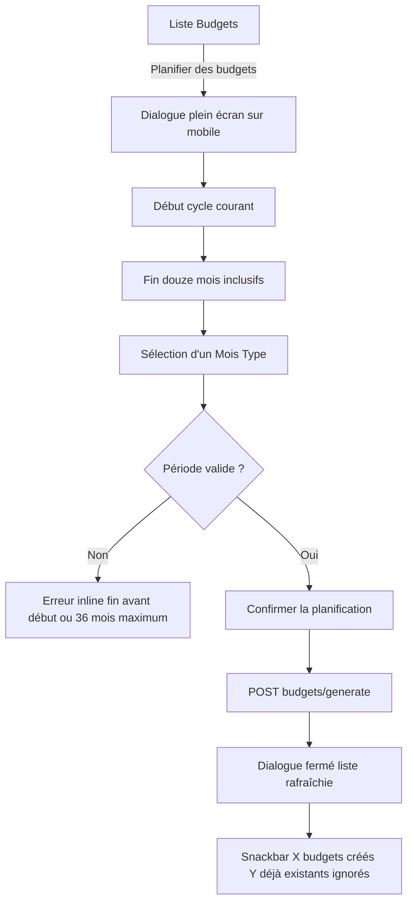
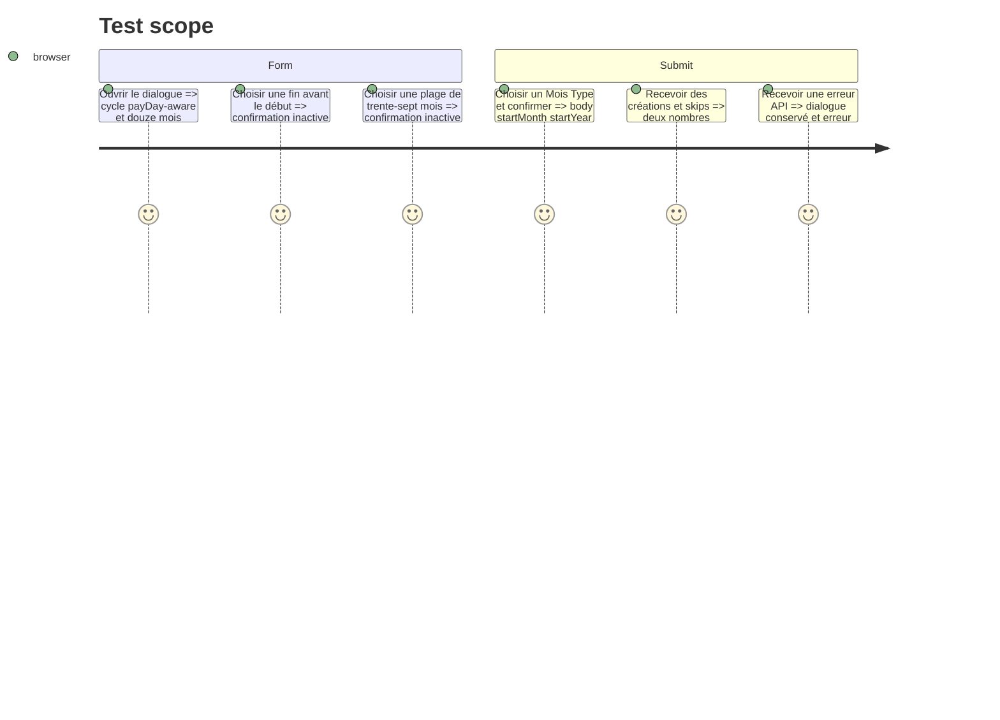

# Instruction: Ajouter la planification à la liste Web

## Architecture projection

> Tree of the final files. ✅ create · ✏️ modify · ❌ delete

```txt
.
└── frontend/projects/webapp/
    ├── public/i18n/
    │   ├── de.json                                               ✏️ traduit le flux de planification
    │   ├── en.json                                               ✏️ traduit le flux de planification
    │   ├── fr.json                                               ✏️ ajoute le vocabulaire produit canonique
    │   └── it.json                                               ✏️ traduit le flux de planification
    └── src/app/feature/budget/budget-list/
        ├── budget-list-page.ts                                   ✏️ expose l'action et le résultat créé/ignoré
        ├── budget-list-page.spec.ts                              ✏️ couvre ouverture rafraîchissement et feedback
        ├── create-budget/services/
        │   ├── template-store.ts                                 ✏️ réutilise sélection modèles et cache pour generate
        │   └── template-store.spec.ts                            ✏️ couvre mutation et invalidation budget
        └── plan-budgets/
            ├── plan-budgets-dialog.schema.ts                     ✅ transforme début/fin inclusifs en DTO existant
            ├── plan-budgets-dialog.schema.spec.ts                ✅ couvre defaults limites et passages d'année
            ├── plan-budgets-dialog.ts                            ✅ rend la sélection et la confirmation accessibles
            └── plan-budgets-dialog.spec.ts                       ✅ couvre états chargement validation succès et erreur
```

## User Journey



## Test Scope



## Wireframe

```txt
┌──────────────────────────────────────────────────────────────┐
│ Budgets                         [Planifier] [+ Ajouter]       │
└──────────────────────────────────────────────────────────────┘

┌─ Planifier des budgets ──────────────────────────────────────┐
│ De                         À                                  │
│ [ Septembre 2026  ▾ ]      [ Août 2027  ▾ ]                  │
│ 12 périodes                                                  │
│                                                              │
│ Mois Type                                                    │
│ (●) Mon modèle par défaut                                    │
│ ( ) Budget minimal                                           │
│                                                              │
│ Les budgets déjà présents seront conservés et ignorés.       │
│                                 [Annuler] [Planifier]         │
└──────────────────────────────────────────────────────────────┘

Notification : 10 budgets créés · 2 déjà existants ignorés
```

## Tasks to do

### `1)` Transformer le formulaire sans changer l'API

> Les deux mois visibles deviennent le DTO existant à la dernière étape.

1. Construire un schéma de formulaire strict `startPeriod/endPeriod/templateId` qui calcule `count = endIndex - startIndex + 1` avec les helpers partagés.
2. Initialiser le début depuis `BudgetListStore.currentDate()` et la fin onze périodes plus tard.
3. Renvoyer des erreurs distinctes pour fin antérieure et plage supérieure à 36, puis repasser le DTO transformé dans `budgetGenerateSchema`.

### `2)` Réutiliser le dialogue et le store de création

> Les modèles, leurs totaux, les états de chargement et le cache existent déjà.

1. Composer le dialogue avec les datepickers mois/année Material et `TemplatesList` existants, en gardant les actions tactiles de 44 px et les labels accessibles.
2. Étendre `TemplateStore` d'une mutation `generateBudgets$` invalidant la clé budget, sans dupliquer le chargement ou la sélection des modèles.
3. Garder le dialogue ouvert sur erreur; le fermer avec la réponse typée seulement après succès.

### `3)` Brancher l'action de liste et le feedback

> Le résultat doit dire ce que le serveur a fait, y compris quand tout existait déjà.

1. Ajouter l'action responsive « Planifier des budgets » dans le header, indépendante du bouton d'ajout unitaire.
2. À la fermeture réussie, laisser l'invalidation rafraîchir le calendrier et afficher les longueurs de `budgets` et `skippedMonths` dans une snackbar localisée.
3. Ajouter les quatre catalogues et les tests composant/store/page correspondant aux chemins heureux, limites et erreurs.

## Test acceptance criteria

| Task | Acceptance criteria                                                                                                                                      |
| ---- | -------------------------------------------------------------------------------------------------------------------------------------------------------- |
| 1    | Le défaut couvre 12 cycles depuis le cycle payDay-aware et aucune requête ne part pour une fin antérieure, plus de 36 mois ou un DTO hors contrat.       |
| 2    | Le dialogue réutilise la liste de Mois Types et le cache existants, reste actionnable au clavier/lecteur d'écran et conserve les choix après une erreur. |
| 3    | Une réussite rafraîchit la liste et annonce séparément les créations et les mois ignorés dans les quatre langues, y compris `0 créé`.                    |
