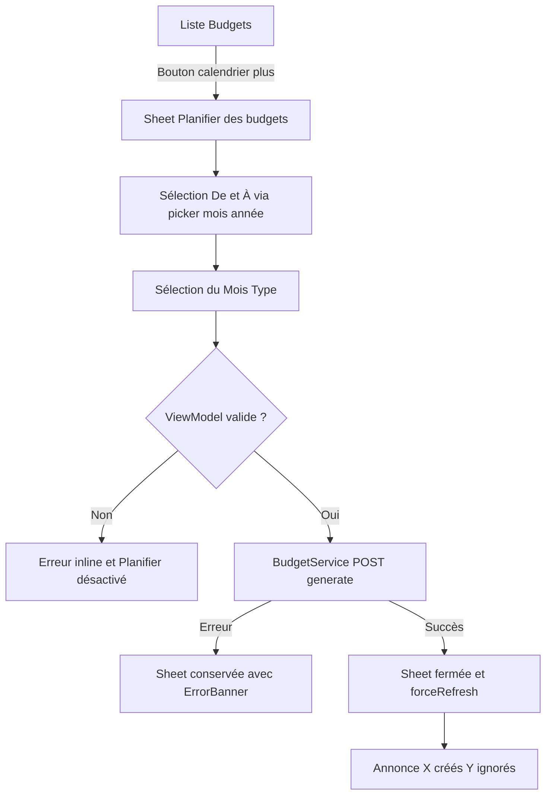
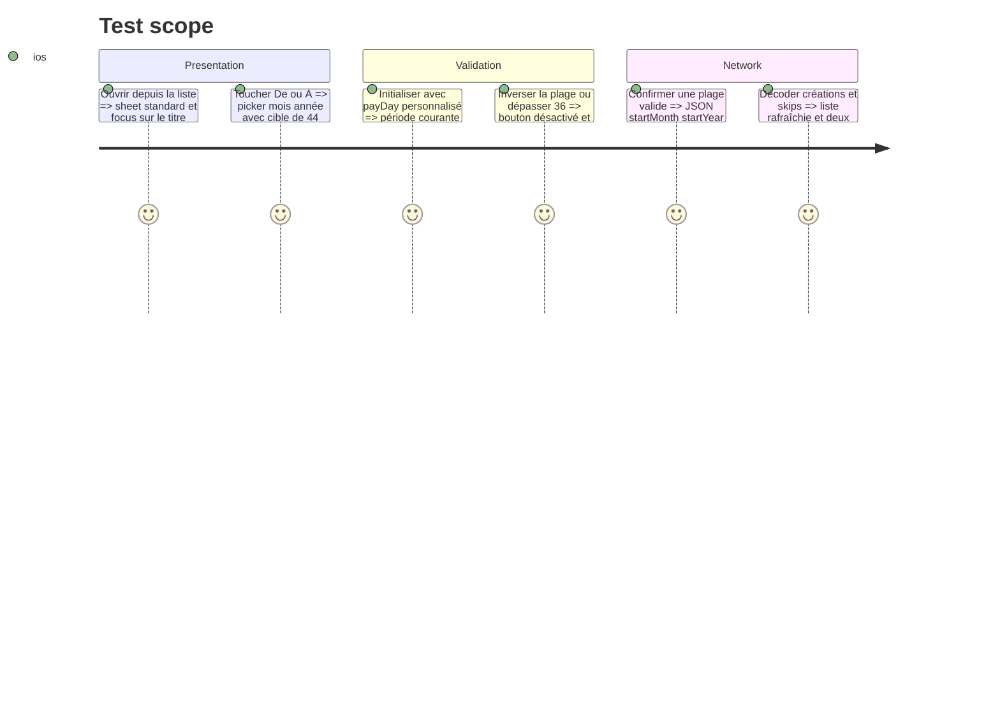

# Instruction: Ajouter la planification à la liste iOS

## Architecture projection

> Tree of the final files. ✅ create · ✏️ modify · ❌ delete

```txt
.
└── ios/
    ├── Pulpe/
    │   ├── Core/Network/Endpoints.swift                          ✏️ mappe POST /budgets/generate
    │   ├── Domain/
    │   │   ├── Models/Budget.swift                               ✏️ ajoute request et réponse Codable de génération
    │   │   └── Services/BudgetService.swift                      ✏️ expose generateBudgets
    │   ├── Features/Budgets/
    │   │   ├── BudgetDetails/Spread/
    │   │   │   ├── SpreadFormSection.swift                      ✏️ adopte le picker mois/année partagé
    │   │   │   └── SpreadMonthPickerSheet.swift                 ❌ remplacé par le composant partagé identique
    │   │   └── BudgetList/
    │   │       ├── BudgetListView.swift                          ✏️ expose la sheet et rafraîchit après succès
    │   │       └── PlanBudgetsView.swift                         ✅ contient la sheet et son ViewModel local
    │   ├── Resources/Localizable.xcstrings                      ✏️ localise action formulaire erreurs et résultat
    │   └── Shared/Components/MonthYearPickerSheet.swift          ✅ généralise le picker existant avec BudgetPeriod
    └── PulpeTests/
        ├── Domain/Services/BudgetGenerationRequestTests.swift    ✅ vérifie path body client key et décodage
        └── Features/Budgets/
            ├── BudgetListAccessibilityTests.swift                ✏️ couvre les deux actions de création
            └── PlanBudgetsViewModelTests.swift                   ✅ couvre defaults validation payload et compteurs
```

## User Journey



## Test Scope



## Wireframe

```txt
Budgets                                      [calendrier +] [+]

┌─ Planifier des budgets ─────────────────────────────────┐
│ [×]                                               [Planifier]
│                                                        │
│ Période                                               │
│ ┌ De ───────────────┐  ┌ À ────────────────┐          │
│ │ Septembre 2026  ↕ │  │ Août 2027       ↕ │          │
│ └───────────────────┘  └────────────────────┘          │
│ 12 périodes                                           │
│                                                        │
│ Mois Type                                             │
│ ◉ Mon modèle par défaut                               │
│ ○ Budget minimal                                      │
│                                                        │
│ Les budgets existants ne seront pas modifiés.         │
└────────────────────────────────────────────────────────┘

Résultat VoiceOver : « 10 budgets créés, 2 déjà existants ignorés »
```

## Tasks to do

### `1)` Ajouter le contrat réseau natif

> Le client encode le même body que Web et Android et décode la réponse existante.

1. Ajouter les structures `BudgetGenerate`, `BudgetGenerateResponse` et la période ignorée dans `Budget.swift`, toutes `Sendable` et avec les types exacts du JSON.
2. Ajouter `.budgetsGenerate` à `Endpoint` avec `/budgets/generate` et la méthode POST.
3. Exposer `generateBudgets` sur `BudgetService` et prouver le body, le header client key, le path et le décodage via `InterceptingURLProtocol`.

### `2)` Réutiliser le picker et les composants de Mois Type

> Le picker Spread est déjà un picker mois/année générique; le déplacer évite une seconde implémentation.

1. Déplacer son rendu vers `Shared/Components/MonthYearPickerSheet.swift` avec `BudgetPeriod`, puis adapter `SpreadFormSection` sans changement fonctionnel.
2. Construire `PlanBudgetsView` en réutilisant `TemplateSelectionCard`, `TemplateService`, les design tokens, `ErrorBanner` et `.standardSheetPresentation()`.
3. Garder le `@Observable @MainActor` ViewModel dans le fichier de sa vue; calculer défaut, compte inclusif, erreurs et DTO avec le miroir de période.

### `3)` Relier la liste au résultat

> L'ajout unitaire reste disponible; la planification reçoit sa propre action accessible.

1. Ajouter un bouton toolbar `calendar.badge.plus` avec label VoiceOver explicite et présenter la nouvelle sheet depuis `BudgetListView`.
2. Après succès, fermer la sheet, appeler `store.forceRefresh()` et annoncer séparément créations/skips, y compris si aucune période n'a été créée.
3. Ajouter les clés `Localizable.xcstrings` pour toutes les locales et tester defaults, limites, payload, compteurs et labels d'accessibilité.

## Test acceptance criteria

| Task | Acceptance criteria                                                                                                                                      |
| ---- | -------------------------------------------------------------------------------------------------------------------------------------------------------- |
| 1    | iOS envoie exactement `templateId/startMonth/startYear/count` à `/budgets/generate`, avec auth/client key existants, et décode budgets/skippedMonths.    |
| 2    | La sheet suit les tokens iOS, réutilise le picker et la sélection de Mois Type existants, et bloque les plages inversées ou supérieures à 36.            |
| 3    | Les actions ajout unitaire/planification sont distinguables par VoiceOver; un succès ferme, rafraîchit et annonce les deux compteurs dans chaque langue. |
