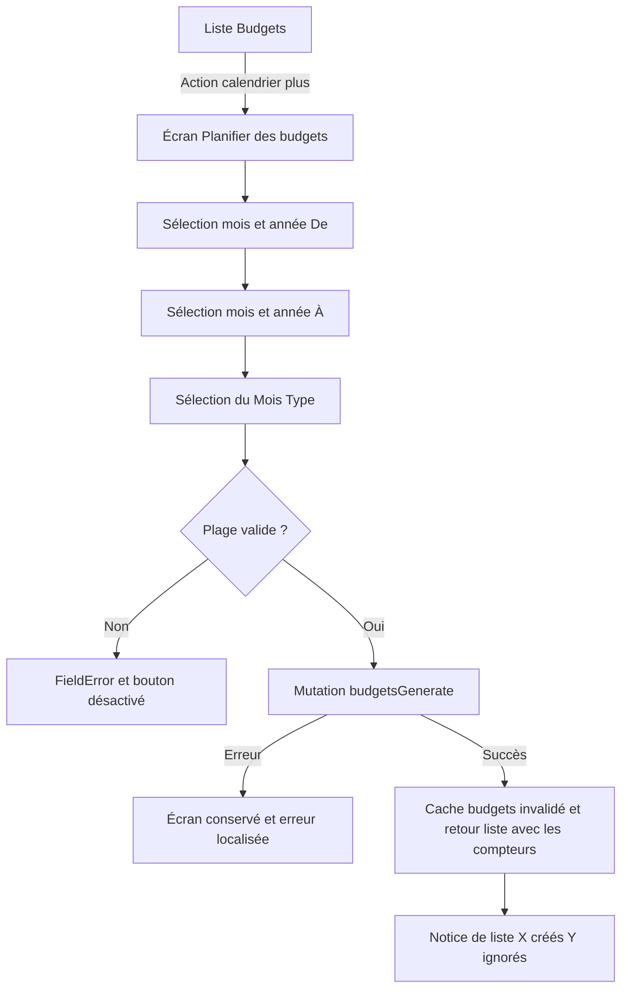
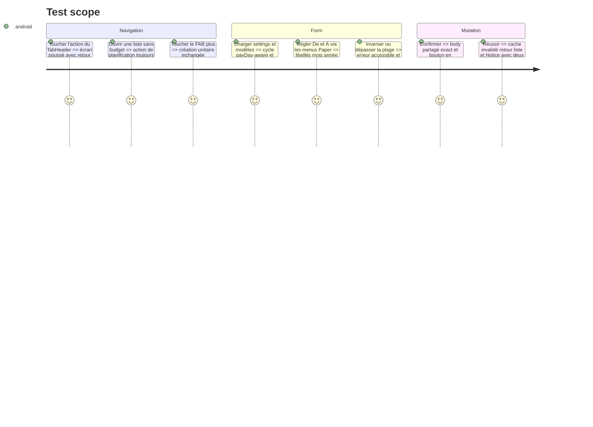

# Instruction: Ajouter la planification à la liste Android

## Architecture projection

> Tree of the final files. ✅ create · ✏️ modify · ❌ delete

```txt
.
└── android/src/
    ├── app/(main)/
    │   ├── (tabs)/budgets.tsx                                  ✏️ ajoute l'action Appbar sans changer le FAB unitaire
    │   └── budget/plan.tsx                                     ✅ rend l'écran poussé De À et Mois Type
    ├── core/i18n/catalogs/
    │   ├── de.json                                             ✏️ traduit le flux de planification
    │   ├── en.json                                             ✏️ traduit le flux de planification
    │   ├── fr.json                                             ✏️ ajoute le vocabulaire produit canonique
    │   └── it.json                                             ✏️ traduit le flux de planification
    └── features/budgets/
        ├── budget-api.ts                                       ✏️ ajoute l'appel generate validé par les schémas partagés
        ├── budget-api.spec.ts                                  ✏️ couvre endpoint body et réponse
        ├── budgets-screen.spec.tsx                             ✏️ couvre l'accès distinct depuis la liste
        ├── generate-budgets-mutation.ts                        ✅ invalide tout le préfixe budget après succès
        └── plan-budget-screen.spec.tsx                         ✅ couvre defaults pickers limites succès et erreur
```

## User Journey



## Test Scope



## Wireframe

```txt
┌──────────────────────────────────────┐
│ Budgets                  [calendrier+]│
│                                      │
│                              (+) FAB │
└──────────────────────────────────────┘

┌──────────────────────────────────────┐
│ ‹  Planifier des budgets             │
│                                      │
│ De                                   │
│ [ Septembre ▾ ] [ 2026 ▾ ]           │
│ À                                    │
│ [ Août      ▾ ] [ 2027 ▾ ]           │
│ 12 périodes                          │
│                                      │
│ Mois Type                            │
│ (●) Mon modèle par défaut            │
│ ( ) Budget minimal                   │
│                                      │
│ Les budgets existants seront ignorés.│
│                        [Planifier]    │
└──────────────────────────────────────┘
```

## Tasks to do

### `1)` Ajouter l'appel et la mutation de génération

> L'endpoint et les schémas sont déjà déclarés; il manque uniquement le chemin métier budgets.

1. Ajouter à `budget-api.ts` un POST vers `ENDPOINTS.budgetsGenerate` avec `budgetGenerateSchema` et `budgetGenerateResponseSchema`.
2. Ajouter `useGenerateBudgets` sur le modèle de `useCreateBudget`, en invalidant `budgetKeys.all` au succès.
3. Tester l'URL, le body, la validation de réponse et l'invalidation sans créer un second cache ni une seconde définition de DTO.

### `2)` Construire l'écran avec les primitives installées

> React Native Paper suffit pour quatre sélecteurs mois/année et la liste de modèles.

1. Créer l'écran poussé avec `ScreenAppBar`, boutons/menus Paper pour mois et année, `RadioButton.Group` pour les Mois Types et footer de confirmation épinglé.
2. Dériver le début du `payDayOfMonth`, la fin avec `periodFromIndex(start + 11)` et le compte inclusif avec `periodIndex`; ne pas synchroniser les defaults asynchrones par effet.
3. Afficher les états sans Mois Type, les erreurs fin antérieure, plus de 36, chargement de données et mutation, avec cibles tactiles et labels TalkBack.

### `3)` Relier la liste et restituer le résultat

> Le FAB reste le raccourci d'ajout unitaire; l'Appbar porte la nouvelle intention.

1. Garder le `TabHeader` dans le shell de la liste, y compris à vide, passer un `Appbar.Action` accessible à son `trailing` existant et router vers `/budget/plan`.
2. Sur succès, revenir à la liste avec les deux compteurs en paramètres de navigation, puis les afficher dans le composant `Notice` existant et nettoyer ces paramètres à sa fermeture, y compris pour zéro création.
3. Ajouter les quatre catalogues et les tests d'écran/navigation; laisser le test de parité existant vérifier que les clés restent identiques.

## Test acceptance criteria

| Task | Acceptance criteria                                                                                                                                                     |
| ---- | ----------------------------------------------------------------------------------------------------------------------------------------------------------------------- |
| 1    | Android utilise le contrat partagé et invalide toutes les vues budgets après une réponse valide, sans nouvelle dépendance ni endpoint local divergent.                  |
| 2    | Le formulaire démarre sur 12 cycles payDay-aware, expose des mois/années explicites et bloque toute plage inversée ou supérieure à 36 avant confirmation.               |
| 3    | L'action planification reste disponible à vide, demeure distincte du FAB unitaire et revient sur une liste fraîche dont la `Notice` annonce créés/ignorés en 4 langues. |
