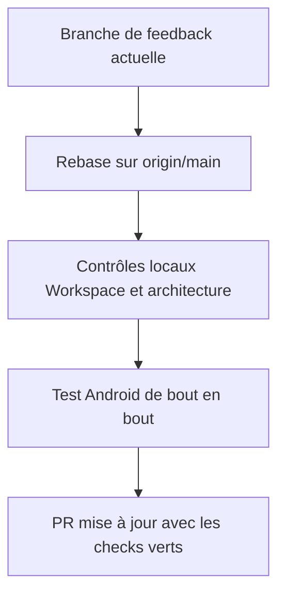
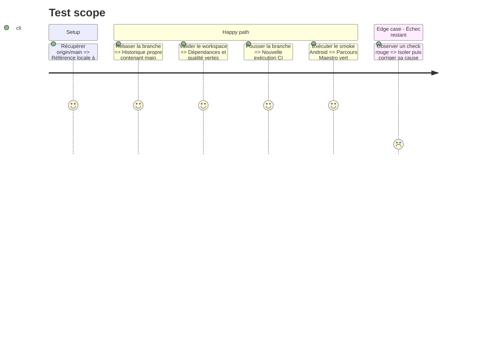

# Instruction: Synchroniser et valider la CI

## Architecture projection

> Tree of the final files. ✅ create · ✏️ modify · ❌ delete

```txt
.
├── android/
│   └── package.json                                      ✏️ reprendre les versions Expo compatibles depuis main
├── ios/Pulpe/App/
│   └── Runtime/AppRuntimeCoordinator.swift               ✏️ résoudre proprement tout conflit avec le correctif de maintenance
└── pnpm-lock.yaml                                         ✏️ reprendre le graphe de dépendances validé sur main
```

## User Journey



## Test Scope



## Tasks to do

### `1)` Intégrer main sans élargir la feature

> Rejouer les commits de feedback sur la dernière base et préserver les deux changements.

1. Rebaser sur `origin/main` et résoudre les éventuels conflits au plus près de leurs sources.
2. Vérifier que la mise à niveau Expo et le lockfile de main sont conservés.

### `2)` Reproduire et corriger les checks

> Ne modifier du code que si un échec subsiste après le rebase.

1. Exécuter les contrôles Workspace, dépendances et architecture applicables.
2. Exécuter le parcours Android en dernier, puis réparer sa cause racine s’il échoue encore.
3. Pousser la branche réécrite et confirmer les checks de la PR.

## Test acceptance criteria

| Task | Acceptance criteria |
| ---- | ------------------- |
| 1 | La branche contient la tête courante de `origin/main` et conserve tous les commits fonctionnels de feedback. |
| 1 | Les versions Expo attendues par SDK 57 et leur lockfile sont présentes sans régénération parasite. |
| 2 | Le graphe de dépendances et la qualité complète du workspace passent. |
| 2 | `Maestro smoke`, `Workspace` et leur agrégat `CI Success` sont verts sur la tête poussée. |
