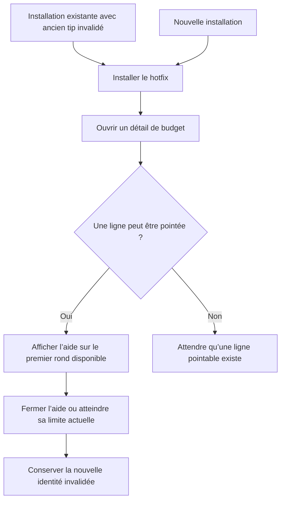
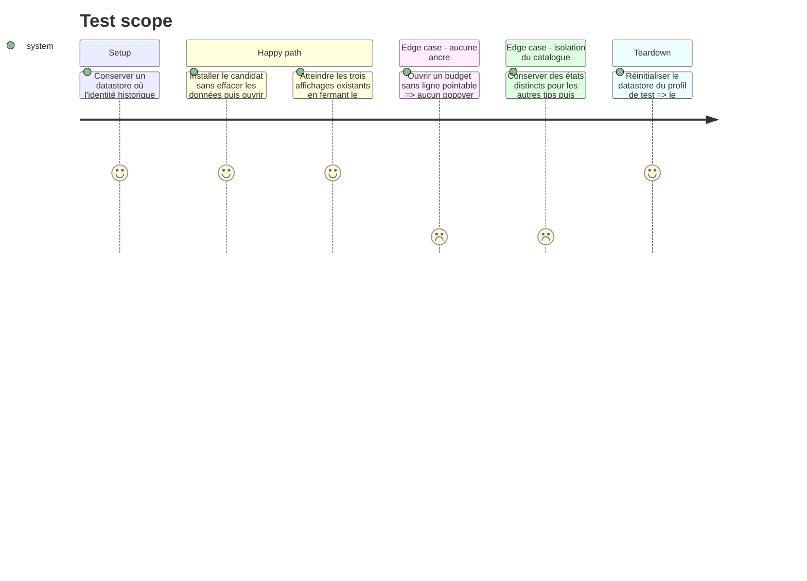

# Instruction: Versionner l’identité persistante du tip de pointage

## Architecture projection

> Tree of the final files. ✅ create · ✏️ modify · ❌ delete

```txt
.
└── ios/
    ├── Pulpe/Features/Tips/ProductTips.swift               ✏️ identité explicite de `CheckingTip`
    └── PulpeTests/Features/Tips/ProductTipsTests.swift     ✏️ garde de régression sur l’identité versionnée
```

## User Journey



## Test Scope



## Wireframe

```txt
┌─────────────────────────────────────┐
│ (1) Navigation                     │
├─────────────────────────────────────┤
│ (2) Résumé du budget               │
├─────────────────────────────────────┤
│ (3) Filtres                        │
│                                     │
│ (4) Section de mouvements           │
│  ┌───────────────────────────────┐  │
│  │ (5) Aide contextuelle         │  │
│  └──────────────┬────────────────┘  │
│  │ (6) ○  Ligne · montant         │  │
│  │     ○  Ligne · montant         │  │
│  └───────────────────────────────┘  │
└─────────────────────────────────────┘

1. Navigation : accès et actions déjà présents.
2. Résumé : état mensuel existant.
3. Filtres : sélection de l’état et du type.
4. Section : groupe de lignes du budget.
5. Aide : popover TipKit existant.
6. Ligne : contrôle circulaire qui sert déjà d’ancre à l’aide.
```

## Tasks to do

### `1)` Donner une nouvelle identité au tip remanié

> L’état persistant de l’ancienne aide ne doit plus bloquer l’aide qui explique le nouveau contrôle.

1. Dans `ProductTips.CheckingTip`, déclarer un `id` explicite et stable, versionné pour cette refonte, distinct de l’identifiant historique dérivé du nom `CheckingTip`.
2. Garder le type et l’instance `ProductTips.checking` afin que l’ancrage et les invalidations existantes utilisent automatiquement la nouvelle identité.
3. Ne modifier ni le titre, ni le message, ni l’image, ni les règles, ni `MaxDisplayCount(3)`.

### `2)` Isoler le hotfix des autres aides

> Seul le tip de pointage doit redevenir éligible.

1. Ne pas appeler `Tips.resetDatastore()` au lancement ou pendant une migration.
2. Ne pas utiliser `resetEligibility()`, indisponible sur tout le parc iOS 18 ciblé.
3. Ne pas ajouter de clé `UserDefaults` : aucune valeur créée après la 1.4.3 ne saurait dire si son nouveau texte a déjà été vu.

### `3)` Verrouiller et vérifier le comportement de mise à jour

> Le test doit échouer si le tip revient à son identité historique.

1. Étendre `ProductTipsTests` avec une assertion sur l’identifiant versionné exact de `ProductTips.checking`.
2. Exécuter `ProductTipsTests` et `CheckingTipAnchorTests`, puis le build `PulpeLocal` sur le simulateur dédié `Pulpe Tests`.
3. Sur un profil de test ayant invalidé l'ancien tip, installer le candidat sans désinstaller l'app et confirmer le nouvel affichage ; atteindre sa limite existante en le fermant entre les affichages, relancer et confirmer son masquage.
4. Vérifier qu’aucun changement ne touche `pessimisticCheck` ou `templatesWebParity`.

## Test acceptance criteria

| Task | Acceptance criteria                                                                                                                                              |
| ---- | ---------------------------------------------------------------------------------------------------------------------------------------------------------------- |
| 1    | Une installation dont l’ancien `CheckingTip` est invalidé voit l’aide remaniée sur le premier rond pointable après mise à jour.                                  |
| 2    | Les autres tips conservent leur état ; aucun reset global ni nouveau stockage applicatif n’est introduit.                                                        |
| 3    | L'identité versionnée est couverte par un test, l'ancrage existant reste vert, le build passe et la limite existante empêche un quatrième affichage.          |
