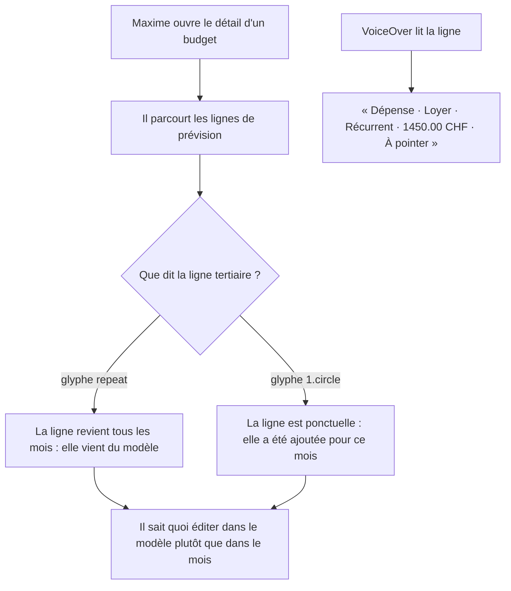
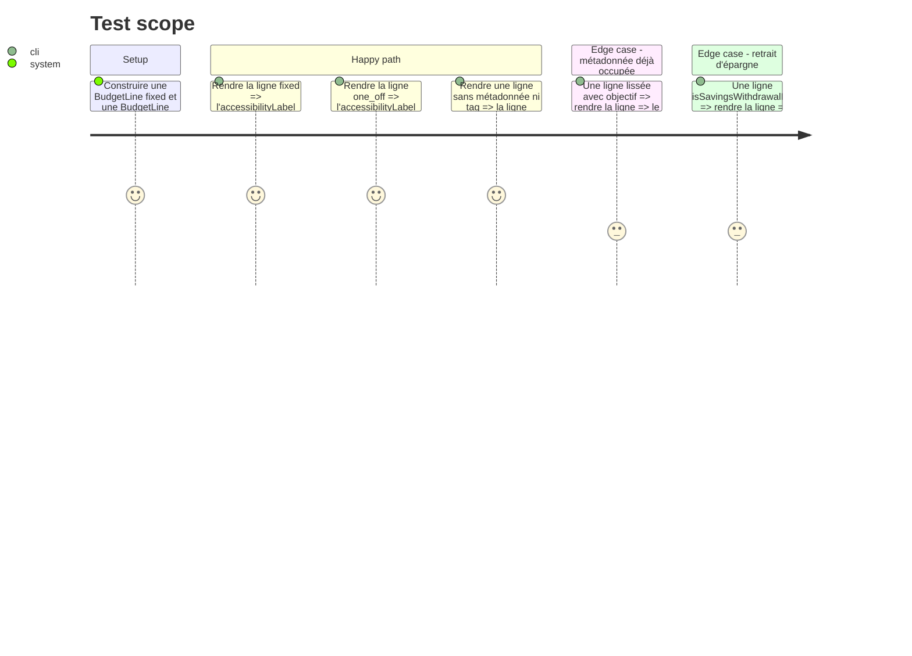

# Instruction: Glyphe de récurrence sur le détail budget

## Architecture projection

> Tree of the final files. ✅ create · ✏️ modify · ❌ delete

```txt
ios/
├── Pulpe/Features/Budgets/BudgetDetails/
│   └── BudgetLineMixedRow.swift                    ✏️ glyphe dans metadataRow, garde levée, mot dans l'accessibilityLabel
└── PulpeTests/Features/Budgets/BudgetDetails/
    └── BudgetLinePresentationTests.swift           ✏️ l'accessibilityLabel porte la récurrence
```

## User Journey



## Test Scope



## Wireframe

```txt
┌──────────────────────────────────────────────────────────┐
│  ╭───╮                                                   │
│  │ ↗ │  Loyer                              1'450.00 CHF  │
│  ╰───╯  ⟳  Récurrent (invisible, VoiceOver)      prévu  ›│
│         └── glyphe seul à l'écran                        │
├──────────────────────────────────────────────────────────┤
│  ╭───╮                                                   │
│  │ ↗ │  Assurance auto                       320.00 CHF  │
│  ╰───╯  ① Lissé · objectif Voiture       restant sur 400 │
│         └── glyphe puis métadonnée existante             │
├──────────────────────────────────────────────────────────┤
│  ╭───╮                                                   │
│  │ ↘ │  Salaire                            4'200.00 CHF  │
│  ╰───╯  ⟳                                              ›│
│         └── seul contenu de la ligne tertiaire           │
└──────────────────────────────────────────────────────────┘

⟳ = SF Symbol "repeat"      ① = SF Symbol "1.circle"
Taille : PulpeTypography.labelMedium, Color.textTertiary — comme le reste de la ligne.
```

## Tasks to do

### `1)` Poser le glyphe en tête de la ligne tertiaire

> La récurrence devient le premier élément de `metadataRow`, toujours présent.

1. Dans `metadataRow`, insérer avant le symbole de retrait d'épargne un `Image(systemName: line.recurrence.icon)` marqué `.accessibilityHidden(true)` — même raison que le symbole voisin : la ligne est un conteneur d'accessibilité et le nom SF serait lu comme un second énoncé.
2. Remplacer la garde `if metadata != nil || !tagNames.isEmpty` par le contenu inconditionnel : le glyphe est toujours là, la ligne tertiaire ne disparaît plus jamais.
3. Vérifier dans les previews que la hauteur de ligne gagnée (~18 pt sur les lignes qui n'avaient pas de métadonnée) ne désaligne pas la colonne du montant.

### `2)` Rendre la récurrence audible

> Le glyphe ne porte aucun texte : VoiceOver doit recevoir le mot.

1. Dans `accessibilityLabel`, insérer `line.recurrence.label` juste après `kindWord`, avant `line.name`.
2. Laisser `metadataText` intact — c'est un helper pur qui produit une chaîne, la récurrence est portée par la vue et par le label, pas par lui.

### `3)` Couvrir par un test

> Un test qui échoue si le mot disparaît du label.

1. Dans `BudgetLinePresentationTests.swift`, ajouter un `@Test` par valeur de `TransactionRecurrence` qui vérifie la présence du mot dans le label rendu.
2. Ajouter un cas sans métadonnée ni tag, pour verrouiller le fait que la ligne tertiaire n'est plus conditionnelle.

## Test acceptance criteria

| Task | Acceptance criteria                                                                                                                    |
| ---- | -------------------------------------------------------------------------------------------------------------------------------------- |
| 1    | Toute ligne du détail budget affiche un glyphe de récurrence en tête de sa ligne tertiaire, y compris celles qui n'avaient rien à dire. |
| 1    | Sur une ligne lissée avec objectif, le glyphe précède le texte existant et celui-ci reste lisible en taille standard.                   |
| 2    | VoiceOver énonce « Récurrent » ou « Prévu » entre la nature et le nom, et n'énonce jamais le nom du symbole SF.                         |
| 3    | Supprimer le glyphe ou le mot du label fait échouer `BudgetLinePresentationTests`.                                                      |
