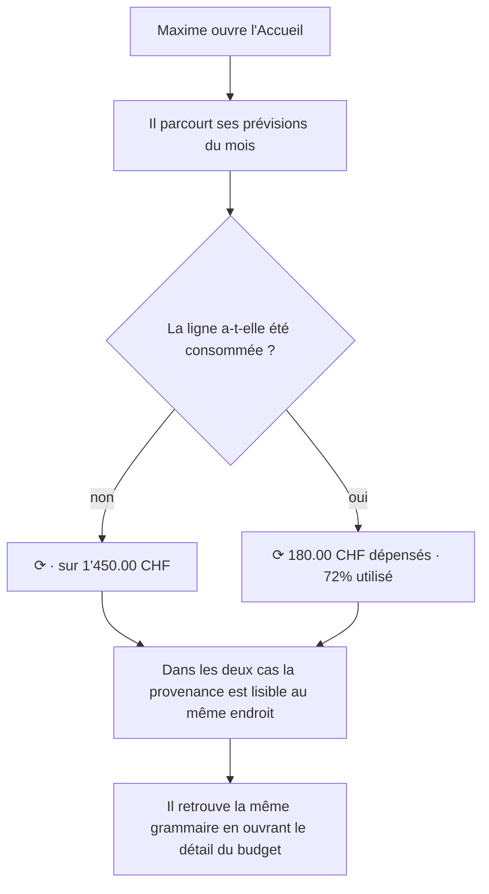
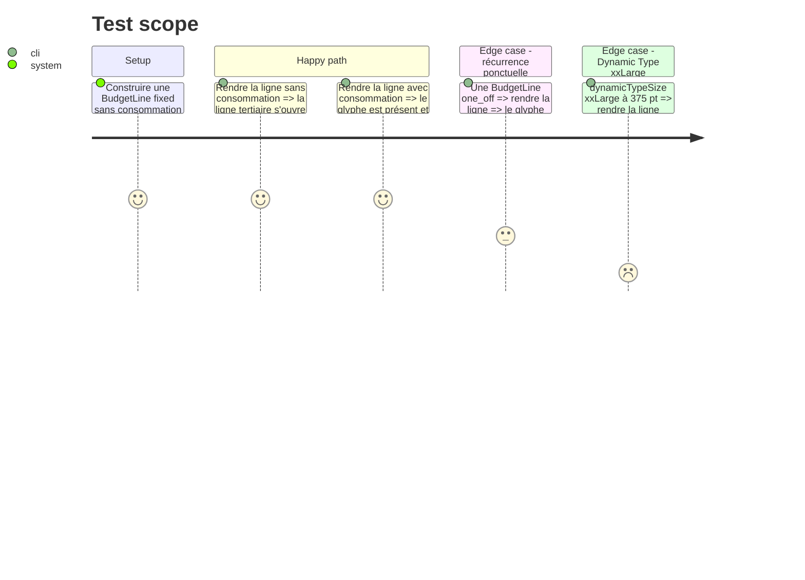

# Instruction: Glyphe de récurrence sur l'Accueil

## Architecture projection

> Tree of the final files. ✅ create · ✏️ modify · ❌ delete

```txt
ios/
├── Pulpe/Features/CurrentMonth/Components/
│   ├── BudgetSection.swift                         ✏️ ne garde que `BudgetSection` (~175 lignes)
│   └── BudgetLineRow.swift                         ✅ `BudgetLineRow` extrait, puis le glyphe y est ajouté
├── PulpeTests/Features/CurrentMonth/
│   └── BudgetLineRowPresentationTests.swift        ✅ le glyphe survit à la consommation
└── project.yml                                     ➖ inchangé : XcodeGen scanne le dossier, aucun fichier à déclarer
```

## User Journey



## Test Scope



## Wireframe

```txt
AVANT (incohérent)                        APRÈS (une seule grammaire)
┌────────────────────────────────┐        ┌────────────────────────────────┐
│ ╭─╮ Courses                    │        │ ╭─╮ Courses                    │
│ ╰─╯ 180.00 CHF dép. · 72% util.│        │ ╰─╯ ⟳ 180.00 CHF dép. · 72% ut.│
│     ▓▓▓▓▓▓▓░░░░░░              │        │     ▓▓▓▓▓▓▓░░░░░░              │
│     ↑ la récurrence a disparu  │        │     ↑ elle est là aussi        │
├────────────────────────────────┤        ├────────────────────────────────┤
│ ╭─╮ Loyer                      │        │ ╭─╮ Loyer                      │
│ ╰─╯ Récurrent · sur 1'450.00   │        │ ╰─╯ ⟳ sur 1'450.00 CHF         │
│     ↑ le mot, seulement ici    │        │     ↑ le glyphe, partout       │
└────────────────────────────────┘        └────────────────────────────────┘

Le mot en toutes lettres disparaît de l'écran ; il reste dans le label VoiceOver.
Cas serré assumé : en xxLarge « 72% utilisé » tronque — la barre de progression le porte déjà.
```

## Tasks to do

### `1)` Extraire `BudgetLineRow` avant d'y toucher

> `BudgetSection.swift` fait 481 lignes contre un plafond SwiftLint à 500, et `swiftlint:disable file_length` est refusé ailleurs dans le projet : ajouter sans extraire ferait passer le fichier dans le rouge.

1. Déplacer `BudgetLineRow` (lignes 176 à 481) dans un nouveau `BudgetLineRow.swift` du même dossier, imports compris.
2. Ne rien renommer et ne rien changer d'autre dans ce commit d'extraction : le diff doit être un déplacement lisible.
3. Vérifier que `BudgetSection.swift` retombe autour de 175 lignes et que la cible compile avant d'écrire la moindre ligne neuve.

### `2)` Poser le glyphe dans tous les cas

> La récurrence cesse d'être le repli du cas « pas de consommation ».

1. Envelopper la ligne tertiaire dans un `HStack` qui commence par `Image(systemName: line.recurrence.icon)`, `.accessibilityHidden(true)`.
2. Dans la branche `hasConsumption`, le glyphe précède `consumptionSummary` ; la barre de progression reste sous le `HStack`, pas dedans.
3. Dans les branches sans consommation, retirer `line.recurrence.label` du texte : il ne reste que « sur X CHF » pour une dépense, et rien pour les autres natures — la ligne tertiaire n'a alors que le glyphe.
4. Reporter le mot dans le label d'accessibilité de la ligne pour ne rien perdre à l'oral.

### `3)` Verrouiller la cohérence par un test

> Le bug corrigé ici est une incohérence entre deux états : c'est exactement ce qu'un test doit tenir.

1. Créer `BudgetLineRowPresentationTests.swift` avec un `@Test` qui rend la même ligne consommée puis non consommée et vérifie que la récurrence est énoncée dans les deux cas.
2. Ajouter un cas `one_off` pour couvrir l'autre glyphe.

## Test acceptance criteria

| Task | Acceptance criteria                                                                                                            |
| ---- | ------------------------------------------------------------------------------------------------------------------------------ |
| 1    | `BudgetSection.swift` et `BudgetLineRow.swift` passent `swiftlint --strict` sans avertissement `file_length`.                   |
| 1    | L'écran d'Accueil rend exactement comme avant l'extraction.                                                                    |
| 2    | Une ligne consommée et une ligne vierge affichent toutes deux le glyphe de récurrence, au même endroit.                        |
| 2    | Aucun écran n'affiche plus les mots « Récurrent » ou « Prévu » sur une ligne de prévision de l'Accueil.                        |
| 2    | VoiceOver énonce toujours la récurrence sur les deux états.                                                                    |
| 3    | Remettre le glyphe sous condition de `hasConsumption` fait échouer `BudgetLineRowPresentationTests`.                            |
