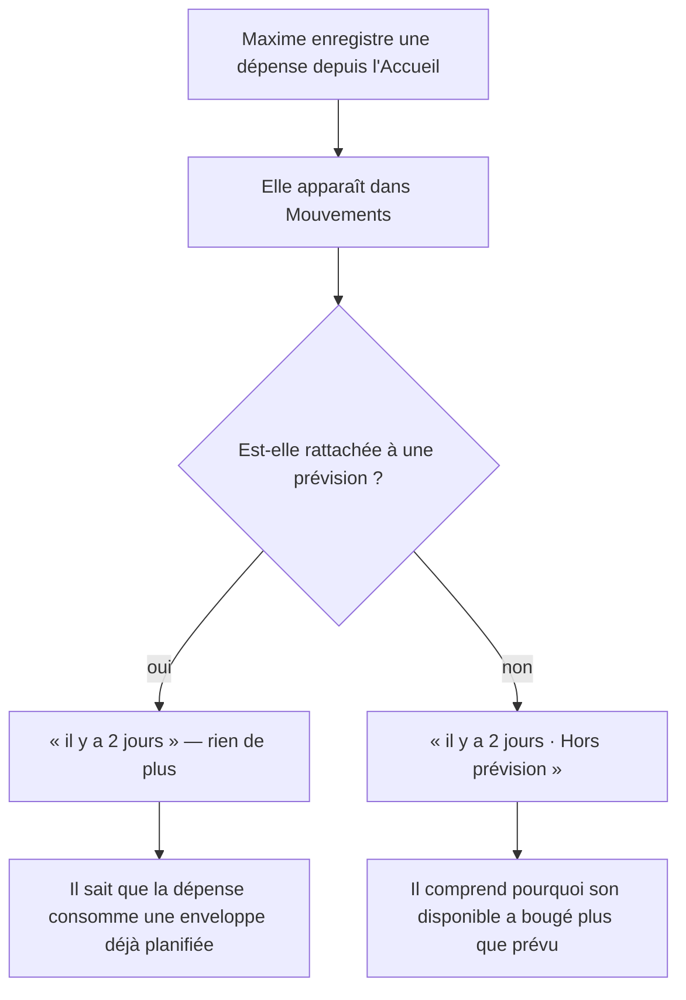
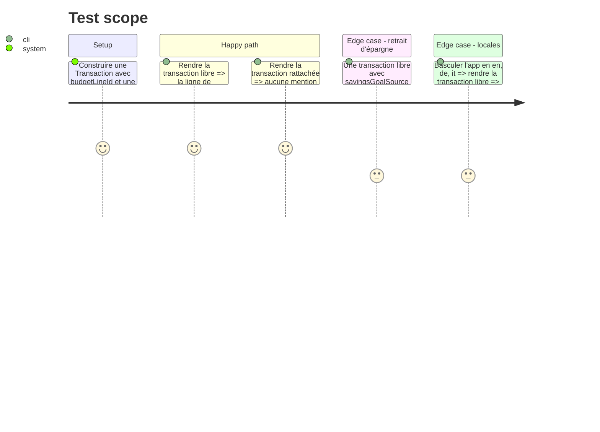

# Instruction: « Hors prévision » sur les transactions libres

## Architecture projection

> Tree of the final files. ✅ create · ✏️ modify · ❌ delete

```txt
ios/
├── Pulpe/Features/CurrentMonth/Components/
│   └── TransactionSection.swift                    ✏️ `TransactionRow` marque une transaction libre
├── Pulpe/Resources/Localizable.xcstrings           ✏️ nouvelle clé au singulier, fr/en/de/it
└── PulpeTests/Features/CurrentMonth/
    └── TransactionRowPresentationTests.swift       ✅ le marqueur suit `isFree`
```

## User Journey



## Test Scope



## Wireframe

```txt
┌──────────────────────────────────────────────────────────┐
│  ╭───╮                                                   │
│  │ ↗ │  Café                                  4.50 CHF   │
│  ╰───╯  il y a 2 jours · Hors prévision                  │
├──────────────────────────────────────────────────────────┤
│  ╭───╮                                                   │
│  │ ↗ │  Courses                              82.30 CHF   │
│  ╰───╯  hier                                             │
│         └── rattachée : rien à signaler                  │
└──────────────────────────────────────────────────────────┘

Même ligne, même typo (PulpeTypography.caption / Color.textTertiary) que la date.
Aucun badge : c'est du texte, séparé par « · », comme SavingsGoalSourceLabel voisin.
```

## Tasks to do

### `1)` Ajouter la clé au singulier

> Le catalogue ne connaît que le pluriel « Hors prévisions », qui sert de titre de section.

1. Ajouter `"Hors prévision"` dans `Localizable.xcstrings` avec les quatre langues fr/en/de/it, en s'alignant sur la traduction déjà retenue pour le pluriel.
2. Ne pas toucher `"Hors prévisions"` ni `"Hors prévisions, %lld"` : ce sont les titres de section, ils restent tels quels.

### `2)` Marquer la transaction libre

> Là où les deux natures se mélangent, et seulement là.

1. Dans le `HStack` de métadonnée de `TransactionRow`, après la date et avant `SavingsGoalSourceLabel`, ajouter le marqueur conditionné à `transaction.isFree`.
2. Utiliser le séparateur « · » déjà en place pour joindre les segments, sans introduire de nouveau composant.
3. Ne rien ajouter dans `BudgetDetailsFreeTransactionsList` : le titre de section y dit déjà la même chose.

### `3)` Couvrir par un test

1. Créer `TransactionRowPresentationTests.swift` : le marqueur apparaît sur `isFree == true`, disparaît sur `isFree == false`.
2. Ajouter le cas où `savingsGoalSource` est présent, pour vérifier que les deux informations tiennent sur la ligne sans se remplacer.

## Test acceptance criteria

| Task | Acceptance criteria                                                                                                     |
| ---- | ------------------------------------------------------------------------------------------------------------------------ |
| 1    | Aucun écran n'affiche la clé brute `Hors prévision` dans l'une des quatre langues.                                      |
| 2    | Une transaction sans `budgetLineId` affiche « Hors prévision » dans Mouvements ; une transaction rattachée n'affiche rien. |
| 2    | La section « Hors prévisions » du détail budget est inchangée, sans marqueur par ligne.                                  |
| 3    | Retirer la condition `isFree` fait échouer `TransactionRowPresentationTests`.                                            |
