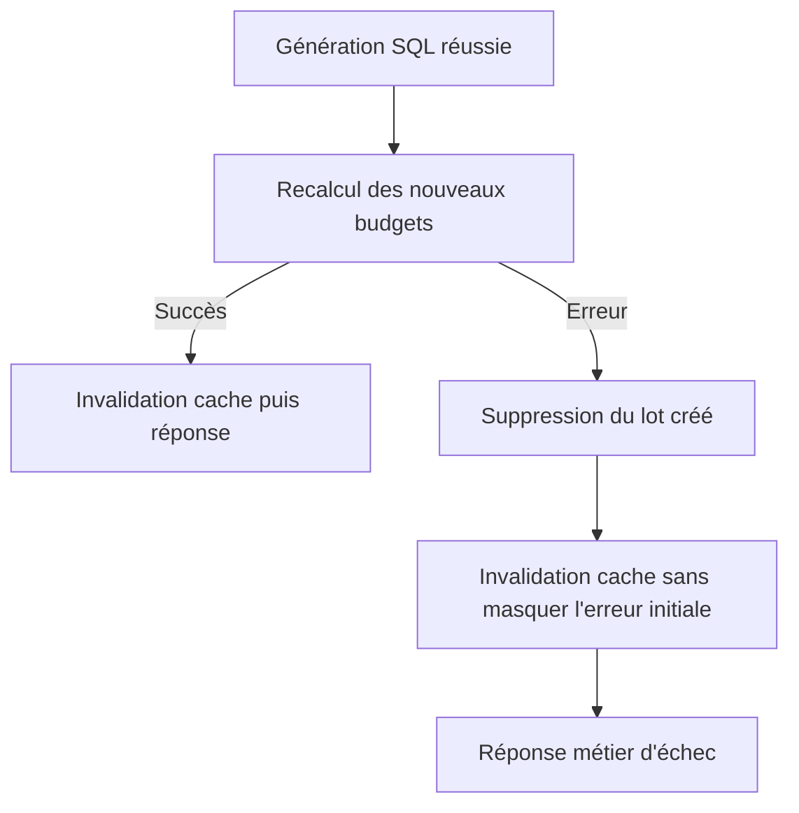
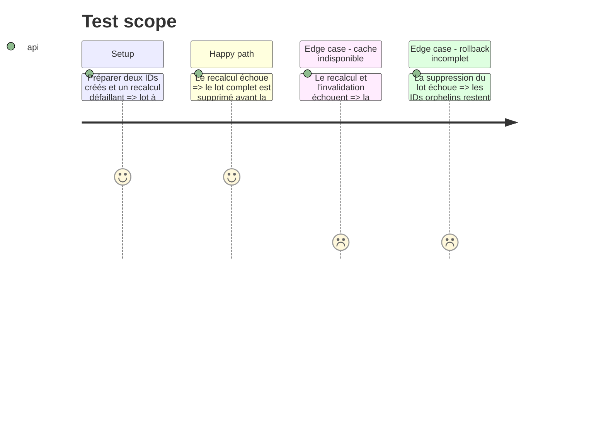

# Instruction: Garantir la compensation backend

## Architecture projection

> Tree of the final files. ✅ create · ✏️ modify · ❌ delete

```txt
.
└── backend-nest/src/modules/budget/application/
    ├── generate-budgets.use-case.ts       ✏️ exécute le rollback avant le cache et préserve l'erreur initiale
    └── generate-budgets.use-case.spec.ts  ✏️ couvre l'échec conjoint du recalcul et du cache
```

## User Journey



## Test Scope



## Tasks to do

### `1)` Prioriser la compensation

> Une dépendance de cache ne doit jamais court-circuiter la protection des données.

1. Réordonner le chemin `catch` pour appeler `rollbackCreatedBudgets` dès que les IDs du lot sont connus.
2. Tenter ensuite l'invalidation du cache comme dégradation non bloquante, sans remplacer la cause initiale ni perdre les IDs orphelins.
3. Conserver le succès, l'ordre des recalculs et le contrat `BUDGET_GENERATE_FAILED` existants.

### `2)` Verrouiller la régression

> Le test doit échouer si le cache peut de nouveau empêcher la suppression.

1. Ajouter un cas où le second recalcul rejette et où `invalidateForUser` rejette aussi.
2. Vérifier que `deleteBudgetsByIds` reçoit tout le lot et que l'exception finale reste une `BusinessException` causée par l'échec de recalcul.
3. Garder le cas existant de rollback réussi et ajouter le cas des IDs orphelins en cas d'échec de suppression.

## Test acceptance criteria

| Task | Acceptance criteria |
| ---- | ------------------- |
| 1 | Après tout échec de recalcul, le backend tente toujours de supprimer tous les budgets créés avant toute opération de cache faillible, puis renvoie l'erreur métier d'origine. |
| 2 | La suite Bun échoue si une erreur d'invalidation peut empêcher `deleteBudgetsByIds`, masquer la cause initiale ou perdre la liste des IDs orphelins. |
