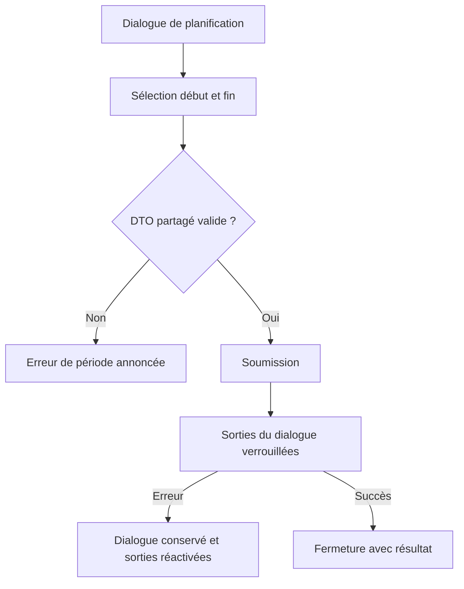
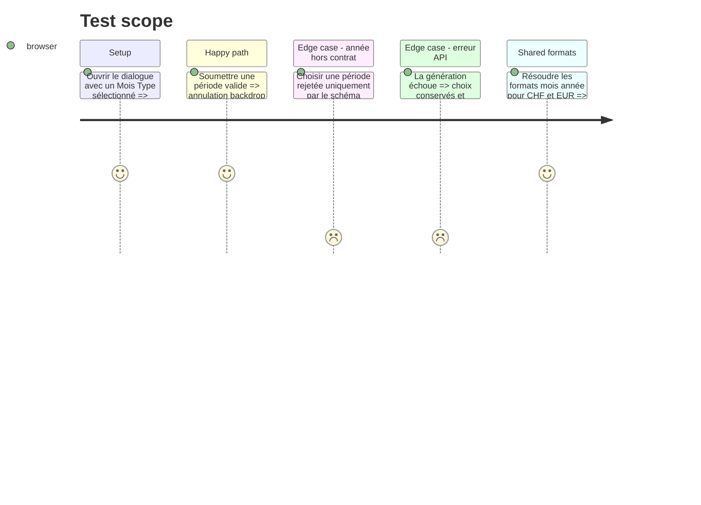

# Instruction: Rendre la validation et la fermeture Web explicites

## Architecture projection

> Tree of the final files. ✅ create · ✏️ modify · ❌ delete

```txt
.
└── frontend/projects/webapp/
    ├── public/i18n/
    │   ├── de.json                                                    ✏️ traduit l'erreur de période hors contrat
    │   ├── en.json                                                    ✏️ traduit l'erreur de période hors contrat
    │   ├── fr.json                                                    ✏️ ajoute le message produit canonique
    │   └── it.json                                                    ✏️ traduit l'erreur de période hors contrat
    └── src/app/
        ├── core/date/
        │   ├── date-display-formats.ts                                ✏️ porte l'unique fabrique de formats Material mois/année
        │   └── date-display-formats.spec.ts                           ✏️ fixe les formats CHF et EUR partagés
        └── feature/budget/budget-list/
            ├── create-budget/budget-creation-dialog.ts                ✏️ consomme la fabrique partagée
            └── plan-budgets/
                ├── plan-budgets-dialog.ts                             ✏️ annonce tout rejet du DTO et verrouille les sorties pendant pending
                └── plan-budgets-dialog.spec.ts                        ✏️ couvre borne annuelle et fermeture pendant pending
```

## User Journey



## Test Scope



## Wireframe

```txt
┌──────────────────────────────────────────┐
│ (1) En-tête du dialogue          [sortie]│
├──────────────────────────────────────────┤
│ (2) Période                              │
│     [début mois/année] [fin mois/année]  │
│ (3) Compteur ou message de validation    │
│                                          │
│ (4) Liste des modèles                    │
├──────────────────────────────────────────┤
│ (5) [annulation]            [soumission] │
└──────────────────────────────────────────┘
```

1. En-tête: titre et sortie native du dialogue.
2. Période: les deux datepickers mois/année existants.
3. Validation: une région annoncée qui explique tout rejet du contrat.
4. Modèles: la liste et la sélection existantes.
5. Actions: annulation et soumission regroupées dans le footer.

## Tasks to do

### `1)` Partager le format mois/année

> La configuration Material identique ne doit vivre qu'à un endroit.

1. Déplacer la composition de `MAT_DATE_FNS_FORMATS` dans `core/date/date-display-formats.ts` sans créer de service ni de nouvelle dépendance.
2. Remplacer les deux helpers locaux des dialogues création et planification par cet export.
3. Étendre le spec date existant pour couvrir les séparateurs CHF et EUR de la configuration Material.

### `2)` Expliquer toutes les périodes invalides

> Le bouton désactivé doit toujours être accompagné d'une raison visible et annoncée.

1. Conserver les messages distincts fin avant début et plus de 36 périodes.
2. Mapper tout rejet résiduel de `budgetGenerateSchema`, notamment la borne annuelle, vers une clé de validation localisée reliée aux datepickers.
3. Ajouter cette clé aux quatre catalogues sans afficher directement les messages Zod anglais.

### `3)` Verrouiller le dialogue pendant la requête

> Une soumission déjà partie ne possède pas de mécanisme d'annulation serveur.

1. Désactiver le bouton Annuler pendant `isGeneratingBudgets`.
2. Basculer `MatDialogRef.disableClose` avant l'attente réseau afin de bloquer backdrop et Escape, puis le réactiver sur erreur; laisser le succès fermer explicitement avec la réponse.
3. Tester l'état pending, le retour à l'état actionnable après erreur et l'absence d'appel API pour la borne annuelle invalide.

## Test acceptance criteria

| Task | Acceptance criteria |
| ---- | ------------------- |
| 1 | Les dialogues de création et de planification obtiennent leurs formats Material mois/année depuis un seul helper testé, avec les rendus CHF et EUR inchangés. |
| 2 | Toute période refusée par le DTO partagé désactive la confirmation et affiche une erreur localisée annoncée; aucune requête n'est envoyée. |
| 3 | Pendant une génération Web, Annuler, backdrop et Escape ne ferment pas le dialogue; après une erreur les choix et les sorties redeviennent disponibles, et un succès ferme avec le résultat. |
