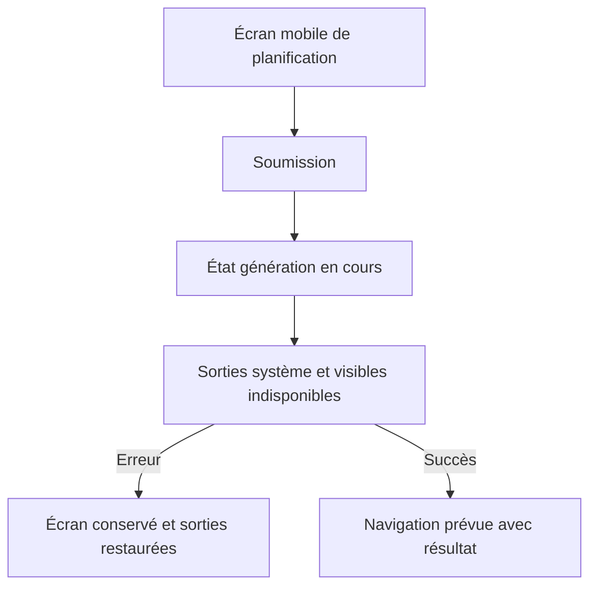
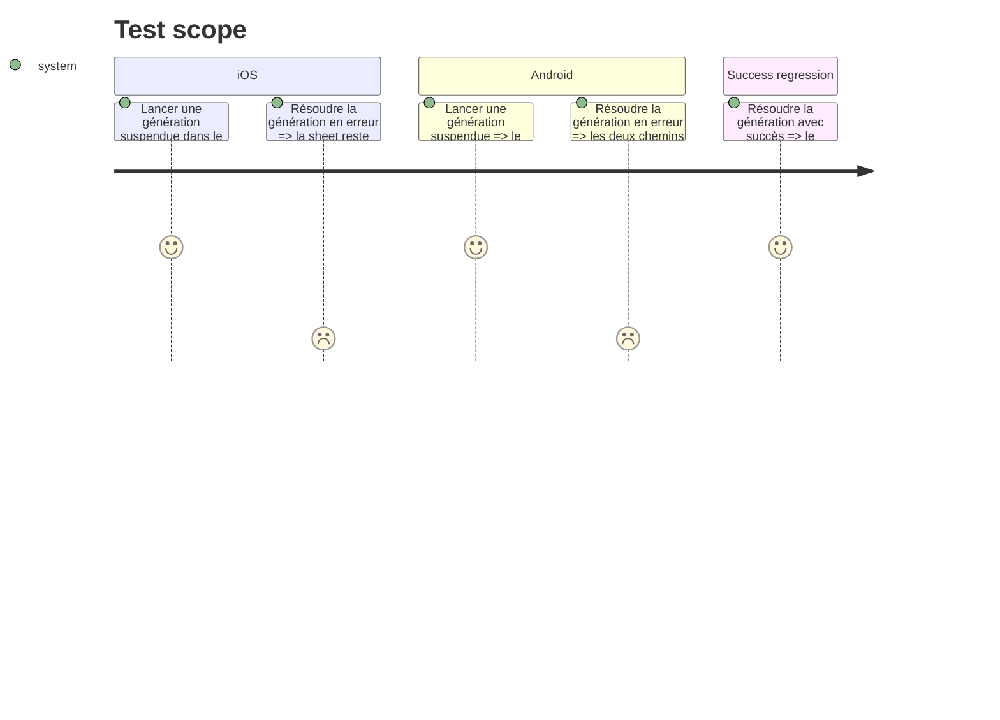

# Instruction: Bloquer les sorties mobiles pendant la génération

## Architecture projection

> Tree of the final files. ✅ create · ✏️ modify · ❌ delete

```txt
.
├── ios/
│   ├── Pulpe/App/
│   │   ├── BudgetLongPressUITestHarness.swift                              ✏️ enregistre le scénario de planification suspendue
│   │   ├── PlanBudgetsUITestHarness.swift                                  ✅ présente la vraie sheet avec une génération suspendue
│   │   ├── PulpeApp.swift                                                  ✏️ route le scénario vers le harness
│   │   └── SavingsGoalIntervalUITestHarness.swift                          ✏️ garde exhaustif le routage des scénarios hors périmètre
│   ├── Pulpe/Features/Budgets/BudgetList/PlanBudgetsView.swift             ✏️ bloque fermeture et swipe avec l'état de génération existant
│   ├── PulpeTests/Features/Budgets/PlanBudgetsViewModelTests.swift         ✏️ prouve la durée de l'état pending et sa libération
│   └── PulpeUITests/PlanBudgetsPendingDismissUITests.swift                 ✅ tente réellement bouton et swipe pendant pending
└── android/src/
    ├── app/(main)/budget/plan.tsx                                          ✏️ bloque retour Appbar et retour système pendant pending
    └── features/budgets/plan-budget-screen.spec.tsx                        ✏️ couvre les deux chemins de retour et leur restauration
```

## User Journey



## Test Scope



## Wireframe

```txt
┌──────────────────────────────────────────┐
│ iOS sheet                                │
│ (1) [sortie]      en-tête      [action]  │
├──────────────────────────────────────────┤
│ (2) période · validation                 │
│ (3) modèles                              │
│ (4) état de génération                   │
└──────────────────────────────────────────┘

┌──────────────────────────────────────────┐
│ Android écran poussé                     │
│ (1) [retour]      en-tête                │
├──────────────────────────────────────────┤
│ (2) période · validation                 │
│ (3) modèles                              │
├──────────────────────────────────────────┤
│ (4) état de génération · action          │
└──────────────────────────────────────────┘
```

1. Navigation: les contrôles natifs de sortie déjà présents.
2. Période: les sélecteurs et messages existants.
3. Modèles: la sélection actuelle, sans nouveau composant.
4. Génération: le chargement et l'action de confirmation existants.

## Tasks to do

### `1)` Aligner iOS sur les sheets mutationnelles existantes

> `SpreadExistingSheet` fournit déjà le pattern attendu.

1. Désactiver `SheetCloseButton` avec `viewModel.isGenerating`.
2. Appliquer `interactiveDismissDisabled(viewModel.isGenerating)` au conteneur de sheet.
3. Conserver l'initialiseur de production et ajouter une injection interne minimale du `PlanBudgetsViewModel` afin que le harness UI fournisse un modèle, un chargement immédiat et une génération suspendue sans réseau.
4. Enregistrer ce scénario dans le routage UI test existant, présenter la vraie sheet, puis ajouter un test XCUITest qui soumet, tente le bouton de fermeture et un swipe descendant, et vérifie que la sheet reste affichée.
5. Ajouter le nouveau cas aux switches exhaustifs des harness existants qui doivent explicitement l'ignorer.
6. Étendre le test du ViewModel avec une action suspendue afin de vérifier que l'état pending couvre toute la requête et retombe sur succès comme sur erreur.

### `2)` Protéger les deux retours Android

> Le bouton visible et le retour matériel doivent partager le même état `generate.isPending`.

1. Désactiver `Appbar.BackAction` pendant la mutation.
2. Réutiliser `BackHandler` pour consommer le retour système uniquement pendant `pending`, avec nettoyage de l'abonnement au changement d'état et au démontage.
3. Étendre le spec d'écran pour vérifier le blocage pendant pending, la restauration après erreur et le chemin de succès existant.

## Test acceptance criteria

| Task | Acceptance criteria |
| ---- | ------------------- |
| 1 | Tant que la requête iOS est en cours, ni le bouton de fermeture ni le geste interactif ne retirent la vraie sheet dans le test UI; ils redeviennent disponibles après une erreur et le succès conserve le refresh et l'annonce. |
| 2 | Tant que la requête Android est en cours, ni l'Appbar ni le retour système ne quittent l'écran; les deux sont restaurés après erreur et le succès conserve la navigation avec les compteurs. |
