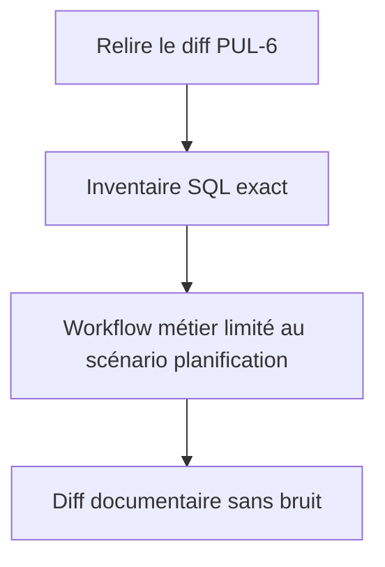
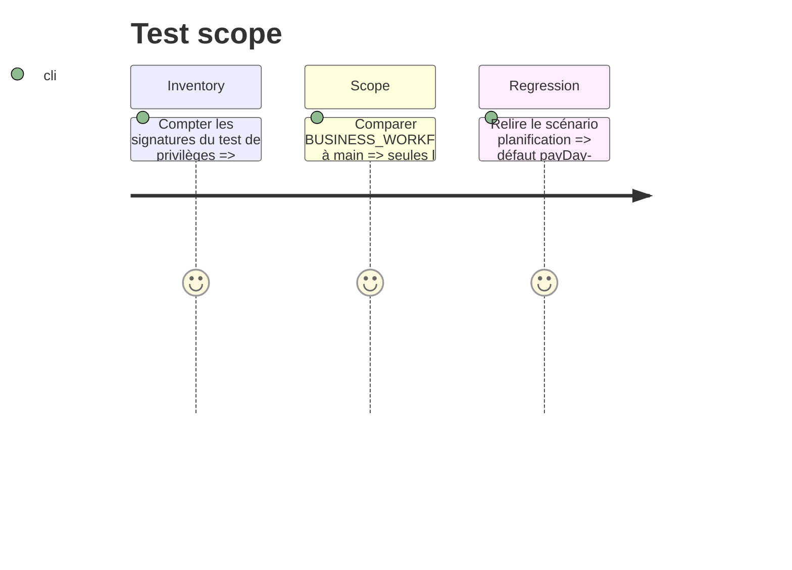

# Instruction: Nettoyer les dérives documentaires

## Architecture projection

> Tree of the final files. ✅ create · ✏️ modify · ❌ delete

```txt
.
├── backend-nest/supabase/tests/README.md  ✏️ aligne les compteurs sur l'inventaire SQL réel
└── docs/BUSINESS_WORKFLOW.md              ✏️ retire le formatage hors scope sans perdre le scénario PUL-6
```

## User Journey



## Test Scope



## Tasks to do

### `1)` Corriger l'inventaire SQL documenté

> Les nombres doivent refléter les tableaux exécutés par la preuve de privilèges.

1. Mettre à jour `security_definer_function_privileges.sql` dans le README à 16 fonctions exposées et 10 RPC `SECURITY INVOKER`.
2. Ne modifier ni le test SQL ni les grants déjà couverts par PUL-6.

### `2)` Réduire le diff du workflow métier

> Le document ne doit porter que le changement produit demandé.

1. Restaurer depuis `main` les changements d'italiques, séparateurs de tableaux et lignes blanches hors du scénario 4.
2. Conserver intégralement le défaut payDay-aware, la plage inclusive de 1 à 36 cycles, les skips et les deux compteurs.
3. Vérifier le diff final du fichier pour confirmer l'absence de normalisation Markdown latérale.

## Test acceptance criteria

| Task | Acceptance criteria |
| ---- | ------------------- |
| 1 | Le README décrit exactement les 16 signatures exposées et les 10 fonctions invoker vérifiées par le test SQL. |
| 2 | Le diff de `docs/BUSINESS_WORKFLOW.md` ne contient plus que le scénario PUL-6, qui conserve le défaut payDay-aware, la plage inclusive, les skips et les deux compteurs. |
