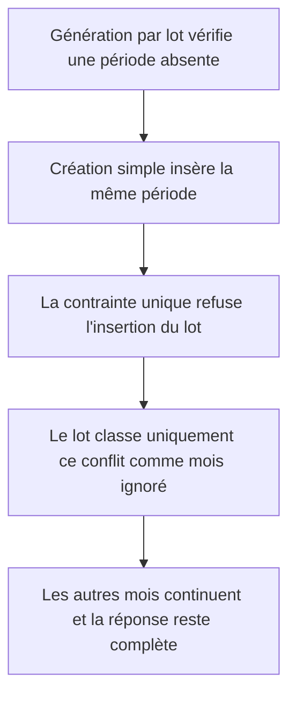
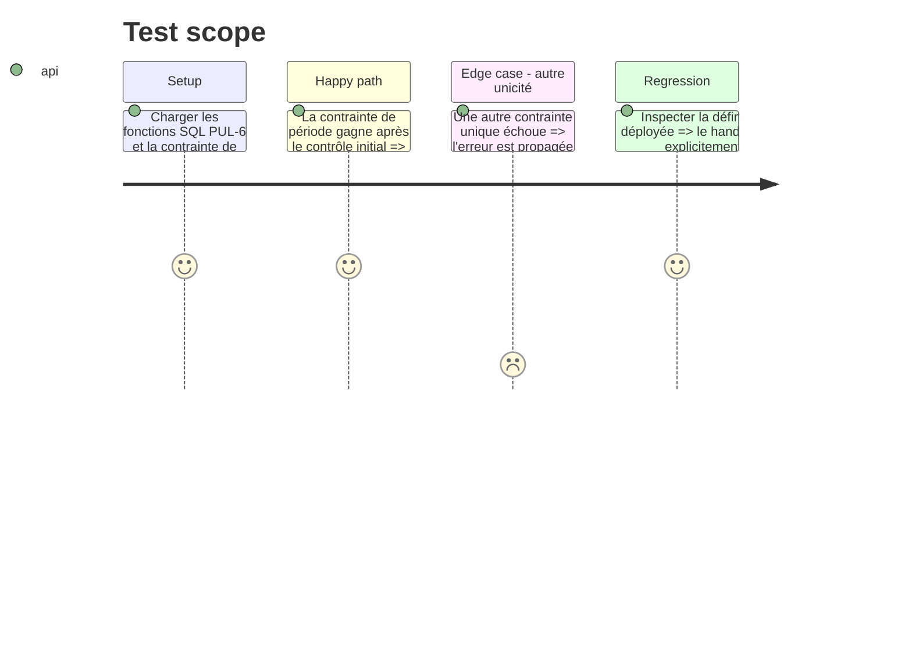

# Instruction: Tolérer la concurrence avec la création simple

## Architecture projection

> Tree of the final files. ✅ create · ✏️ modify · ❌ delete

```txt
.
└── backend-nest/supabase/
    ├── migrations/20260901120000_generate_budgets_atomically.sql  ✏️ traite le conflit de période comme un skip concurrent
    └── tests/generate_budgets_atomically.sql                       ✏️ verrouille le traitement ciblé de la contrainte unique
```

## User Journey



## Test Scope



## Tasks to do

### `1)` Cibler le conflit de période

> La contrainte existante décide du gagnant sans élargir le verrouillage.

1. Encadrer l'appel feuille dans un sous-bloc PL/pgSQL qui intercepte `unique_violation`.
2. Lire le nom de contrainte et convertir uniquement `unique_month_year_per_user` en entrée `skipped_months`.
3. Relancer toute autre violation afin de conserver le rollback atomique.

### `2)` Verrouiller la régression

> Le test échoue si le conflit redevient une erreur globale ou si le handler devient trop large.

1. Vérifier dans la définition de fonction déployée la présence du ciblage explicite de `unique_month_year_per_user`.
2. Conserver les preuves existantes de rollback tardif, de verrou utilisateur et d'ordre chronologique.

## Test acceptance criteria

| Task | Acceptance criteria |
| ---- | ------------------- |
| 1 | Une création simple concurrente de la même période ne fait plus échouer le lot; le mois est signalé comme ignoré et les autres périodes continuent. |
| 2 | Seul le conflit `unique_month_year_per_user` devient un skip; toute autre erreur conserve l'annulation complète du lot. |
